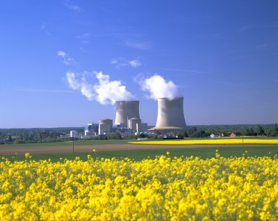

Cet axe regroupe les sujets fondamentaux
et appliqués, relevant de la problématique du comportement des radionucléides
dans l’environnement, des déchets de l’aval du cycle électronucléaire, du
contrôle des réacteurs,des concepts de réacteurs du futur (Génération IV), de
leur combustible ou de la production d’hydrogène associée, de la physique
nucléaire fondamentale ou des études de matériaux que ces concepts nouveaux
requièrent (fission, ITER), et de l’utilisation des techniques (principalement
nucléaires, mais aussi optiques et spectroscopiques) de contrôles et
d’investigations non destructifs ou de non prolifération, ainsi que l'activité
de mesure des radionucléides dans l’environnement du service SMART.

[SEN](/recherche/sen/erdre-presentation) - [Prisma](/recherche/prisma/presentation) - [Radiochimie](/recherche/radiochimie/radiochimie-presentation)
