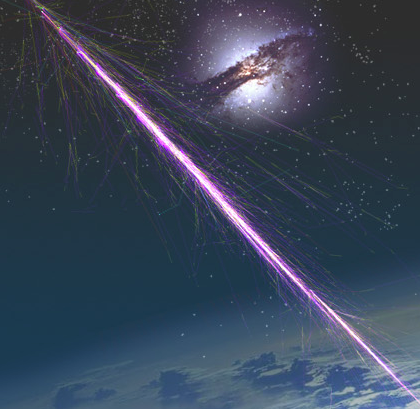

Ce pôle regroupe les recherches, d’ordre fondamental, concernant des phénomènes physiques d’énergie élevée qui se sont passés ou qui se passent encore dans notre univers. Sur le plan expérimental, ces activités vont de pair avec le développement de détecteurs toujours plus performants tant au niveau des capteurs (détecteurs gazeux ou au silicium, antennes, etc.) qu’au niveau des techniques associées (électronique, ASIC, informatique en temps réel, mécanique).

Ceci promeut l’association étroite des groupes expérimentaux et des services techniques. Cette particularité est à l’origine d’échanges transversaux, fédérateurs au sein du laboratoire et permettant des collaborations extérieures avec des structures industrielles ou de recherche.

[Astro](/recherche/astro/astro-presentation) - [SEN](/recherche/sen/erdre-presentation) - [Plasma](/recherche/plasma/presentation-groupe-plasma) - [Théorie](fr/recherche/univers-a-haute-energie/theorie/presentation) - [Xénon](/recherche/xenon/presentation) - [Neutrino](fr/recherche/univers-a-haute-energie/neutrino/presentation)
