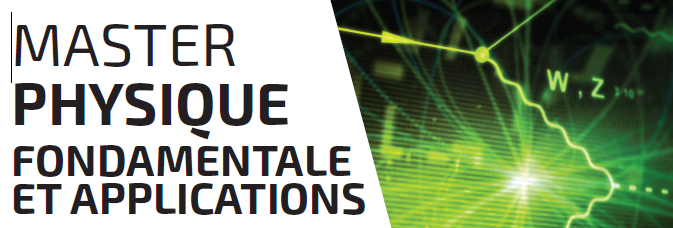

La spécialité du Master Physique fondamentale et applications est une formation supérieure à bac +5 dans le domaine de la physique subatomique et des rayonnements ionisants qui a pour objectif de :

*   Former les étudiants à et par la recherche
*   Former des spécialistes de type ingénieur-expert
*   Participer à la formation des futurs physiciens médicaux

Formation co-habilitée entre l’Université de Nantes et l’IMT Atlantique, la spécialité de M2 PFA propose trois options :

*   Recherche en Physique Subatomique (RPS)
*   Rayonnements Ionisants et Applications médicales (RIA)
*   Démantèlement et Modélisation Nucléaires (DMN)

### Objectifs :

→ Préparer les étudiants au doctorat en physique nucléaire et des hautes énergies (théorie, expérience, modélisation, détection, analyse) et former des spécialistes dans les domaines d'application du nucléaire et des rayonnements ionisants. Sont principalement concernés :

*   Le monde de la recherche
*   La radioprotection
*   L'instrumentation et la mesure dans l'environnement
*   Les applications dans le secteur biomédical et de la santé
*   Les applications dans le secteur de l'industrie nucléaire

 → Permettre pour les étudiants ayant suivi le parcours RIA, l'inscription au concours d'entrée au Diplôme de Qualification en Physique Radiologiques et Médicale ([DQPRM](http://www-instn.cea.fr/-DQPRM-Physique-medicale-.html)), qui a pour but de former des personnes spécialisées en radiophysique médicale dont la mission principale est de garantir la qualité et la sécurité dans l'utilisation médicale des rayonnements ionisants.

