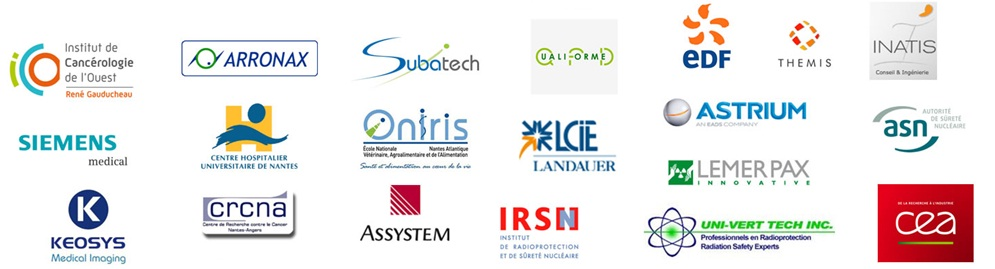

### Partenariats et collaborations :

*   Centre National de la Recherche Scientifique (CNRS),
*   Institut National de Physique Nucléaire et de Physique des Particules (IN2P3),
*   Institut National de la Santé et de la Recherche Médicale (Inserm),
*   Accélérateur pour la Recherche en Radiochimie et Oncologie à Nantes Atlantique (ARRONAX),
*   Institut de Cancérologie de l'Ouest (ICO),
*   CHU de Nantes,
*   Commissariat à l'Energie Atomique (CEA),
*   ISNTN,
*   Autorité de Sûreté Nucléaire (ASN),
*   Institut de Radioprotection et de Sûreté Nucléaire (IRSN),
*   Agence Nationale pour la Gestion des Déchets Radioactifs (ANDRA),
*   Institut de Recherche en Communications et Cybernétique de Nantes (IRRcyN),
*   Etc...

### École doctorale de rattachement :

ED 500 " Matière, Molécules, Matériaux en Pays de la Loire" (3MPL)

###  Insertion professionnelle :

Ces dernières années, plus de 80%!d(MISSING)es diplômés ont été embauchés en moins de 3 mois (CDD ou CDI) ou ont poursuivi leur études (Doctorat et/ou DPQRM).

Ils ont recruté nos étudiants ou les ont accueillis en stage :

