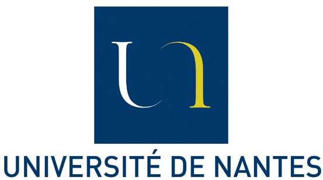
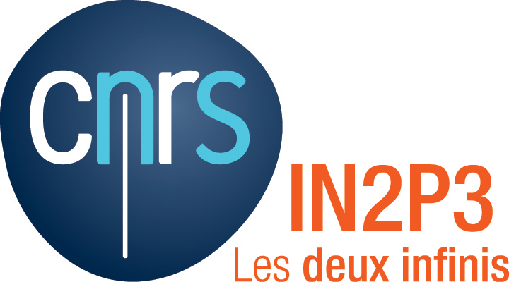
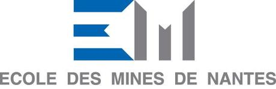
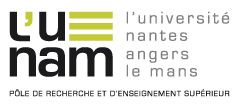
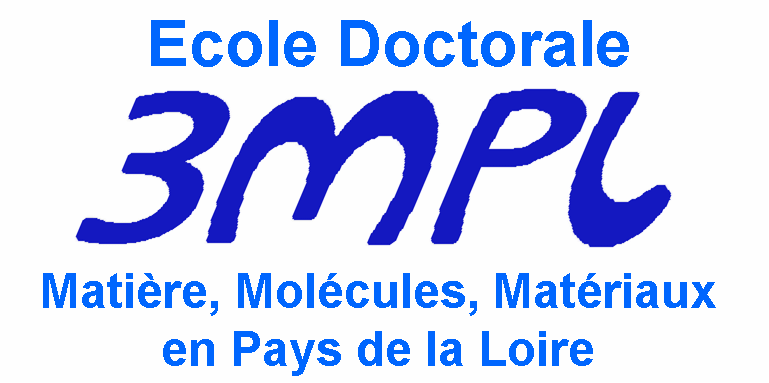

SUBATECH is a joint laboratory (UMR 6457) of the [National Institute for nuclear and particle physics](http://www.in2p3.fr/presentation/politique/statuts_missions_en.htm) (IN2P3) from the [CNRS](http://www.cnrs.fr/index.php) (National Center for the Scientific Research), the [École des Mines of Nantes](http://www.mines-nantes.fr/en/) and the [University of Nantes](http://www.univ-nantes.fr/33496937/1/fiche___pagelibre/&RH=1291798103626&RF=INSTITUTIONNEL_EN)

  

Via these two later funding agencies, Subatech is a member of the Research and Higher Education Cluster [L'UNAM](http://www.english.lunam.fr). The laboratory is also a member of the interdisciplinarity research federation [GRIM3](http://www.cnrs-imn.fr/GRIM3/) (Groupe de Recherche Interdisciplinaire sur les Matériaux, les Molécules et la Matiere) and a member of the Universe Sciences Observatory of Nantes Atlantique [OSUNA](http://www.osuna.univ-nantes.fr/). The laboratory is affiliated to the graduate school [3MPL](http://3mpl.univ-angers.fr/) (Molécules, Matieres et Matériaux en Pays de Loire) delivering doctor titles.

   
