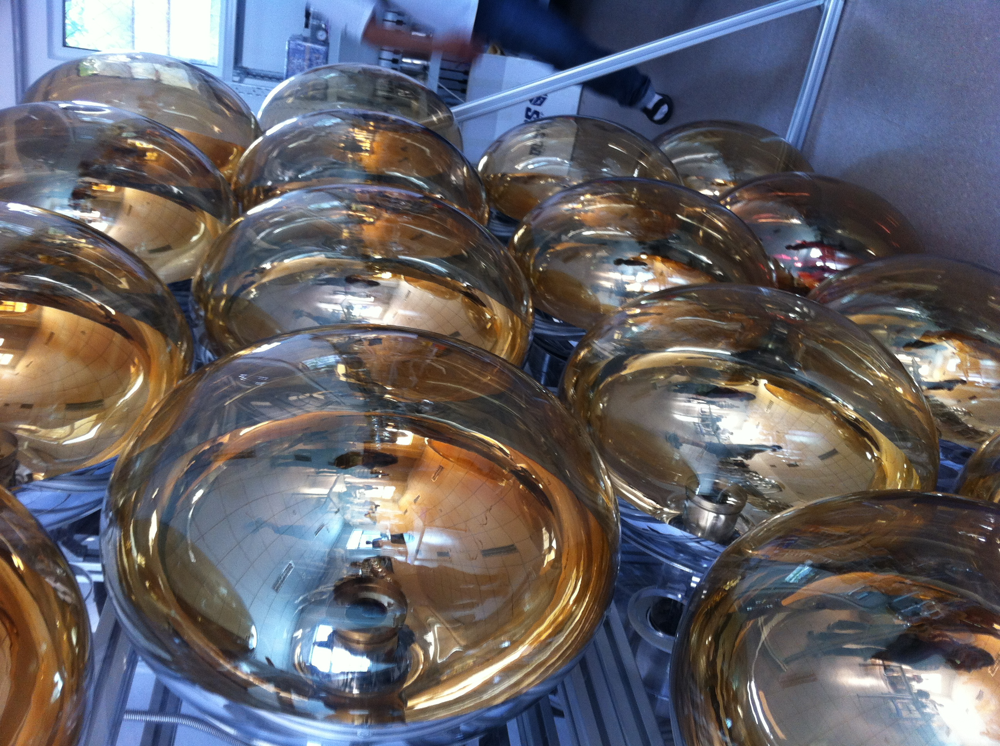
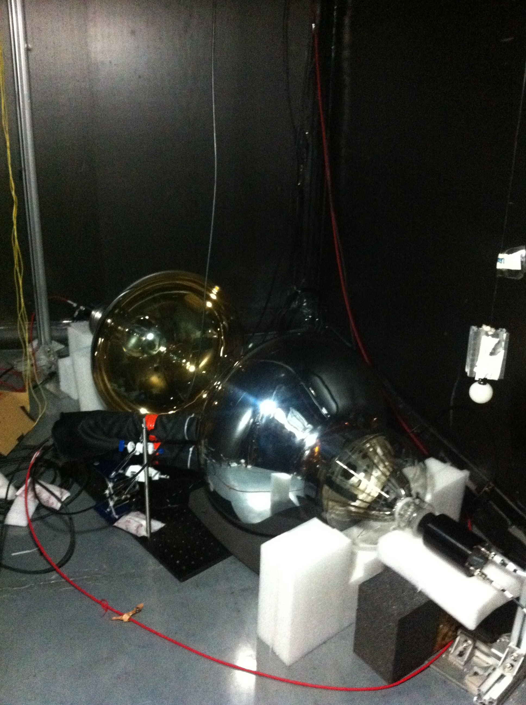
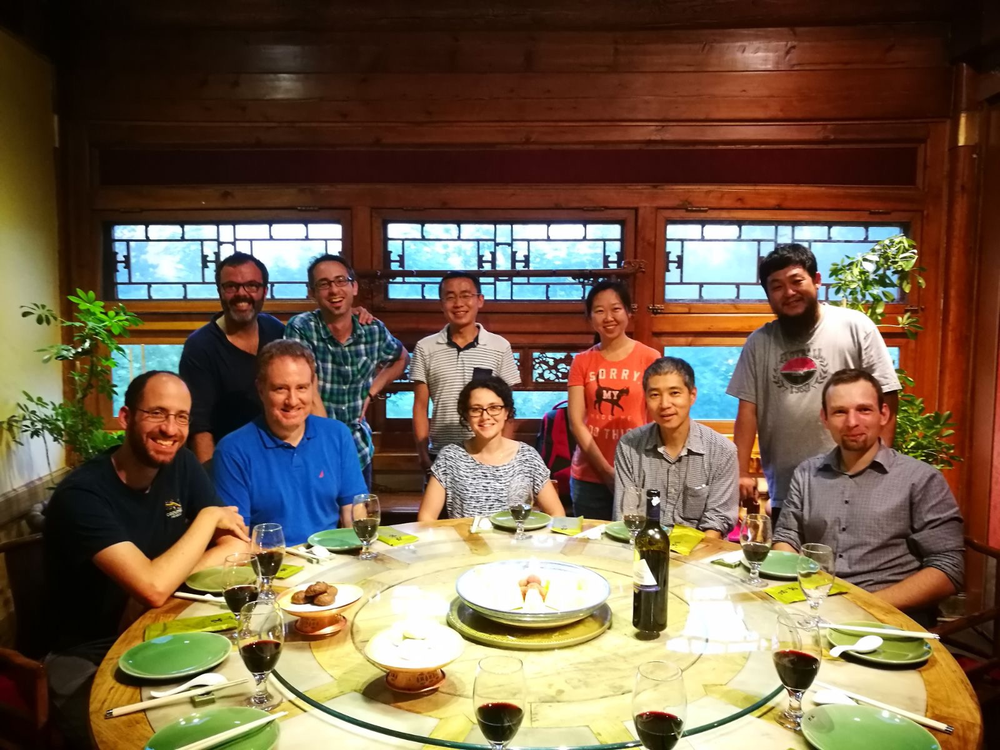
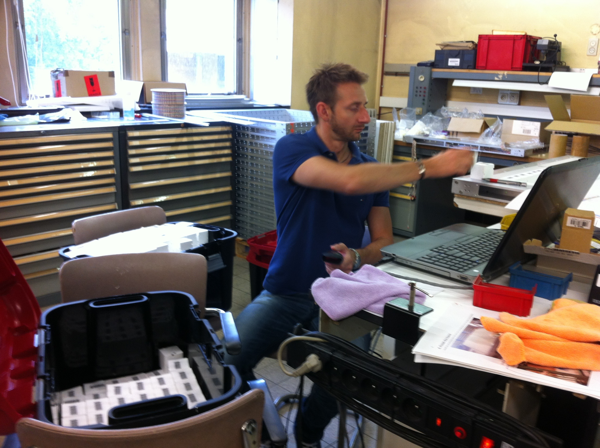
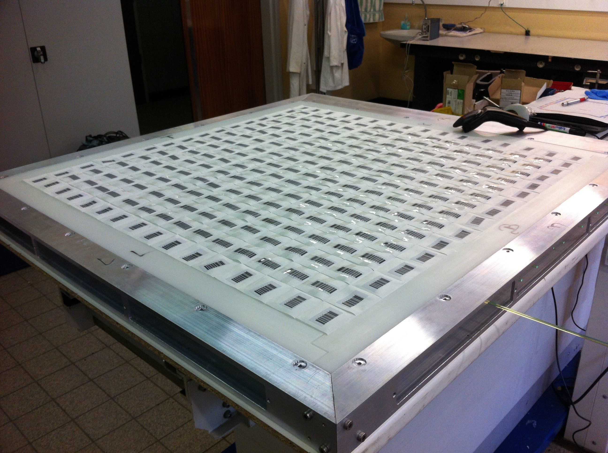
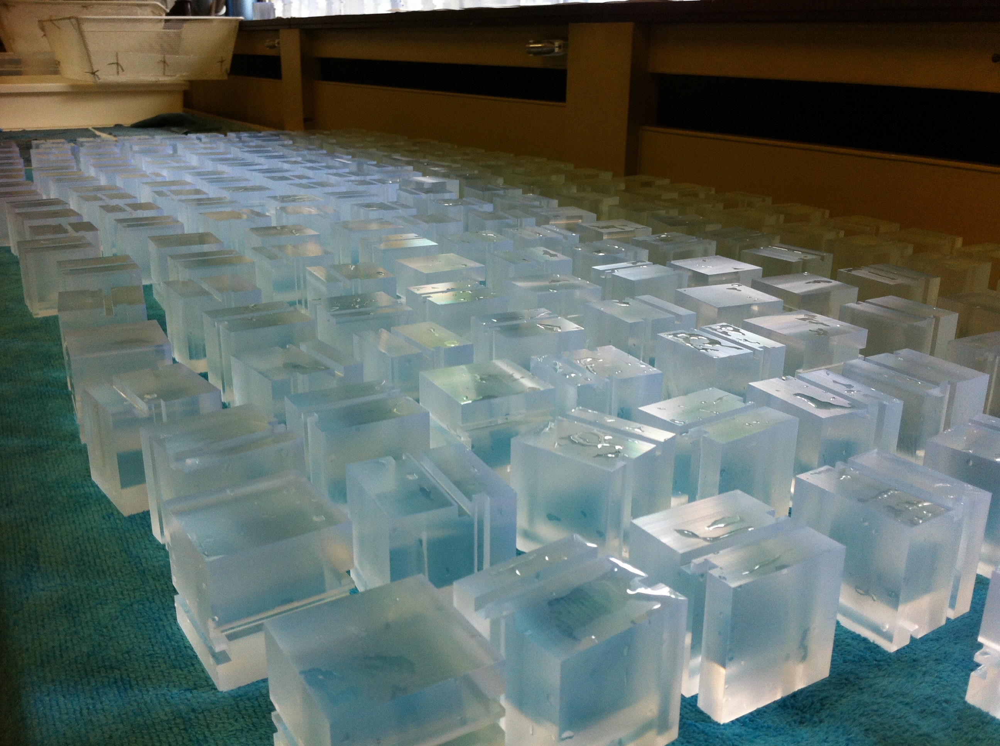
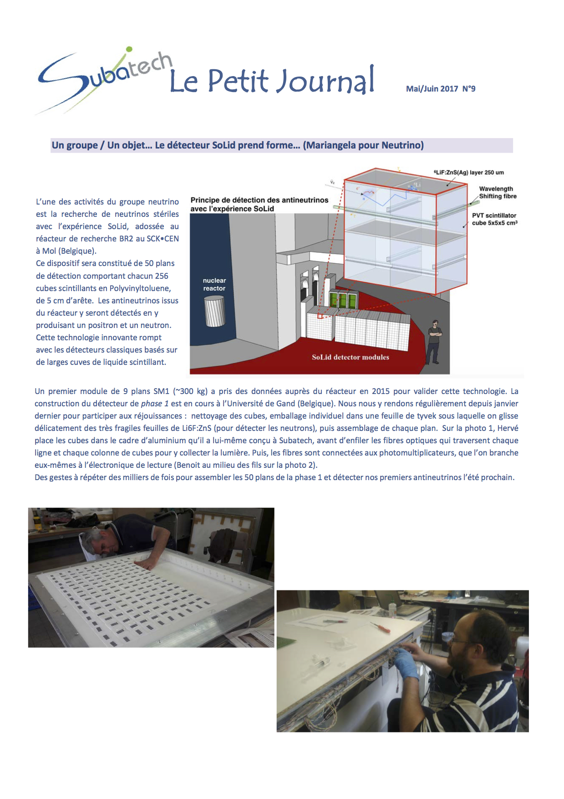
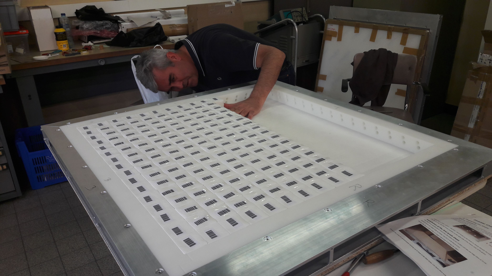
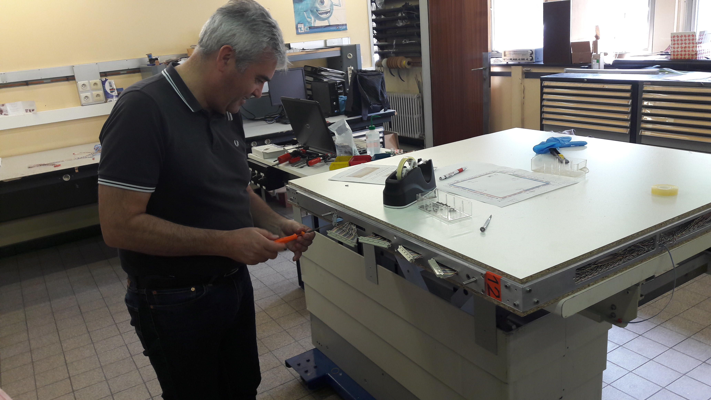
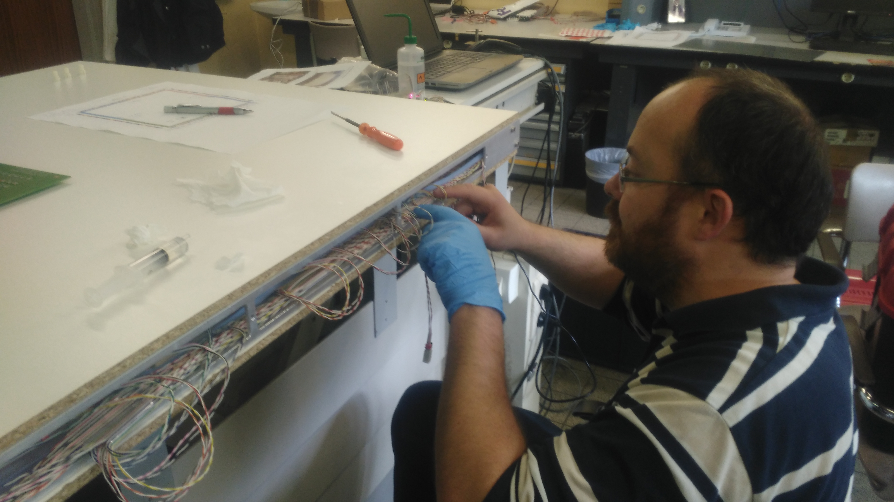

### Juillet  2017 : Reunion JUNO (Peking, China)

Deux reunions (electronique et physique) de la collaboration JUNO en Chine. Ici des photos d'une visite du laboratoire à IHEP et un diner avec nos collègues  

###         

### Juin 2017 :  Shift Solid (Ghent, Belgium)

Assemblage du detecteur SoLid --  Frederic Yermia, Mariangela Settimo

     

### Mai 2017 : SoLid sur  "Le Petit journal"  du laboratoire

### 

### Avril 2017 : Shift  SoLid (Ghent, Belgium) 

Assemblage en 3 phases: Hervé place les cubes dans le cadre d’aluminium qu’il a lui-même conçu à Subatech, avant d’enfiler les fibres optiques et brancher l’électronique de lecture (Benoit). 

 -- Hervé Carduner, Benoit Viaud 

    
