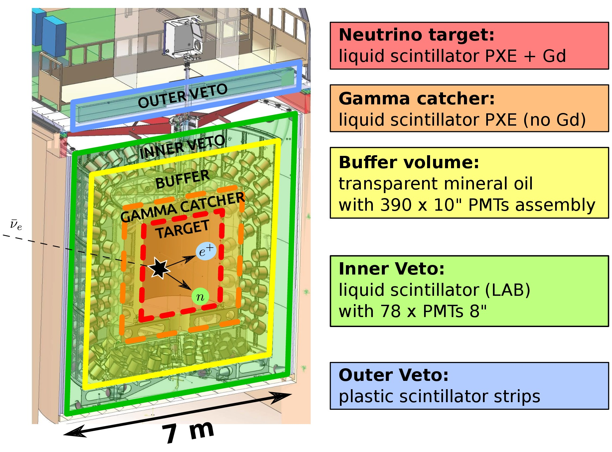

The [Double Chooz](http://doublechooz.in2p3.fr/Status_and_News/status_and_news.php) experiment is dedicated to the detection of electron antineutrinos from nuclear reactors  through two identical detectors placed at 400 m and 1050 m from the Chooz power plant in France [\[1\]](https://arxiv.org/abs/hep-ex/0606025). 

The main goal of the experiment is to measure the θ13 mixing angle, by comparing the energy spectra of the electron anti-neutrinos measured in the near (ND) and far detectors (FD). Indeed, the ND monitors the flux with nearly no oscillation while the FD is most affected by the oscillations. The accurate and precise measurement of θ13 is vital for the future efforts on neutrino physics, such as the determination if neutrinos violate the Charge-Parity conservation, and their mass distribution. 

Other activities beyond the measurement of θ13 are also ongoing in the collaboration, as the improvement in the measurement of the mean cross section per Fission, the determination of the spectrum of reactor antineutrinos.

* * *

****The detector****

The employed detection principle is inverse beta decay process: \\(\\bar{\\nu}\_e+p \\rightarrow e^++n\\) (energy threshold 1.8 MeV). The positron annhilation produces a prompt signal whereas the neutron is tagged by its capture on Gd and H nuclei (occuring from a few µs to hundreds of µs after the prompt signal). The signature of antineutrino interaction is provided by a delayed coincidence between these two events, allowing a powerful rejection of many backgrounds.

**Our activities:**

Our group is involved in the statistical analysis to mesure the θ13 mixing angle, in the correlated background induced by muons interacting in the detector or in its vicinity, and in the optimisation of the signal selection. 

In the past years, the [ERDRE group](en/research/nuclear-and-environment/erdre/about) was participating with studies on the reactor and anti-neutrino energy spectrum prediction.

**Collaborations**

Double Chooz is an international collaboration composed by France, Germany, USA, Spain, Japan, Russia and Brazil. The french institutions involved in the experiment are the CNRS/IN2P3 laboratories of APC-Paris, IPHC-Strasbourg, CENBG-Bordeaux and SUBATECH-Nantes, and the CEA/DSM-SPhN CEA/DSM-SPhN departments. 

**Contacts:**

Thiago Sogo-Bezerra ([Thiago.Sogo-Bezerra@subatech.in2p3.fr](mailto:Thiago.Sogo-Bezerra@subatech.in2p3.fr))

Frederic Yermia ([yermia@subatech.in2p3.fr](mailto:yermia@subatech.in2p3.fr)) 

**References:**

[Double Chooz](http://doublechooz.in2p3.fr/Status_and_News/status_and_news.php) official webpage

\[1\] Ardellier, F., et. al., 2006. Double Chooz: A Search for the Neutrino Mixing Angleθ13. [arXiv: hep-ex/0606025v4](https://arxiv.org/abs/hep-ex/0606025).
