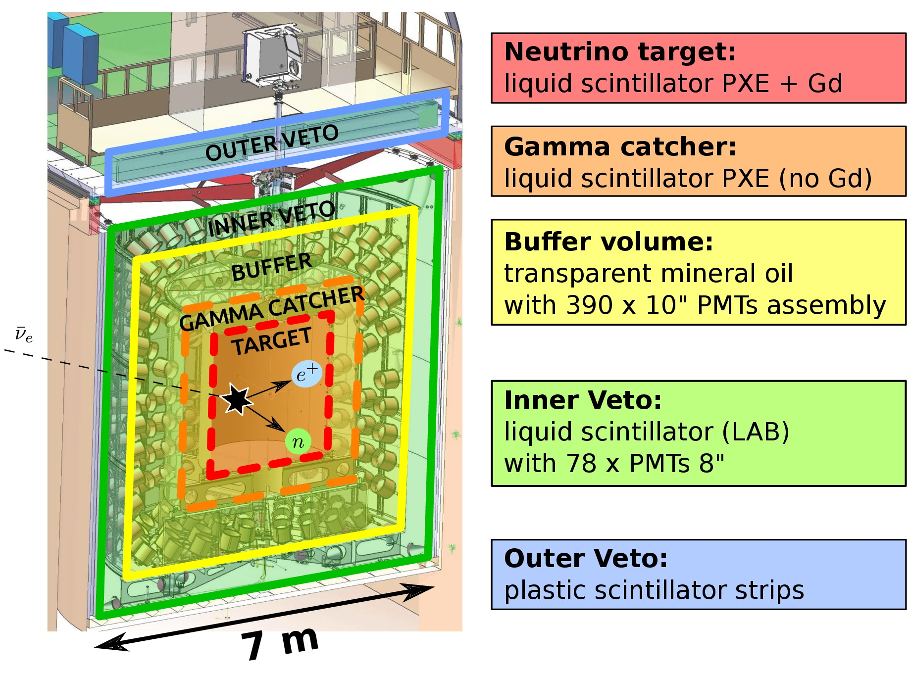

L'éxpérience [Double Chooz](http://doublechooz.in2p3.fr/Status_and_News/status_and_news.php) a pour but la détection des anti-neutrinos des réacteurs avec deux détecteurs identiques positionnés à 400 m (« détecteur proche », ND) et 1050m (« détecteur lointain », FD) à Chooz, en France [\[1\]](https://arxiv.org/abs/hep-ex/0606025). 

The main goal of the experiment is to measure the θ13 mixing angle, by comparing the energy spectra of the electron anti-neutrinos measured in the near (ND) and far detectors (FD). Indeed, the ND monitors the flux with nearly no oscillation while the FD is most affected by the oscillations. The accurate and precise measurement of θ13 is vital for the future efforts on neutrino physics, such as the determination if neutrinos violate the Charge-Parity conservation, and their mass distribution. 

Other activities beyond the measurement of θ13 are also ongoing in the collaboration, as the improvement in the measurement of the mean cross section per Fission, the determination of the spectrum of reactor antineutrinos.

Son objectif scientifique principale est la mesure de l'angle de mélange θ13 à travers la comparaison des spectres des antineutrino electroniquemesurés dans le deux détecteurs: à cause de l'oscillations, le détecteur lointain pourras mesurer une disparition des antineutrinos electroniques  par rapport au détecteur proche. La mesure precise 

* * *

**Le détecteur**

Le principe de detection est la désintegration beta inverse: \\(\\bar{\\nu}\_e+p \\rightarrow e^++n\\) (seuil en energie de 1.8 MeV). L'annhilation du positron produit un signal rapide ("prompt") et le neutron est détecté via sa capture (de quelque µs à quelque centaine de µs après le signal prompt) par des noyaux de Gd et de H dissous dans le liquide scintillant. La coincidence des ces deux signaux permet d'identifier les neutrinos et de s’affranchir d’une proportion importante du bruit de fond.

**Nos activités:**

Le groupe est responsable de l'analyse statistique pour la mesure de l'angle de melange θ13. On est aussi investi sur la mesure du bruit de fond corrélé des muons interagissants dans le détecteur ou dans ses environs et dans l'optimisation de la selection du signal. 

Dans les derniers années , le  groupe [ERDRE](en/research/nuclear-and-environment/erdre/about) a participé aux étudiés des predictions des spectres des anti-neutrino du réacteur. 

**Collaborations**

Double Chooz est une collaboration internationale réunissant des chercheurs français, allemands, américains, espagnols, japonais, russes, brésiliens. En France, les institutions impliqués sont les laboratoire du CNRS/IN2P3 de APC-Paris, IPHC-Strasbourg,  CENBG-Bordeaux and SUBATECH-Nantes,  et les départements de CEA/DSM-SPhN CEA/DSM-SPhN. 

 ****Contacts:****

Thiago Sogo-Bezerra ([Thiago.Sogo-Bezerra@subatech.in2p3.fr](mailto:Thiago.Sogo-Bezerra@subatech.in2p3.fr)) 

Frederic Yermia ([yermia@subatech.in2p3.fr](mailto:yermia@subatech.in2p3.fr)) 

**References:**

[Double Chooz](http://doublechooz.in2p3.fr/Status_and_News/status_and_news.php) official webpage

\[1\] Ardellier, F., et. al., 2006. Double Chooz: A Search for the Neutrino Mixing Angleθ13. [arXiv: hep-ex/0606025v4](https://arxiv.org/abs/hep-ex/0606025).
