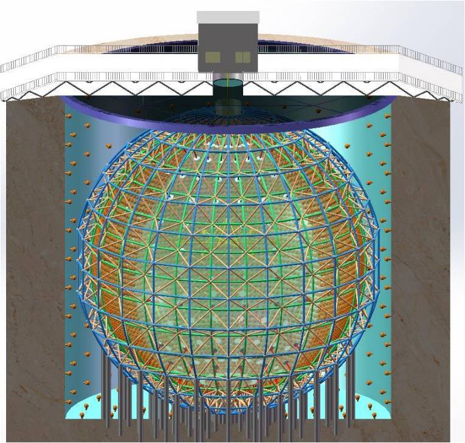
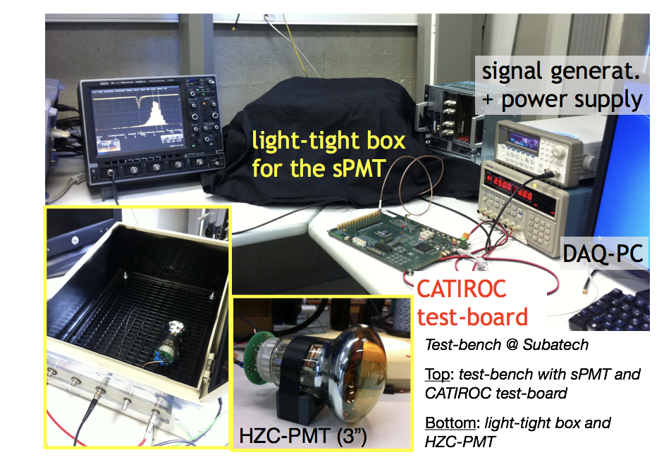

Le **Jiangmen Underground Neutrino Observatory (JUNO)**, en construction à Jiangmen (dans le Sud de la Chine), est une expérience polyvalente dédiée à la détermination de la hiérarchie de masse des neutrinos et à la mesure précise des paramètres d'oscillation des neutrinos. La mesure de la hiérarchie de masse réclame une résolution en énergie inégalée jusqu'à présent (de l'ordre de 3%!à(MISSING) 1 MeV) et une incertitude de 1%!e(MISSING)n absolu sur l'échelle en énergie. Grace à son design et à son très grand volume de détection, JUNO est également un observatoire pour les neutrinos issus de supernovae, pour les géo-neutrinos et pour la recherche de neutrinos exotiques. 

* * *

**Le détecteur**

JUNO est un détecteur de neutrino à ligne de base intermédiaire, placé à 53 km des neutrales nucléaires de Yangjiang et de Taishan, dans un tunnel situé à 700m de profondeur. Il est constitué d'une sphère en verre acrylique de 35.4 m de diamètre remplie de 20.000 tonnes de liquide scintillant. La sphère est entourée par 17.000 photomultiplicateurs de 20 pouces de diamètre (51 cm, appelés Large PMTs or LPMT) et 25.000 photomultiplicateurs de 3 pouces (7.6 cm appelés Small PMT or SPMT). Le détecteur est immergé dans une piscine d'eau instrumentée avec 2000 LPMT agissant comme véto pour les muons.

 with SPMT inserted in the interspaces between and LPMTs.")

Un ensemble de trajectographie, utilsant des plastiques scintillants, couvre le dessus du détecteur et fournit des informations supplémentaires sur le bruit de fond induit par les muons.

L'observation "stéréoscopique" est motivée par la nécessité d'une très grande controle des incertitudes : les LPMT permettent la collection d'une grande quantité de lumière et garantissent des erreurs stochastiques conformes aux exigences des objectifs scientifiques; les SPMT fourniront les informations complémentaires indispensables au controle des erreurs systématiques.

**Nos Activités** 

Notre équipe est impliqué dans des activités de **contruction et de simulation**. Nous avons la responsabilité du système d'acquisition des SPMT et nous participons aux tests des validation de l'électronique et des photomultiplicateurs en collaboration étroite avec les autres laboratoires en France, en Europe et en Asie. Nous bénéficions du support du service électronique du laboratoire pour ces activités.

****La collaboration****

Ce projet ambitieux est le résultat d'un effort international important  impliquant 450 collaborateurs, 66 instituts et 14 pays. En France, les groupes  de l'APC-Paris, d'OMEGA-Paris et du CENBG-Bordeaux participent à l'expérience.

**Contact: **

Mariangela Settimo ([mariangela.settimo@subatech.in2p3.fr](mailto:mariangela.settimo@subatech.in2p3.fr)) 

Frederic Yermia ([yermia@subatech.in2p3.fr](mailto:yermia@subatech.in2p3.fr)) 

****Référence****

[Le site web officiel de JUNO](http://juno.ihep.cas.cn)

The JUNO collaboration, "Neutrino physics with JUNO",  J. Phys. G 43 (2016) 030401, [arXiv: 1507.05613](https://arxiv.org/abs/1507.05613)
