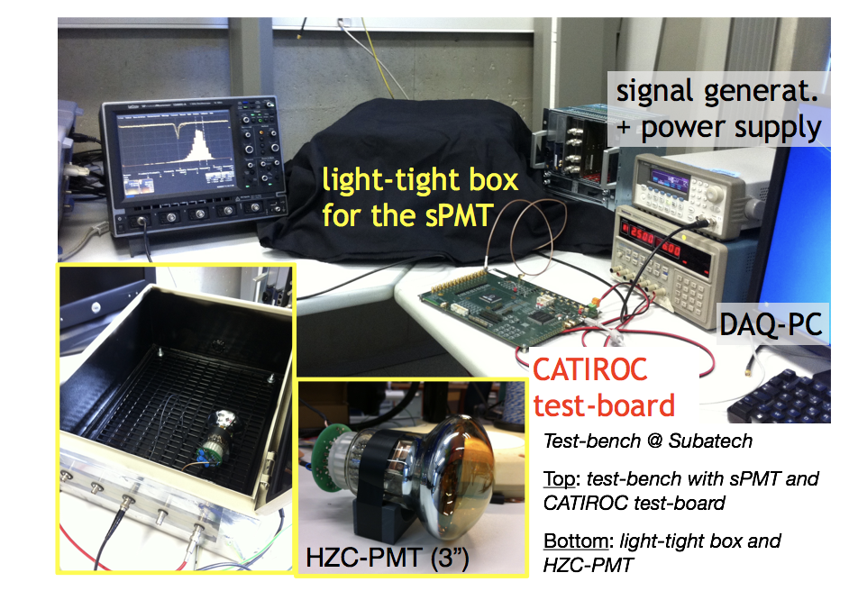

The **Jiangmen Underground Neutrino Observatory (JUNO)**, under construction in Jiangmen (in the South of China), is a multipurpose neutrino experiment aiming at the determination of the _neutrino mass hierarchy_ in vacuum oscillation and the precise measurement of _oscillation parameters_. The mass hierarchy measurement requires an unprecedented resolution on the energy (at the level of 3%!a(MISSING)t 1 MeV) and an absolute energy scale uncertainty better than 1%! (MISSING)Because of its design and its large detection volume, JUNO is also an observatory for _supernova neutrinos, geo-neutrinos_, and to perform exotic neutrino searches. 

* * *

**The detector**

JUNO is a medium-baseline neutrinos detector, placed at 53 km from the Yangjiang and Taishan nuclear power plants, in a tunnel 700m underground. It consists of a 35.4 m diameter acrylic glass sphere filled with 20.000 tonnes of liquid scintillator. The sphere is surrounded by 17000 photo-multipliers having a diameter of 20-inches (51 cm, called Large PMTs or LPMT) and 25000 photo-multipliers (called Small PMT or SPMT) of 3-inches (7.6 cm). The central detector is submerged in a water pool instrumented with 2000 LPMT, which acts as muon veto.

 with SPMT inserted in the interspaces between and LPMTs.")

A top tracker system, made of plastic scintillators, covers the top of the detector and can provide additional informations for muon-induced background.

The \`\`stereo'' design is motivated by the need of a precise control of the uncertainties: the LPMT will collect a large amount of the light and will ensure a stochastic error within the requirements for the scientific goals, and the SPMT will provide additional informations for the control of the systematic uncertainties. 

**Activities** 

Our group is involved in **construction and simulations** activities. We have the responsibility of the _data acquisition_ of the 3-inches PMT system and we  participates to the _validation tests of the electronics and the PMTs_, in strict collaboration with the other laboratories in France, Europe, Asia and South America and with the support of the electronics workshop of our laboratory.

**Collaboration**

This ambitious project is the result of an big international effort, supported by around 450 collaborators, 66 institutions and 14 countries. In France the groups participating to the experiment are APC-Paris, OMEGA-Paris, CENBG-Bordeaux.

**Contact: **

Mariangela Settimo ([mariangela.settimo@subatech.in2p3.fr](mailto:Thiago.Sogo-Bezerra@subatech.in2p3.fr))

Frederic Yermia ([yermia@subatech.in2p3.fr](mailto:yermia@subatech.in2p3.fr)) 

**References:**

[JUNO official website](http://juno.ihep.cas.cn)

The JUNO collaboration, "Neutrino physics with JUNO",  J. Phys. G 43 (2016) 030401, [arXiv: 1507.05613](https://arxiv.org/abs/1507.05613)

M. He for the JUNO Collaboration, "Double Calorimetry System in JUNO", [arXiv:1706.08761](https://arxiv.org/pdf/1706.08761.pdf)
