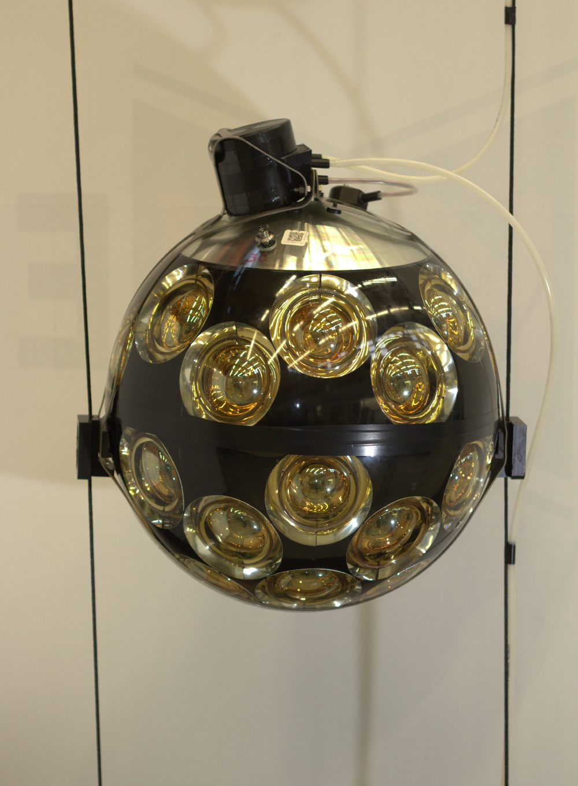

[KM3NeT](http://www.km3net.org) (Cubic KiloMetre Neutrino Telescope) est à la fois une infrastructure de recherche et la collaboration réunissant les équipes engagées dans la réalisation de cette infrastructure. Elle englobe deux télescopes à neutrino gigantesques installés aux fonds de la mer Méditerranée au large de Toulon et de la pointe Sud de la Sicile. De grands volumes sont instrumentés de modules optiques capables d'enregistrer la lumière Cerenkov produite par la décroissance des neutrinos dans la matière. L'un de ces ensembles [ORCA](https://www.km3net.org/research/physics/particle-physics-with-orca/) (Oscillation Research with Cosmics in the Abyss) s'intéresse aux propriétés des neutrinos (nombre, hierarchie de masse) tandis que le second [ARCA](https://www.km3net.org/research/physics/astronomy-with-arca/) (Astroparticle Research with Cosmics in the Abyss) sera dédié à l'observation des neutrinos cosmiques.

Pour observer la lumière produite, des modules optiques comprenant 31 photomultiplicateurs et leur électronique de lecture et de contrôle ont été développés. Ces modules sont associés par groupe de 18 pour former des lignes de détection. 115 de ces lignes sont prévues pour former l'ensemble ORCA et 230 lignes serviront pour réaliser ARCA. KM3NeT est actuellement en cours de construction. Les premières lignes ont été immergées en 2017 et seront rapidement completées pour former la Phase 1 des détecteurs. Au terme de plusieurs années de construction, les deux ensembles atteindront leur taille finale et leur pleines capacités d'observation.

Subatech est officiellement impliqué depuis Février 2017 dans la [collaboration KM3NeT](https://www.km3net.org/about-km3net/collaboration/) constituées d'une cinquantaine d'équipes de recherche (principalement européennes) dont 4 laboratoires de l'in2p3. L'équipe nantaise comprenant des physiciens et des personnels techniques, participe à la construction de KM3NeT en ayant mis en place un site d'assemblage des modules optiques. Avec les premières lignes en fonctionnement et les premières données, les physiciens s'impliquent également dans les programmes de physique autour notamment des aspects multi-messagers étudiés en collaboration avec les autres grands observatoires.

Contact : Lilian martin ([lilian.martin@subatech.in2p3.fr](mailto:lilian.martin@subatech.in2p3.fr)) ou Richard Dallier ([Richard.Dallier@subatech.in2p3.fr](mailto:Richard.Dallier@subatech.in2p3.fr))
