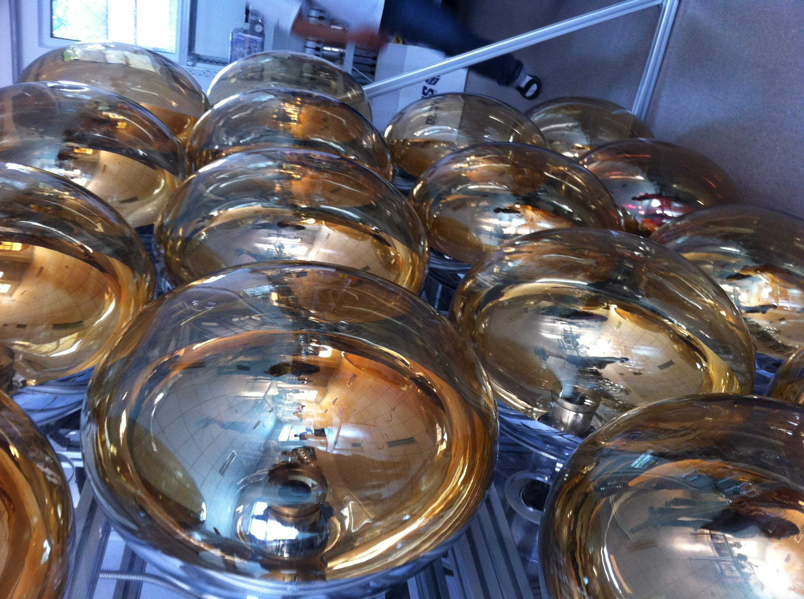
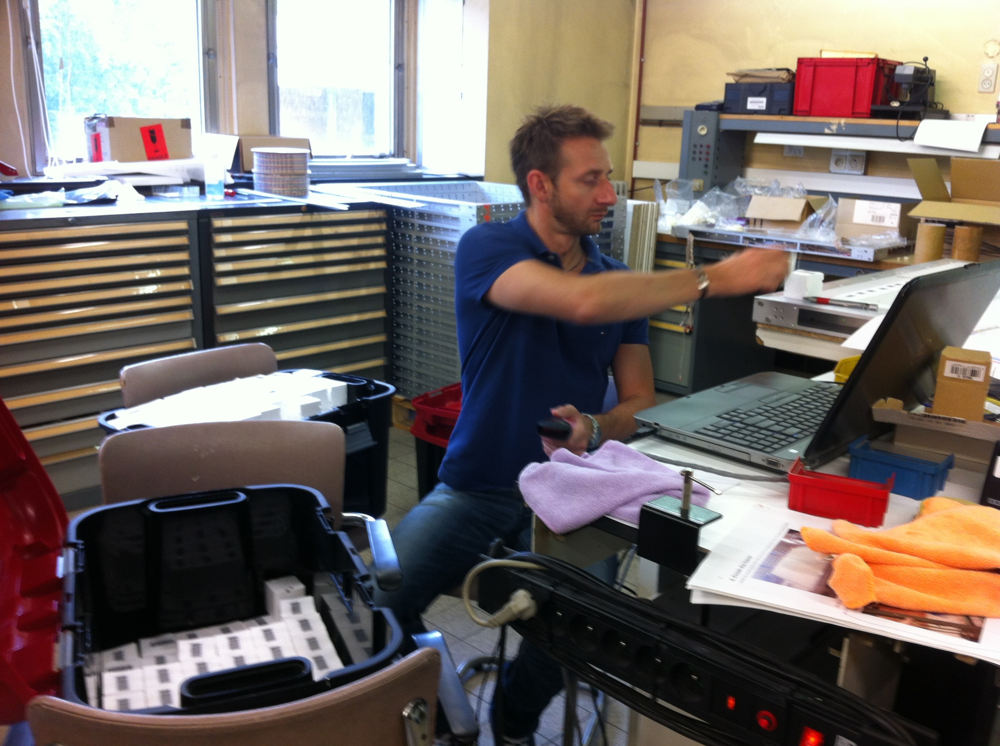
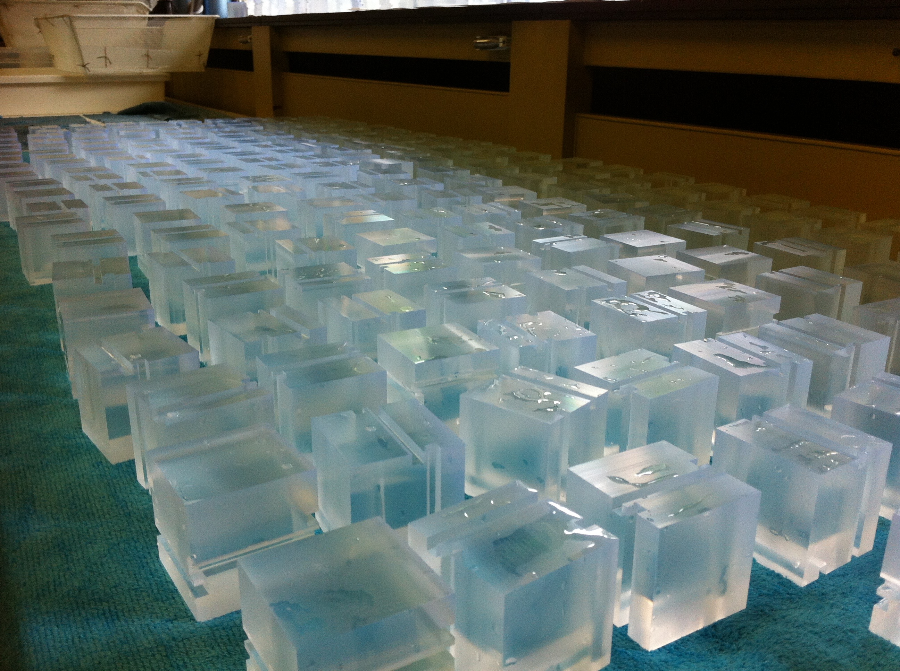
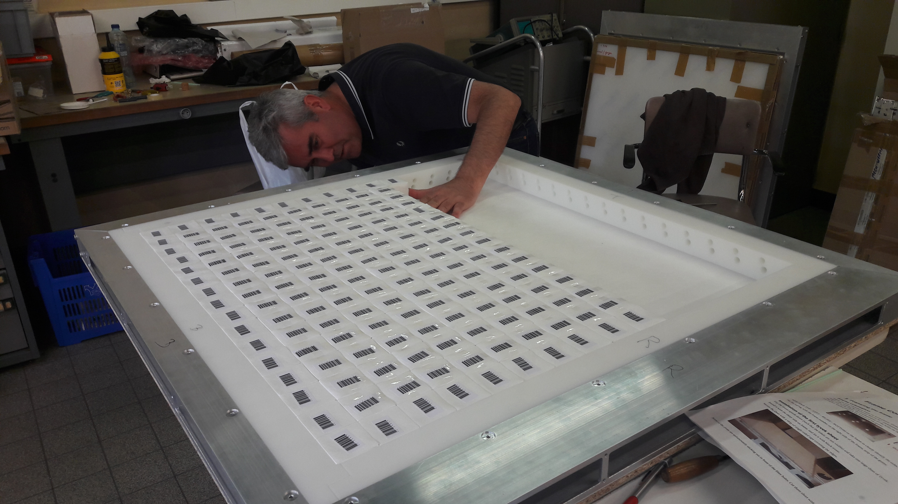
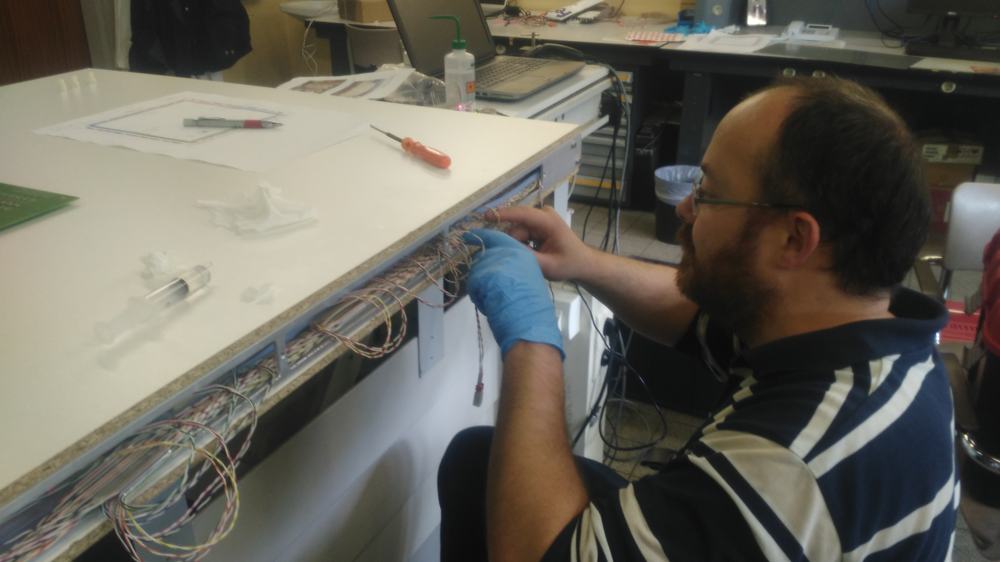

### July 2017 : Meeting JUNO (Beijing, China)

At the electronics and the collaboration meetings in China:  the visit of the lab and a nice dinner 

###         

### June 2017 :  Shift Solid (Ghent, Belgium)

Working hard for another plane of the SoLid experiment --  Frederic Yermia, Mariangela Settimo

     

### May 2017 : SoLid on the "Le Petit journal"  of the laboratory 

### 

### April 2017 : Shift  SoLid (Ghent, Belgium) 

Here three phases for assemblying one of the plane of the SoLid experiments. -- Hervé Carduner, Benoit Viaud 

