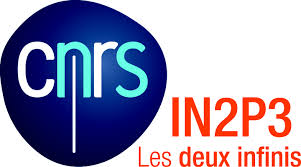

The ''_Neutrino_'' group, officially formed in 2016, is the result of the will to reinforce the fundamental neutrino physics activity in SUBATECH. It was motivated and made possible by the increasing number of reserchers interesting in the subject and joining neutrino experiments.  

Neutrino physics, especially the observation of neutrino oscillations, has provided one of the first evidences that our knowledge of the Universe is uncomplete. 

 ")

Understanding the oscillations of neutrinos, their masses and nature is one of the most effective way to have access to a physics ''beyond the standard model'' and to answer to the big questions on our Universe, as the asymmetry between matter and antimatter, the dark matter, as well as the understanding of the most violent phenomena in astrophysical objects. 

Some members of the group are involved in neutrino physics from nuclear reactors since several years. Other members were previously participating in astroparticle and particle physics experiments, which perfectly fit with the broad potentialities offered by the neutrinos research field. 

                  
