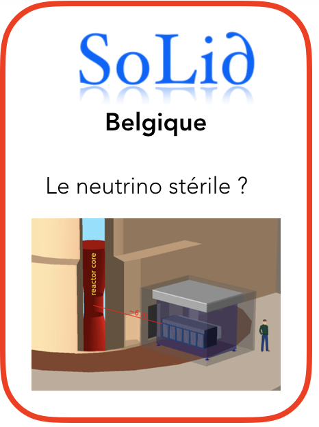
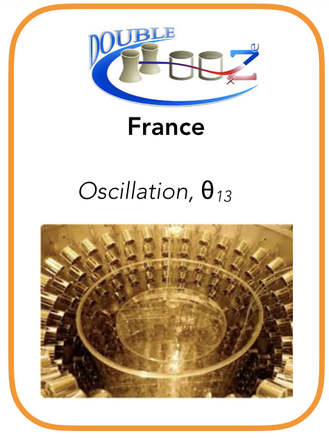
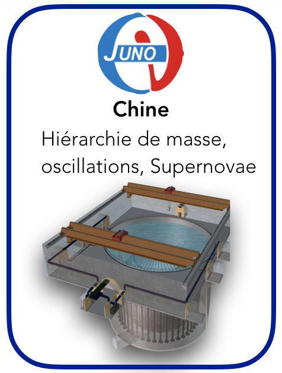
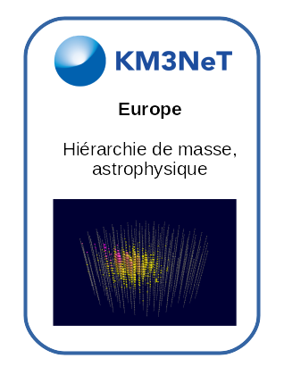

Our research activities are related to the **the study of neutrino oscillations from nuclear reactors and astrophysical sources,** and to the application of nuclear physics to the **[electro-nuclear scenarios](/recherche/sen/systeme-et-scenarios.xx)**.

Our group is mostly involved in experiments dedicated to:

* * *

**1) Low-energy neutrinos (MeV) and neutrinos from nuclear reactors**

_**Experiments for the detection of neutrinos from nuclear reactors but which are also highly competitive also for the observation of atmospheric, solar and astrophysical neutrinos (e.g., from Supernovae), geo-neutrinos as well as neutrinos from dark matter or exotic physics scenarios.**_

We aim at measuring the mixing angles of the PMNS, the Δm2 terms and the mass hierarchy, for testing the scenario of a new neutrino type, the so-called "sterile neutrino" and for detecting astrophysical neutrinos from Supernovae. The new experiments, currently under construction, have a detection volume very large which would allow the detection of geo-neutrinos, and the test of exotic-physics. 

We are primarily involved in 3 experiences with detectors located at very short (few meters), short (few hundreds - 1 km) and medium (~ 50 km) distances from nuclear reactors.

        

* * *

**2) High-energy astrophysical neutrinos **

**Aiming at the detection of neutrinos (of atmospheric or astrophysical origin) within the context of the[ KM3Net project](/recherche/neutrino/la-collaboration-km3net.fr), a network of telescopes in the deep Mediterranean sea****. **These neutrino telescopes have also access to very high energy neutrinos, produced only in violent astrophysical phenomena, (in the TeV - EeV range).  

                        
