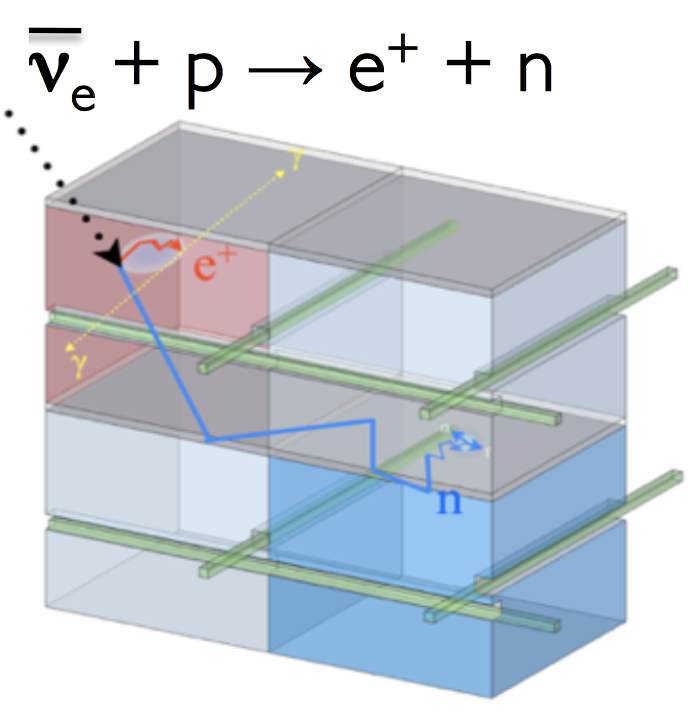
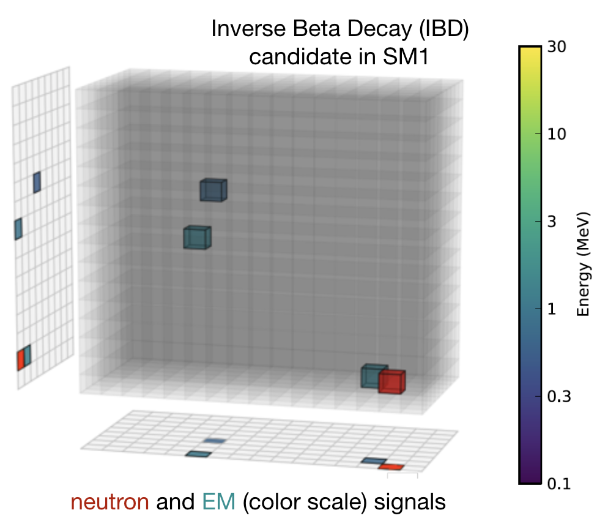

")

The **SoLid** experimentwill address and solve one of the most outstanding issue in neutrino physics: the experimental neutrino oscillation anomalies that are pointing towards the existence of a new neutrino state (_neutrino sterile_) with a mass of around 1 eV. The best way to tackle this problem is to make a measurement close to a reactor core < 10m where little is known and where the oscillation effect would be most prominent. 

The design and the set up at the BR2 research-dedicated reactor (in Mol, Belgium) made the experiment one of the most suitable for the sterile neutrino search. Moreover SoLid  will provide the best flux measurement of 235U, the key ingredient of the anti-neutrino flux predictions for future experiments.

* * *

**The detector**

A novel techology is used in SoLid to overcome the technical challanges related to the detecteur location: the operation on the surface and very close to the reactor core requires a highly performant background rejection and a miniaturisation of the detection system. The detector is indeed segmented in PVT cubes of 5 cm side, optically separated and having a layer of 6LiF:ZnS(Ag) which is responsible of the neutron capture.  

With the combination of high granularity, high neutron-gamma discrimination and precise localization of the Inverse Beta Decay (IBD) products, a better experimental sensitivity can be achieved compared to other state-of-the-art technology.

A reduced-size prototype (4x4x4 cubes ; 8kg) and a test with a full-size prototype, SM1, funded by Subatech (Mines Carnot) and installed at 5.5 m from the BR2 reactor core, demonstrated the performance and the feasibility of the technique \[1-4\]. 

**Our Activities**

Our group has a central role in the collaboration with a strong participation in the **detector construction and analysis**. After a participation to the R&D phase, including the design and construction of the mechanical structure of the detector, we are now contributing to the cube preparation and modules assembly (see news/gallery section) in Ghent (Belgium). The group has the physics coordination of the experiment and is involved in the energy calibration of the PVT cubes and in the GEANT4 simulation of the detector.

**Collaboration**

The SoLid experiment gather an international collaboration of about 50 physicists distributed in 10 laboratories comprising three partners in France (IN2P3 laboratories), six partners in Europe (UK and Belgium) and one in the United States. LAL and Virginia Tech have joined SoLid this year. 

**Contact**

Frederic Yermia ([Frederic.Yermia@subatech.in2p3.fr](mailto:Frederic.Yermia@subatech.in2p3.fr))

Benoit Viaud ([viaud@subatech.in2p3.fr](mailto:viaud@subatech.in2p3.fr))

**References** 

\[1\] [http://pos.sissa.it/archive/conferences/234/071/EPS-HEP2015\_071.pdf](http://pos.sissa.it/archive/conferences/234/071/EPS-HEP2015_071.pdf)\[2\] [http://pos.sissa.it/archive/conferences/234/080/EPS-HEP2015\_080.pdf](http://pos.sissa.it/archive/conferences/234/080/EPS-HEP2015_080.pdf)\[3\] [http://pos.sissa.it/archive/conferences/234/086/EPS-HEP2015\_086.pdf](http://pos.sissa.it/archive/conferences/234/086/EPS-HEP2015_086.pdf)\[4\] [http://pos.sissa.it/archive/conferences/234/083/EPS-HEP2015\_083.pdf](http://pos.sissa.it/archive/conferences/234/083/EPS-HEP2015_083.pdf)
