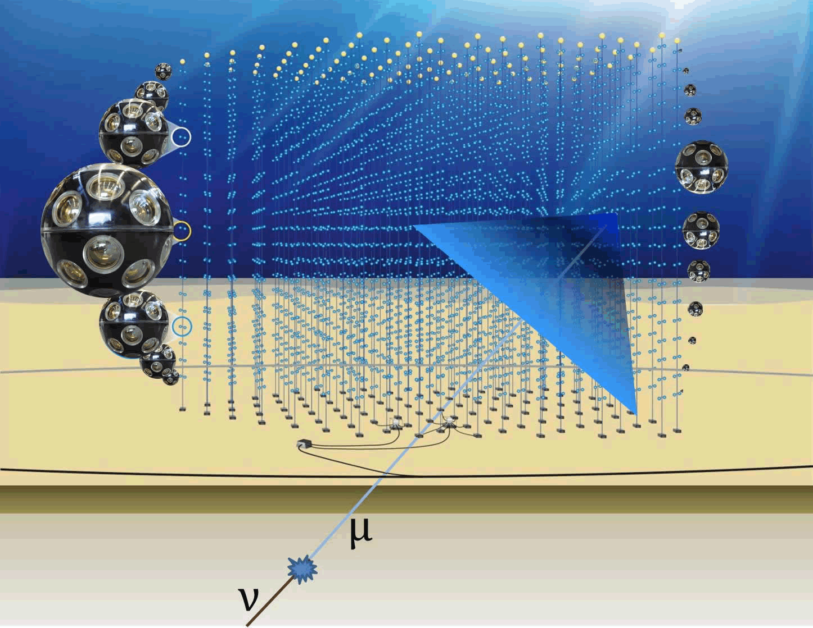
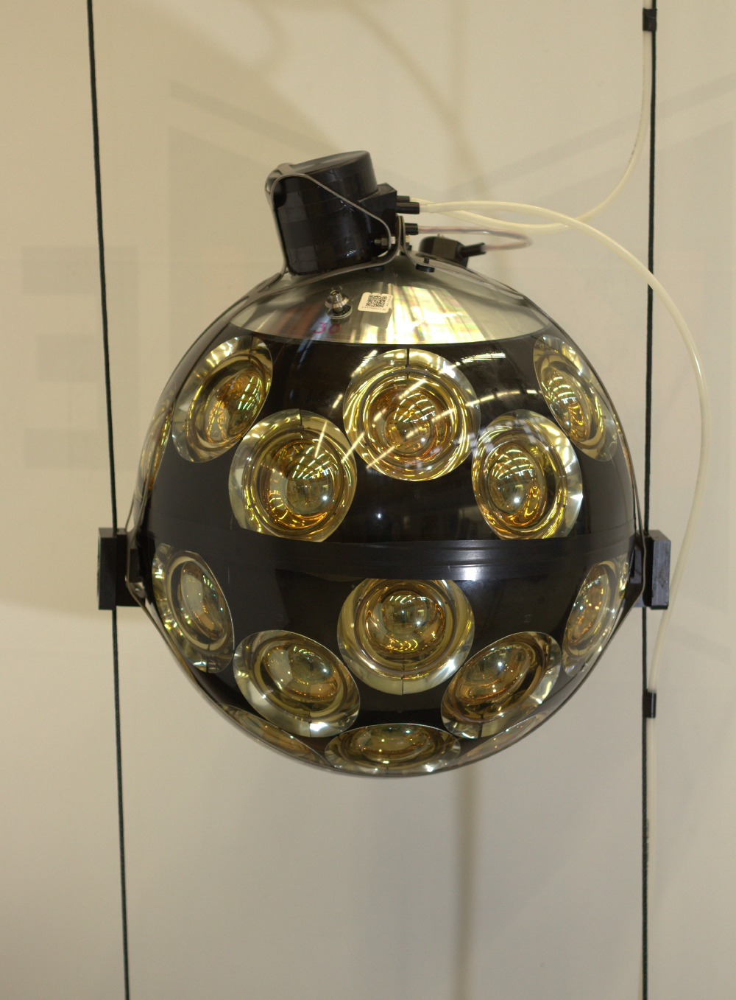

[KM3NeT](http://www.km3net.org) (Cubic KiloMetre Neutrino Telescope) is both a research infrastructure and a collaboration of research teams engaged in the construction of this infrastructure. It embraces two large neutrino telescopes installed on the mediterranean seabed off the coast of Toulon and of the south cap of Sicily. Very large volume are equipped with optical modules able to detect and to register the Cerenkov light produced by the decay of neutrinos in matter. The [ORCA](https://www.km3net.org/research/physics/particle-physics-with-orca/) (Oscillation Research with Cosmics in the Abyss) telescope will allow to study neutrino fundamental properties (number, mass hierarchy) while the [ARCA](https://www.km3net.org/research/physics/astronomy-with-arca/) (Astroparticle Research with Cosmics in the Abyss) telescope is dedicated to high energy cosmic neutrino observations.

To detect the produced light, optical modules have been developed that include 31 photomultipliers and their digitizing and control electronics. Modules are grouped by 18 to form lines (detection units). 115 detection lines are expected to form the ORCA telescope while 230 detection lines will be needed to complete the ARCA telescope. KM3NeT is currently under construction. The first detection units have been immersed in 2017 and will be soon followed by other units to completed the first construction phase of the telescopes. After few years of construction, the two telescopes will reach their nominal sizes and their full observation capabilities.

Subatech is an officlal member [KM3NeT collaboration](https://www.km3net.org/about-km3net/collaboration/) since February 2017. The collaboration is made of about 50 research teams (mostly from europeen countries) including 4 laboratories from the in2p3. The Subatech team (physicists, engineers and technicians) is involved in the construction of KM3NeT namely by setting up an optical module assembly site. With the first detection units in operation and the first interesting data, physicists will be involved in the physics analysis key programs especially in the multi-messenger efforts developed in collaboration with other large observatories.

Contact : Lilian martin ([lilian.martin@subatech.in2p3.fr](mailto:lilian.martin@subatech.in2p3.fr)) ou Richard Dallier ([Richard.Dallier@subatech.in2p3.fr](mailto:Richard.Dallier@subatech.in2p3.fr))
