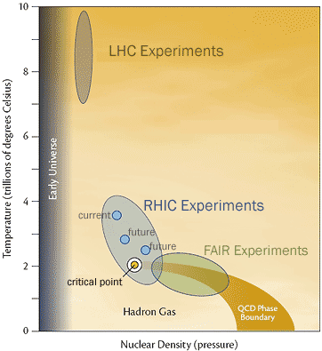

 Today, a ten of reasearchers, assistant professors and professors of the [Université de Nantes](http://www.univ-nantes.fr) , [ Ecole de Mines ](http://www.emn.fr) and the [ CNRS](http://www.cnrs.fr)/[IN2P3](http://www.in2p3.fr) are members of the Plasma group of Subatech. The main goal of our research is to study the phase diagram of the hadronic matter (state of matter and very high temperature: thousands of billions of celsius degrees, and/or high pressures: more than billions of billions of billions of atmospheres) via the heavy ion collisions at ultra relativistic energies. In particular we aim at characterizing a state of matter called the Quark Gluon Plasma, that existed after the first nanoseconds and until tens of microseconds after the BigBang of the Universe. For this reason we are deeply involved in the heavy ion program at the [ Large Hadron Collider (LHC)](http://public.web.cern.ch/public/fr/LHC/LHC-fr.html), [ CERN](http://www.cern.ch) (Switzerland). We are members of the [ ALICE ](http://aliweb.cern.ch/) collaboration. ALICE is the only LHC experiment designed for the heavy ion physics. We participated in its construction that ended in 2008, and have developed software of the ALICE official reconstruction code, online ALICE software and physics analysis software. We have a major role in the physics analyses related to hard probes of QGP, like photons, jets, open heavy flavours and quarkonia.
