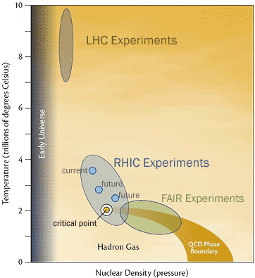

 Aujourd’hui, le groupe plasma est constitué d’une dizaine d’enseignants-chercheurs et chercheurs de l’[Université de Nantes](http://www.univ-nantes.fr), de [l'IMT Atlantique](http://www.imt-atlantique.fr) et du [CNRS](http://www.cnrs.fr)/[IN2P3](http://www.in2p3.fr), et de plusieurs post-doctorants et d'étudiants en thèse. Son but principal est l'étude du diagramme de phases de la matière hadronique via les collisions entre ions lourds aux énergies ultra relativistes

Pour cette raison, nous sommes fortement impliqués dans le programme d’ions lourds au [Large Hadron Collider (LHC)](http://public.web.cern.ch/public/fr/LHC/LHC-fr.html) du [CERN](http://www.cern.ch) (Suisse) via la seule expérience du LHC conçue pour étudier de la matière hadronique à haute température. La finalisation de la construction du détecteur [ALICE](http://aliweb.cern.ch/) en 2008 a été accompagnée par une forte implication dans les développements du logiciel de reconstruction et des analyses qui nous permettront de jouer un rôle majeur dans les analyses de physique des sondes dures les plus prometteuses au LHC depuis 2010 : les photons, les jets, les saveurs lourdes ouvertes et les quarkornia.
