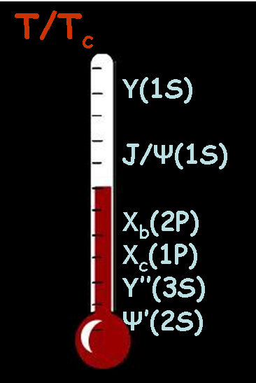
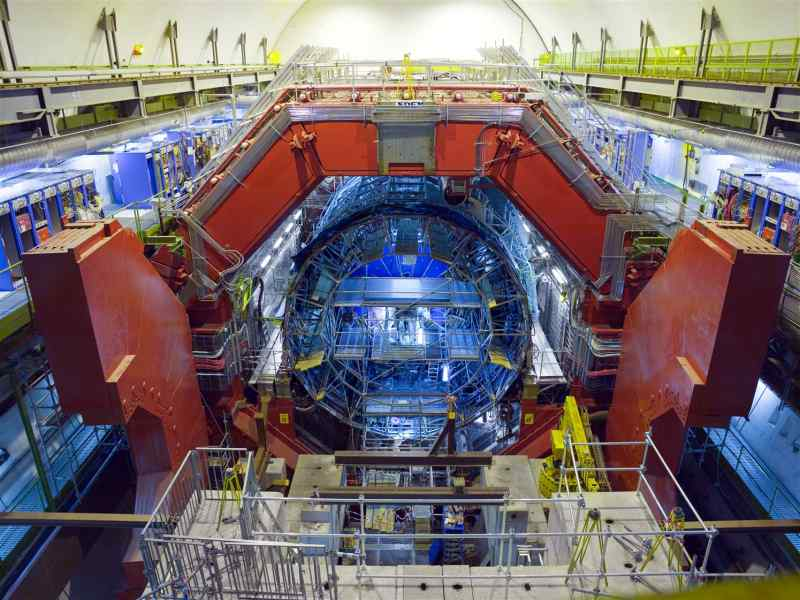

Un état déconfiné de la matière nucléaire, le plasma de quarks et de gluons (PQG), devrait exister à très haute température et densité d’énergie, selon les calculs de QCD sur réseau. Il est attendu que cet état atypique de la matière soit produit aux premiers  instants de collisions d’ions lourds ultra-relativistes. Cette prédiction a motivé, depuis plus de 25 ans, la mise en place d’un important programme expérimental dédié à l’étude des collisions d’ions lourds. Des évidences expérimentales ont été observées à l’accélérateur SPS au [CERN](www.cern.ch) avec la mesure de la suppression anormale du charmonium dans les collisions PbPb les plus centrales à 17 GeV dans le centre de masse. Depuis 2000, en particulier, le Relativistic Heavy Ion Collider au Brookhaven National Laboratory (BNL, USA) a collecté d’importants résultats qui ont donné lieu à l’annonce officielle de la découverte d’un nouvel état de la matière de très petite viscosité.

 Parmi les observables pertinentes qui ont conduit a une telle conclusion, le recours à des sondes dures via le phénomène de jet quenching a littéralement explosé à [RHIC](http://www.bnl.gov/rhic/) ces dernières années motivant leur étude au [LHC](http://public.web.cern.ch/public/fr/LHC/LHC-fr.html) où l’énergie est multipliée par plus d'un facteur vingt par rapport à RHIC. Le jet quenching pourra être étudié plus en détail via ses propriétés intrinsèques, processus gamma-jet ou via les jets charmés ou beaux. D’autres phénomènes attendus qui ne seraient observés qu’aux énergies disponibles au LHC est le déconfinement et la recombinaison des quarks charmés. Finalement, de nouvelles surprises nous attendront dans la terra incognita explorée par le LHC.

Le groupe plasma de Subatech est le seul parmi les groupes français travaillant dans ce domaine, à avoir participé aux programmes d’ions du SPS et de RHIC (expériences [PHENIX](http://www.phenix.bnl.gov/) et [STAR](http://www.star.bnl.gov/)). Avec la préparation du programme d’ions lourds à RHIC, Subatech s’était impliqué fortement dans le développement du détecteur silicium à pistes de l’expérience STAR (depuis 1997) et dans les programmes de physique de STAR et de PHENIX (ce dernier depuis 1999). Dans l’expérience STAR une forte activité de physique a eu lieu autour de l’étude de la production d’étrangeté  et de celle des corrélations à deux particules. En parallèle, la construction et la mise au point du détecteur silicium à pistes (SSD) de STAR a nécessité la mobilisation globale de tous les services techniques du laboratoire compte tenu de l‘ampleur technique de ce projet. Dans l’expérience PHENIX, l’activité principale a été le développement du système en ligne du calorimètre électromagnétique et l’analyse de physique sur la suppression des particules de grande impulsion transverse et sur les photons directs. Le groupe s’est investi également dans le développement et la construction des détecteurs ALICE depuis 1996. Tout d’abord, sur le spectromètre à muons et le détecteur silicium à pistes d’ALICE. Ensuite, une nouvelle activité a démarré, la construction du calorimètre électromagnétique d’ALICE depuis 2006.

Aujourd’hui, nous sommes fortement impliqués dans le programme d’ions lourds au Large Hadron Collider du CERN (Suisse) via l'expérience [ALICE](http://aliweb.cern.ch) la seule expérience du LHC conçue pour étudier de la matière hadronique à haute température via les collisions entre ions lourds. La finalisation de la construction du détecteur ALICE en 2008 a été accompagnée par une forte implication dans les développements du logiciel de reconstruction et des analyses de physique qui nous permettrent de jouer un rôle majeur dans les analyses de physique des sondes dures les plus prometteuses au LHC: les photons, les jets, les saveurs lourdes ouvertes et les quakornia.

Le groupe plasma de Subatech est le seul parmi les groupes français à s’être investi dans 4 projets de construction de détecteur d’ALICE: assemblage du détecteur silicium SSD, construction de chambres du système de trajectographie du spectromètre à muon, construction de cartes de collection de données et d’acquisition du système de déclenchement du spectromètre à muon et la construction du calorimètre électromagnétique. L’expérience acquise sur RHIC a été et est de grande utilité pour bien se positionner au niveau du développement du logiciel hors ligne et des analyses de physique. La participation à 4 projets de construction, nous a permis de nous impliquer dans la physique du tonneau central et du spectromètre à muons d’ALICE. Finalement, nous avons également une excellente visibilité dans la collaboration ALICE grâce aux nombreuses responsabilités que nous avons prises: responsabilité LCG-France, responsabilité adjointe des projets MUON et EMCal à l'échelle de la collaboration internationale, responsabilité adjointe du système de trajectographie du spectromètre à muons, responabilité du logiciel d’analyse et de reconstruction du spectromètre à muon d’ALICE, les coordinations de Physcis Working Groups d'ALICE, responsabilité technique européenne du projet EMCAL, responsabilité des algorithmes de reconstruction des jets etc ..

Nous participons également à de nombreuses collaborations internationales. Tout d’abord au I3 pour la physique hadronique en Europe (I3HP2) via les réseaux ReteQuarkonii, SaporeGravis et JetCal depuis 2008. Nous sommes les coordinateurs internationaux des réseaux ReteQuarkonii et SaporerRavis.
