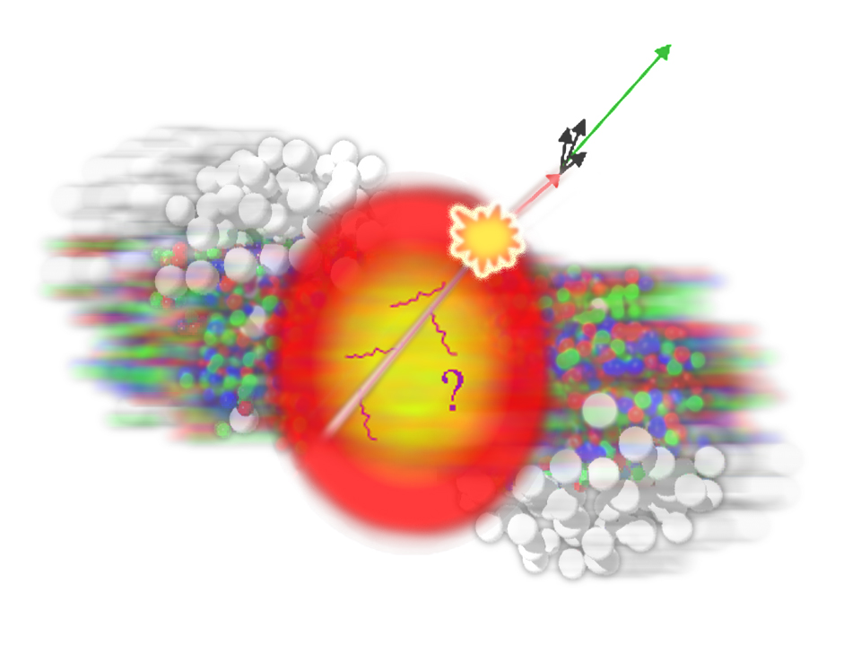
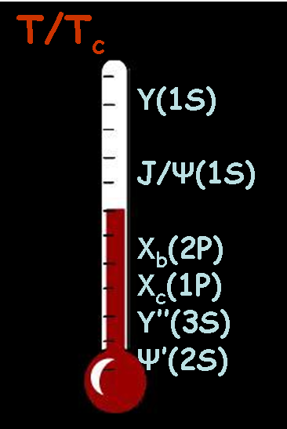

A deconfined state of hadronic matter, the Quark Gluon Plasma (QGP), should exist at high temperature and pressure, as predicted by lattice QCD calculations. It is expected that QGP is produced  in heavy ion collisions at ultra relativistic energies. During the last 25 years, several experimental heavy ion programmes have been developed in Europe and USA. First evidence of a deconfined state of matter was observed at SPS accelerator [CERN](www.cern.ch). Since 2000, the [ Relativistic Heavy Ion Collider (RHIC)](http://www.bnl.gov/rhic/) at [Brookhaven National Laboratory (BNL, USA)](www.bnl.gov) has obtained very interesting physics results about the QGP properties. An official announcement stating that QGP behaves as a perfect fluid at temperatures reached by RHIC was broadcasted in 2005, in parallel with the publication of the RHIC experiment white papers.

 The hard probes of the QGP have played a key role at RHIC, namely with the discovery of jet quenching. This has been an excellent motivation to study hard probes at LHC where their production cross-sections are enhanced by large factors with respect to that at [RHIC](http://www.bnl.gov/rhic/). Jet quenching is studied more in detail via the dijets processes, photon-jet or heavy flavour jets. New phenomena, like deconfinement and recombination of charm quarks could be observed. Finally, no doubt that new surprises will take place in the _ terra incognita_ of LHC.

The plasma group of Subatech has participated to the heavy ion programmes at SPS, RHIC ([PHENIX](http://www.phenix.bnl.gov/) and [STAR](http://www.star.bnl.gov/) experiments). Our group has been strongly involved in the construction of the [ALICE](http://aliweb.cern.ch) detector since 1996. First, with the construction of the ALICE muon spectrometer and the ALICE strip silicon detector and, since 2006, with the construction of the ALICE electromagnetic calorimeter.

Today, our major activity is the physics programme of the ALICE experiment. The end of the ALICE construction in 2008 was accompanied by a noticeable contribution to the online, reconstruction and analysis softwares. This has allowed us to play a strong role in the most promising physics analyses at LHC, like jets, photons, quarkonia and open heavy flavours, that are being developed since 2009.

Finally, we have an excellent visibility in the ALICE collaboration as we have many responsibilities in the ALICE management, ALICE muon spectrometer, ALICE EmCal, reconstruction software, physics working groups and LCG-France. In addition we participate to other international collaborations, namely the 7th FP CEE Hadronic Physics I3, via the networks ReteQuarkonii, SaporeGravis and JetCal. We are international coordinators of the ReteQuarkonii and SaporeGravis networks.
