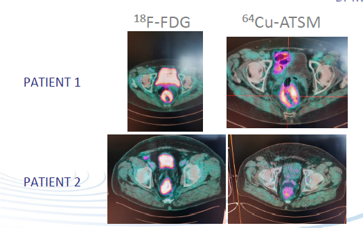
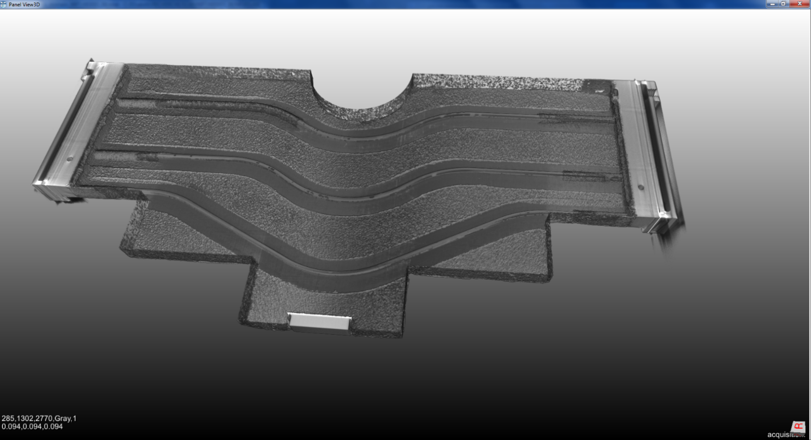
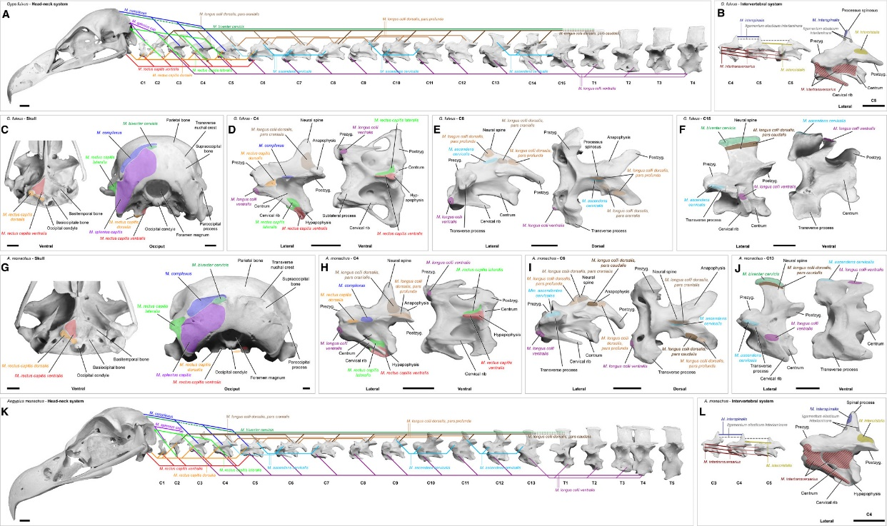
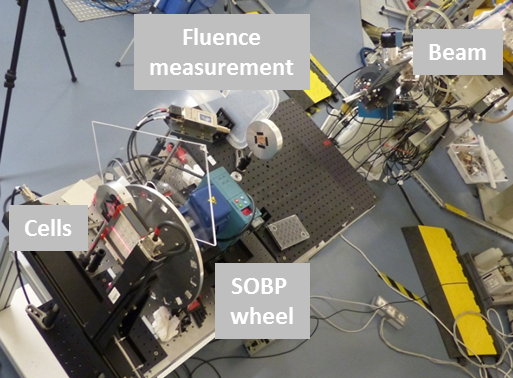

Nos 3 expertises scientifiques sont présentées de manière synthétique ci-après.

**RaMI, Radioisotopes Médicaux Innovants** - **Mots-clés : santé, médecine nucléaire, isotopes**

Les travaux de l’équipe PRISMA en lien avec la médecine nucléaire s’inscrivent depuis le début dans le cadre d’un réseau dont l’existence remonte à la fin des années 90. Ainsi, [**la première publication nantaise**](https://pubmed.ncbi.nlm.nih.gov/10541359/) sur la radio-immunothérapie alpha, en 1999, a été rendue possible grâce à la mise à disposition d’une salle dédiée au sein du laboratoire de radiochimie de Subatech. En parallèle, un projet de cyclotron porté conjointement par la direction du laboratoire et par la médecine nucléaire nantaise a vu le jour et s’est concrétisé au milieu des années 2000. Dans ce cadre un International Scientific Committee (ISC) a été mis en place afin d’accompagner le développement de recherche en lien avec les capacités du cyclotron installé au sein du GIP ARRONAX. Ce travail collaboratif intense et constant, regroupant les laboratoires [**CEISAM**](http://www.sciences.univ-nantes.fr/CEISAM/), **CRCINA**, [**ONIRIS**](https://www.oniris-nantes.fr/), **Subatech**, le **GIP ARRONAX**, le département commun [**CHU de Nantes**](https://www.chu-nantes.fr/)/**ICO** de médecine nucléaire et le [**LS2N**](https://www.ls2n.fr/), confronté aux recommandations de l’ISC a permis d’établir une stratégie commune de long terme. Cela s’est traduit par l’obtention du financement de plusieurs projets collaboratifs ambitieux : CPER **Autour du cyclotron** 2007-2013, Projets Régionaux **NucSan** 2010-2014 et **PENF** 2010-2014, investissements d’avenir [**Equipex ARRONAXPlus**](https://www.univ-nantes.fr/impact-societal/equipex-arronaxplus-nucleaire-pour-la-sante-847070.kjsp?RH=INSTITUTIONNEL_FR) 2012-2020, [**Labex IRON**](http://www.labex-iron.com) 2012-2020, [**IRC TransForMed**](https://next-isite.fr/transformed/) 2018-2021. Ils ont tous eu pour partenaires les équipes de Subatech - PRISMA, Radiochimie, Xemis. Les travaux réalisés sont présentés régulièrement devant les COPIL de ces projets ainsi que les comités scientifiques et les financeurs comme l’**ANR** notamment.

Nos recherches portent sur la production de radio-isotopes pour des applications médicales (imagerie, radio-immunothérapie…) en particulier sur la production d’isotopes non conventionnels dans les gammes d’énergie (jusqu’à 70 MeV proton) et en utilisant l’ensemble des projectiles disponibles (protons, deutérons et particules alpha) des accélérateurs de haute énergie comme le cyclotron C70 du GIP ARRONAX. Nous avons développé une expertise sur la mesure de sections efficaces, outil indispensable pour optimiser la production de radionucléides en quantité et pureté. Les données recueillies sont intégrées aux bases de données internationales comme [**EXFOR**](https://www-nds.iaea.org/exfor/) et permettent de contraindre les codes de simulation des réactions nucléaires comme, par exemple, le code [**TALYS**](https://doi.org/10.1016/j.nds.2012.11.002). Grâce à l’expertise du service mécanique de Subatech et aux chercheurs du GIP ARRONAX, nous avons développé la production de **Strontium-82** (cibles RbCl et Rb métal) dont le GIP ARRONAX est maintenant un des 6 producteurs mondiaux. Nous avons aussi participé au développement de la production de **Cuivre-64** pour lequel un essai clinique a débuté en mai 2019 au sein de l’ICO pour l’imagerie pronostique du cancer du rectum et à la production de l’**Astate-211** qui alimente les équipes de radiochimie de Subatech et celles du CRCINA. Nous travaillons au développement de ciblerie haute puissance pour l’Astate-211 en participant entre autre à l’[**ANR REPARE**](https://anr.fr/Projet-ANR-19-CE31-0013) 2019-2023, pour le **Scandium-44** avec utilisation dans XEMIS et pour le **Germanium-68**.

Récemment, nous avons initié un projet **SMILES** (Spectroscopie de Masse et Ionisation Laser pour l’Environnement et la Santé) et déposé un dossier de financement dans le cadre du **CPER** 2021-2027. Il s’agit d’explorer le potentiel de la séparation en masse couplée à l’ionisation laser notamment pour les applications médicales : fabrication de cibles enrichies et/ou séparation isotopiques post irradiation.

**IRMa, Interaction Rayonnement Matière** - **Mots clés : analyse par faisceau d’ions, contrôles non destructifs, PIXE/PIGE, RX**

Notre recherche s’inscrit dans une des composantes du pôle matériaux de la région des Pays de Loire : la plateforme [**Technocampus Composites Pôle EMC2**](http://www.technocampus-composites.fr/acteurs/pole-emc2) qui regroupe tous les acteurs (académiques et industriels) de l’industrie des composites. Notre équipe s’est impliquée dans le développement d’une technique innovante couplant laser et ultrason et dans la tomographie X pour la caractérisation des matériaux composites de grande taille. Nos compétences en tomographie X sont valorisées auprès de nos partenaires académiques IMT Atlantique, IN2P3, [**DGA**](https://www.defense.gouv.fr/dga), [**IFREMER**](https://wwz.ifremer.fr/), laboratoire Subatech, [**ANR AVINECK**](https://anr.fr/Projet-ANR-16-CE33-0025) et industriels [**Airbus**](https://www.airbus.com/), [**NBC-Sys**](https://www.nexter-group.fr/filiales/nbc-sys.html) , en utilisant notre plateforme de reconstruction tomographique 3D installée dans la hall E du laboratoire. Elle est constituée d’un appareil de micro-tomographie à rayons X EasyTom 4 de [**RX solutions**](https://www.rxsolutions.fr/) et d’un cluster informatique dédié à la reconstruction 3D.

Nous avons aussi participé activement au développement de la plateforme d’analyse multimodal du GIP ARRONAX avec l’implantation des méthodes **PIXE** (Particle Induced X-ray Emission) et **PIGE** (Particle Induced Gamma Emission) à haute énergie. Les capacités de ces techniques pour l’analyse multi élémentaire ont été démontrées (des précisions de l’ordre du ppm sont atteintes pour la mesure des atomes lourds dans une matrice légère) et nous avons développé des méthodes originales pour les échantillons multicouches. Nous complétons aussi les bases de données de sections efficaces d’ionisation à haute énergie de manière à contraindre les codes théoriques et ainsi permettre des mesures quantitatives de qualité. Les différents projets sont arrivés à terme et les compétences sont maintenant progressivement déployées vers les expertises scientifiques **RaMI** et **HB**.

**HB, HadronBiologie** - **Mots-clés : santé, radiobologie, hadronthérapie flash**

Ces deux dernières années, l’équipe PRISMA a développé une expertise scientifique de hadronbiologie en utilisant les savoir-faire développés au sein d’**IRMa** et en utilisant les faisceaux disponibles du C70. Il s’agit de réaliser des études radiobiologiques en collaboration avec l’équipe R&D d’ARRONAX, l’ICO et le CRCINA sur les mécanismes biologiques déclenchés par l’irradiation, aux niveaux cellulaire et moléculaire (mort cellulaire, dommages et réparation de l’ADN, signalisation…) avec des protons mais aussi des particules alpha. À cette fin, un travail important a été réalisé pour étendre la gamme de faisceaux stables utilisables et pour développer et qualifier des moyens de mesure des caractéristiques faisceau - [**ANR PEPITE**](https://anr.fr/Projet-ANR-17-CE31-0015) 2017-2020 par le LLR, projet IN2P3 DIAMTECH 2020-2023, études de la réponse des films radiochromiques - de la dose sur une gamme étendue d’intensité (du pA au µA). Un travail important a aussi été réalisé sur le design, la conception et l’utilisation d’un banc de tests permettant de mettre en place de nombreux détecteurs, de reproduire les conditions de traitement de hadronthérapie - pic de Bragg étalé (SOBP) en collaboration avec l’IP2I de Lyon - et d’irradier des rongeurs avec un finacement de l’ICO. Des premières expériences de radiobiologie ont eu lieu avec une équipe de l’**INFN de Legnaro** qui ont permis de valider l’ensemble des développements réalisés. Un travail important est en cours sur la mise en œuvre d’un système de pulsation du faisceau qui permet de contrôler très précisément la durée d’irradiation (quelques centaines de µs à plusieurs secondes) pour les particules alpha et les protons. Cela ouvre de nombreuses possibilités d’études cinétiques des mécanismes en jeu en radiobiologie avec de possibles impacts sur les modalités de traitements en radiothérapie avec, par exemple, le mode de thérapie flash. Nous avons récemment initié en collaboration avec l’ICO, le projet **FlashMod** (End-to-end dosimetry for preclinical proton FLASH irradiation at ARRONAX) financé par la campagne **PCSI 2020**.

### Produits et activités de la recherche de l’équipe PRISMA

En préambule, la liste des 56 publications, 70 conférences, thèses, HDR de l’équipe PRISMA ainsi que quelques posters et chapitres d’ouvrage concernant la période 2015-2020 sont consultables en suivant ce [**lien**](https://hal.archives-ouvertes.fr/search/index/?qa%!B(MISSING)collection_t%!D(MISSING)%!B(MISSING)%!D(MISSING)=SUBATECH-Prisma&producedDateY_i=2020+OR+2019+OR+2018+OR+2017+OR+2016+OR+2015&sort=producedDate_tdate+desc). Seule la thèse de R. Formento Cavaier n’est pas disponible pour des raisons de confidentialité imposée par AAA/Novartis.

#### RaMI, Radioisotopes Médicaux Innovants - Production d’isotopes radioactifs pour des applications médicales

##### Les activités développées sont les suivantes :

*   Mesures de sections efficaces de production : technique des stacked foils dans l’air et sous vide, faisceaux de protons, de deutéron et de particules alpha, spectroscopie gamma, comparaison avec les données de la littérature et les modélisations théoriques
*   Production d’isotopes : voies de production, contaminants, rendement de production en cible épaisse (Thick Target Yield, TTY), développement de cibles haute puissance en collaboration avec le service mécanique du laboratoire Subatech et l’équipe R&D du GIP ARRONAX
*   Activation neutronique : projets **TheraneaN** 2010-2013 puis **TheraneaM** 2014-2019, contrat avec [**AAA/Novartis**](https://www.adacap.com/)
*   Études pour la valorisation des fines : isotopes d’intérêt pour la médecine ou l’industrie nucléaire, contrats avec [**ORANO**](https://www.orano.group/fr)
*   Ionisation laser et séparation en masse : Projet **SMILES**

##### Faits marquants de la période 2015-2020 :

*   Production en routine de Strontium-82 à partir d’une cible Rubidium métal (protons de 70 MeV et une intensité de 150 \*A soit 10 kW).
*   Utilisation du Cu-ATSM pour le diagnostic du cancer du rectum, premier patient le 23 mai 2019 ; aboutissement des travaux sur la production de Cuivre-64 en collaboration avec le GIP ARRONAX, l’ICO et le CHU de Nantes par la mise en place d’un essai clinique.

*   Production d’erbium-169 de très haute activité spécifique pour une potentielle radiothérapie ciblée - [publication](https://doi.org/10.1016/j.nimb.2019.04.022). Preuve de concept pour l’intérêt de la technique de séparation de masse dans la production d’isotopes (R. Formento et al.).
*   Design d’un colis de transport de type B dédié aux isotopes médicaux (thèse de M. Maietta - [article web](https://www.lemerpax.com/mission-accomplie-pour-maddalena-maietta-et-lemer-pax/))
*   Comment les données nucléaires collectées pour la production de radionucléides médicaux pourraient contraindre les codes nucléaires (C. Duchemin) - [publication](https://doi.org/10.1051/epjconf/201714608008)

#### IRMa, Interaction Rayonnement Matière - Analyse par faisceaux d’ions, contrôle non destructif de matériaux

##### Les activités développées sont les suivantes :

*   Mesures de données nucléaires : sections efficaces de production de rayons X et gamma pour les mesures quantitatives de haute énergie PIXE et PIGE
*   Ion Beam Analysis : analyse par faisceau d’ions PIXE et PIGE à haute énergie
*   Plate-forme EasyTom : radiographie rayons X et tomographie 3D
*   Plate-forme TOMOROBOT

##### Faits marquants de la période 2015-2020 :

*   Développement d’une méthode pour l’analyse d’échantillons multicouches avec la méthode PIXE à haute énergie (A. Subercaze - [publication](https://doi.org/10.1016/j.nimb.2017.02.014))
*   Mesure des sections efficaces de production des rayons X lors de l’interaction de protons avec la matière (M. Hazim et al., soumis à NIMB)
*   Projet Inter-site IMT Atlantique “Post-doc – Appel numérique 2019” avec le Département Image et Traitement de l’Information (ITI) et le Département Systèmes Energétiques et Environnement dans le cadre du projet Carnot TSN : MISS - Analyse d’images de systèmes poreux complexes par tomographie RX appliquée aux cartouches filtrantes (E. Lys)
*   Caractérisation de possibles défauts dans un dispositif de refroidissement de carte électronique par tomographie à rayons X pour le projet MFT, expérience Alice @ CERN, en collaboration avec l’équipe Plasma du laboratoire SUBATECH, - 2017-2019 (E. Lys)

*   ANR AVINECK - Le cou de l’oiseau, un bras pour les robots (X. de la Bernardie)

#### HB, HadronBiologie

##### Les activités développées sont les suivcantes :

*   Mesures et contrôle in situ du débit de dose : signal de Bremsstrahlung, PIXE, détecteur DIAMANT, détecteur PEPITES, gamma-caméra, chambre d’ionisation
*   Plate-forme d’irradiation : cellules et petits animaux, faisceaux de protons et de particules alpha, thérapie flash

##### Faits marquants de la période 2015-2020 :

*   Validation de la plateforme radiobiologique - [publication](https://doi.org/10.1093/rpd/ncy301)
*   Expériences d’irradiation par faisceau alpha ARRONAX GIP C70 avec pic de Bragg étalé (SOBP)

*   Développement d’un profileur faisceau ultra fin pour des faisceaux de particules chargées dans le cadre de l’ANR [**PEPITES**](https://anr.fr/Projet-ANR-17-CE31-0015) - [publication](https://doi.org/10.1016/j.nima.2018.09.134)
