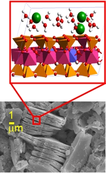

Le projet «modélisation moléculaire» a commencé en 2010 dans le cadre de la chaire industrielle "Stockage et entreposage des déchets radioactifs". La modélisation moléculaire à l’aide des techniques de dynamique moléculaire, de Monte Carlo, et de chimie quantique est de plus en plus utilisée aujourd’hui dans de nombreux domaines. Parmi eux nous pouvons citer la chimie, la biophysique, les sciences des matériaux, la géoscience, les sciences du sol et bien d’autres encore.

Le projet est appelé à jouer un rôle de plus en plus transversal et multidisciplinaire au sein du groupe de radiochimie, en établissant en lien, à travers des concepts théoriques bien maîtrisés, entre diverses activités de recherche scientifique expérimentale, comme les mesures d'isothermes de sorption ou des travaux fondamentaux sur la chimie des radioéléments (Po, Tc, At ...).

En ce qui concerne les analyses des déchets nucléaires, des simulations au niveau moléculaire augmenteront la compréhension fondamentale de la façon dont les ions radiotoxiques interagissent avec les surfaces des roches d'accueil sur les sites d'élimination des déchets, de même qu’avec la matière organique, etc. Les propriétés électriques près de la limite surface aqueuse/interface solide peuvent mieux être décrites et comprises au niveau moléculaire.

Dans le cas des applications médicales, la modélisation moléculaire aidera à sélectionner les ligands de vectorisation de radionucléides pour les thérapies nucléaire et l'imagerie.

Des collaborations sont établies avec les laboratoires [CEISAM](http://www.sciences.univ-nantes.fr/CEISAM/ceisam.php) (Université de Nantes),  [PECSA](http://www.pecsa.upmc.fr/) (UPMC, Paris), le [Département de la Géochimie](http://www.sandia.gov/geo/staff.html) des Sandia National Laboratories (Albuquerque, Etats-Unis), et avec les [programmes de chimie et des sciences géologiques](http://ns.msu.edu/index.php/about-cns/dean-r-james-kirkpatrick/) de l'Université Michigan State (East Lansing, Etats-Unis). Une nouvelle collaboration internationale [ATLAB](http://www.ing.pan.pl/Atlab/0Atlab-index_E.htm) avec l'Institut des sciences géologiques (Académie Polonaise des sciences) a commencé à la fin de 2011 dans le cadre de l'EU FP7 REGPOT-2011-1 programme.

Plus d'informations sur le projet de modélisation moléculaire on peut être trouvé [ici](http://www.emn.fr/z-subatech/kalinich/fr/research.html).
