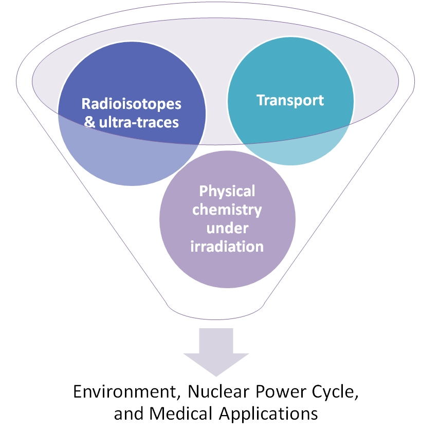

**T**he research activities of the radiochemistry group are focused on the behavior of radioactive substances in their basic and applied aspects related the environmental, nuclear fuel cycle, and medical applications.

**T**he group was able to aquire internationally recognized scientific expertise, both experimental and theoretical, in the field of radiochemistry related to radioactive waste disposal . These studies, conducted in close collaboration with [ANDRA](http://www.andra.fr/), now cover the investigations of dissolution/corrosion mechanisms of the waste package (confinement matrix waste container), the transport of radionuclides in the geochemical barriers, both engineered (cement, bentonite clay) and natural (clayey and sandy geological formations of waste repositories). This also includes the study of the radionuclides' behavior in the biosphere. This activity is enhanced by the industrial chair "[Storage of radioactive waste](http://www.mines-nantes.fr/fr/CORPORATE-RELATIONS/Nos-chaires/Storage-and-Management-of-Nuclear-Waste)". The radiochemistry group also develops, in collaboration with the [SMART](fr/mesures/le-service-smart/presentation) service the methods of measurement / speciation of radioisotopes present in trace amounts in the environment in the context of related programs [OSUNA](http://www.osuna.univ-nantes.fr/) and the CNRS / University Chair [SBADE](http://www.osuna.univ-nantes.fr/51626556/0/fiche___pagelibre/&RH=1293798259421).  

**T**he arrival of the cyclotron [ARRONAX](http://www.cyclotron-nantes.fr/) in 2010 led to the development of new research activities . These are supported by the projects "investments for the future" (Equipex [ARRONAX+](http://www.cyclotron-nantes.fr/spip.php?article124), Labex [IRON](http://www.labex-iron.com/)) and involve the use of radioisotopes in nuclear medicine and the effect of radiation on matter.

**F**inally, a new set of research activities have started around the dismantling of nuclear power installations under a strong partnership with [DAHER](http://www.daher.com/).

**A**ll research activities of the radiochemistry group can be divided into three research broad areas: "[Radioisotopes and Ultra-trace concentrations](fr/recherche/nucleaire-et-environnement/radiochimie/recherche/radioisotopes)", "[Transport](fr/recherche/nucleaire-et-environnement/radiochimie/recherche/transfert)" and "[Physical chemistry under irradiation](fr/recherche/nucleaire-et-environnement/radiochimie/recherche/radiolyse)". They are conducted within the programs funded by the region, the ANR, the [NEEDS](http://www.cnrs.fr/mi/spip.php?article19) program, the European Commission, investments for the future, or by the industry.
