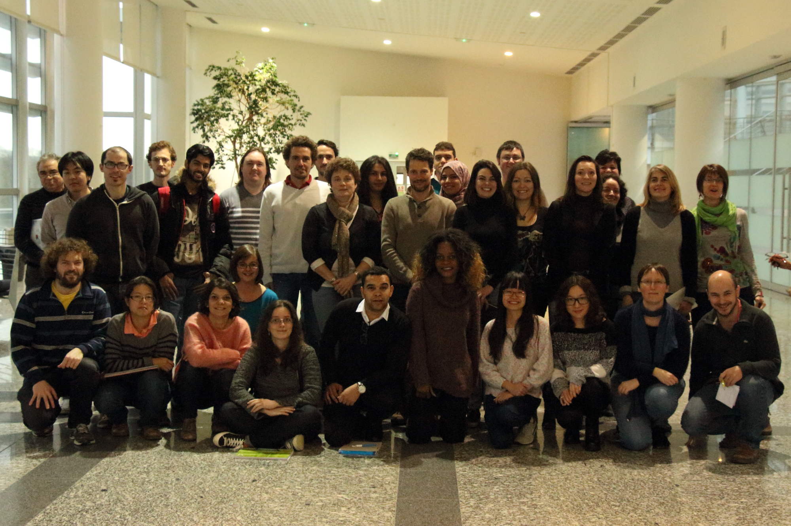

**L**es activités de recherche du groupe de radiochimie sont dédiées aux questions fondamentales et appliquées en lien avec le comportement des substances radioactives dans l’environnement, dans le cycle électronucléaire et pour les applications médicales.

