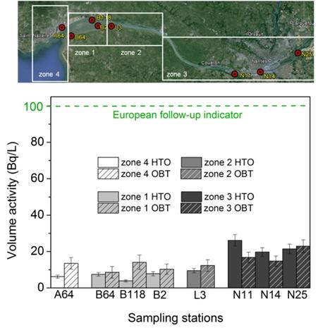
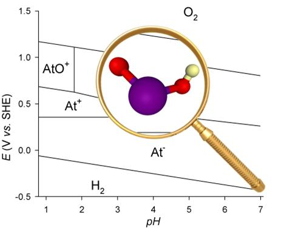

**T**he theme focuses on the study of radioisotopes' ( RIs ) behavior in aqueous solutions at extremely low concentrations (ultra- traces ) in the context of either medical (associated with labex [IRON](http://www.labex-iron.com/)) ) or environmental (in conjunction with [OSUNA](http://www.osuna.univ-nantes.fr/)) applications. These activities combine two approaches: molecular scale studies (spectroscopic techniques, computational molecular modeling) and macroscopic methods (solution chemistry and speciation techniques ). The activities related to the [OSUNA](http://www.osuna.univ-nantes.fr/) project are directly linked with the theme "transport" and involve the development of new methods of measurement and speciation of natural or artificial RIs, such as tritium, in the environment to the ultra-trace level.

**A**ctivities in connection with the labex [IRON](http://www.labex-iron.com/) are divided into two projects:

_**Astatine**_ it is a rare (artificially produced) and invisible radionuclide (extremely low ultra-trace concentrations). The isotope (At -211 ) is at the center of a study in Nantes for the use in targeted alpha therapy. We are particularly interested in exploring the metallic character of astatine and responsiveness of At ( III) in order to develop innovative protocols of radiolabeling.

The **_Scandium_** project is aimed at the development and use of innovative radioisotopes Sc ( Sc- 44m , SC -44 , SC -47 ) in nuclear medicine.
