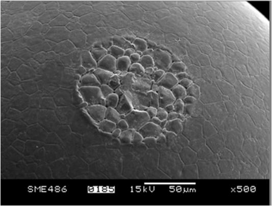

**T**he radiolysis is the set of chemical transformations in materials caused by absorption of energy from ionizing radiation. Radiolysis is present at every stage of the nuclear fuel cycle: the reactor core, fuel reprocessing, waste storage ... The consequences of alpha- and gamma- radiolysis of the systems studied are very different and involve parallel studies along several complementary directions. They were initiated in SUBATECH through collaboration with the [LCP d’Orsay](http://www.lcp.u-psud.fr/) as part of a doctoral thesis in 2006. They continue today closely associated with the cyclotron [ARRONAX](http://www.cyclotron-nantes.fr/). These research projects are well structured and constitute part of an interdisciplinary collaborative efforts involving several laboratories.

**T**he studies in Nantes are particularly focused on the effect of alpha radiation. We are interested in speciation in solution and at solid/solution interfaces. In addition to the post-irradiation analysis, the project now has two coupled instruments: an UV-visible spectrophotometer and a Raman spectrometer. 

**T**hese research activities are grouped now around three projects:

**_Radiolytic yields_** - the measurements in order to quantify the formation of radical species or molecular species in water as function of the beam parameters (intensity, energy, dose, ... ) and as function of chemical parameters (pH, solution composition, solvents, gas partial pressure, temperature, ...). For these studies, a system of pulsed alpha radiolysis synchronized with a light probe is being developed.

_**Radiolysis and corrosion at the solid/liquid interface**_ - This project focuses on the study of the effect of alpha radiolysis on materials of interest in the nuclear fuel cycle (storage, reprocessing, ...) . We are currently especially interested in the UO2 matrix.

**_Irradiated materials_** - ": This project develops in collaboration with [DAHER](http://www.daher.com/) and concerns the effects of radiation on the structure of materials in the context of decommissioning of nuclear reactors.
