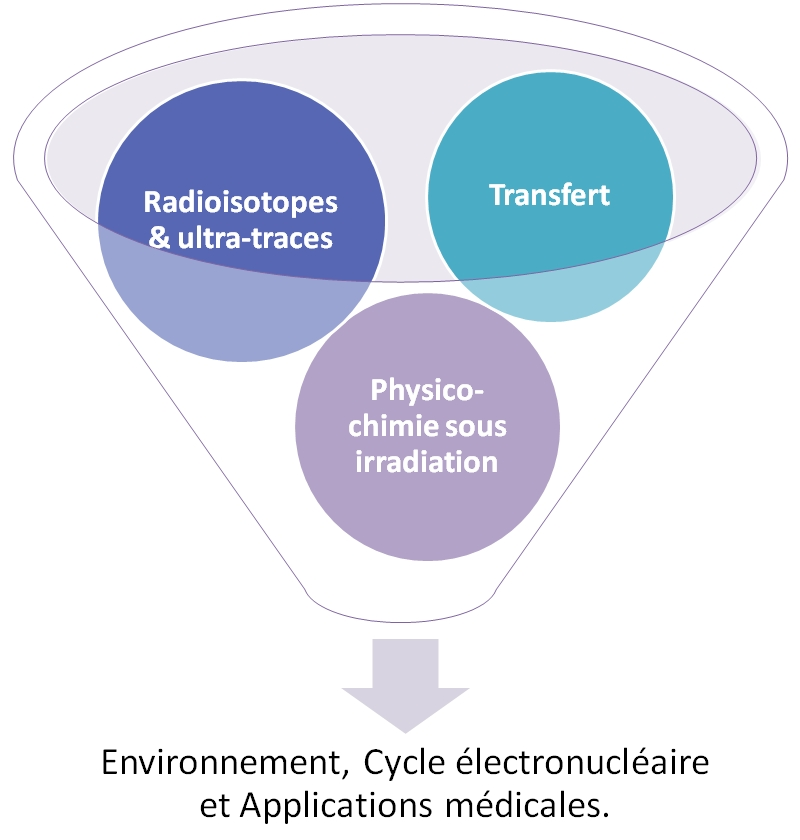

**L**es activités de recherche du groupe de radiochimie sont dédiées aux questions fondamentales et appliquées en lien avec le comportement des substances radioactives dans l’environnement, dans le cycle électronucléaire et pour les applications médicales.

**L**e groupe a pu acquérir une expertise scientifique internationalement reconnue, tant sur le plan expérimental que théorique, dans le domaine de la radiochimie liée au stockage des déchets radioactifs. Ces études menées avec l’[ANDRA](http://www.andra.fr/) couvrent aujourd’hui l’étude des mécanismes de dissolution/corrosion du colis (matrice de confinement des déchets, conteneur), l’étude du transfert des radioisotopes dans les barrières ouvragées (ciment, bentonite) et géologiques (milieux argileux et sableux) et enfin l’étude du comportement des radioisotopes dans la biosphère. Cette activité est renforcée par la chaire industrielle "[Stockage et entreposage des déchets radioactifs](http://www.mines-nantes.fr/fr/CORPORATE-RELATIONS/Nos-chaires/Storage-and-Management-of-Nuclear-Waste)".

**L**e groupe de radiochimie développe également, en concertation avec le service [SMART](fr/mesures/le-service-smart/presentation), des méthodes de mesure/spéciation des radioisotopes présents en quantités traces dans l’environnement dans le cadre de programmes liés à l’[OSUNA](http://www.osuna.univ-nantes.fr/) et la Chaire CNRS/Université [SBADE](http://www.osuna.univ-nantes.fr/51626556/0/fiche___pagelibre/&RH=1293798259421).  

**L**’arrivée du cyclotron [ARRONAX](http://www.cyclotron-nantes.fr/) en 2010 a conduit au développement de nouvelles activités de recherches. Celles-ci sont soutenues par les investissements d’avenir (equipex [ARRONAX+](http://www.cyclotron-nantes.fr/spip.php?article124), labex [IRON](http://www.labex-iron.com/)) et concernent l’utilisation des radioisotopes en médecine nucléaire et l’effet des rayonnements sur la matière.

**E**nfin, une nouvelle activité autour du démantèlement démarre dans le cadre d’un partenariat fort avec [DAHER](http://www.daher.com/).

**L**es activités du groupe de radiochimie sont ainsi regroupées en trois thèmes de recherche, «[radioisotopes et ultra-traces](fr/recherche/nucleaire-et-environnement/radiochimie/recherche/radioisotopes)», «[transfert](fr/recherche/nucleaire-et-environnement/radiochimie/recherche/transfert)» et «[physico-chimie sous rayonnements](fr/recherche/nucleaire-et-environnement/radiochimie/recherche/radiolyse)». Elles sont réalisées dans le cadre de programmes financés par la région, l’ANR, le programme [NEEDS](http://www.cnrs.fr/mi/spip.php?article19), la Commission Européenne, les investissements d’avenir ou les industriels.
