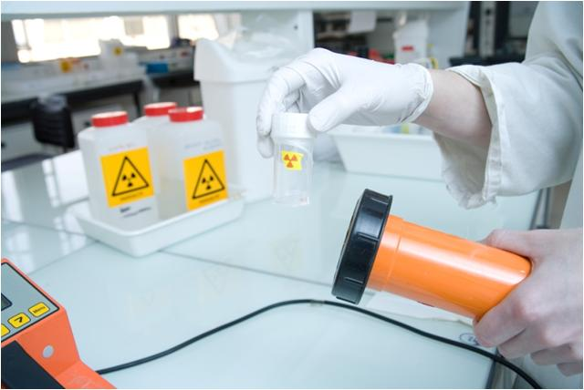
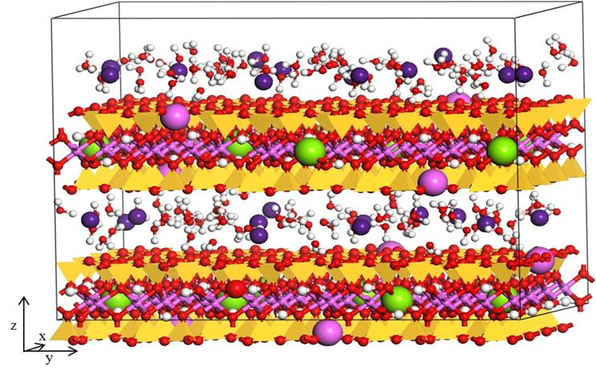
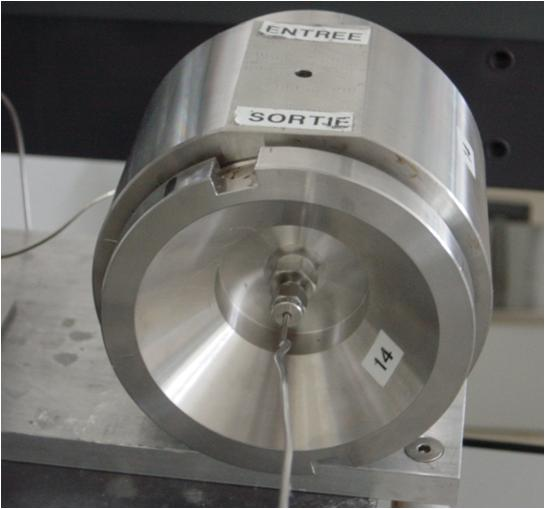
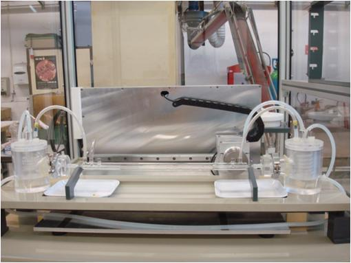

**T**he objective of this theme is to study the transport of radionuclides in the natural and engineered barriers for radioactive waste disposal and to study the behavior of natural or artificial radioisotopes in the biosphere and geosphere. The ultimate goal is to develop quantitative description of such transport for the implementation in the geochemical modeling codes. To achieve this goal, the research is being performed along several directions:

**T**he study of specific model systems that are not yet well understood. This work requires basic experimental studies at the molecular and macroscopic level that is complemented by [computational molecular modeling](/) approach.

**T**he development of experimental techniques and devices for acquiring data representative of the site (intact sample , controlled atmosphere , etc.) . In particular, Subatech has developed experimental techniques suitable for samples with very low permeability.

**T**he study of the effect of colloids on the transport of radionuclides.

**T**he development analytical methods and tools for the analysis (quantity, speciation) of radioisotopes in the environment. The recent purchase of a [high resolution ICP-MS instrument](fr/recherche/nucleaire-et-environnement/radiochimie/equipements-methodes-techniques) is part of this commitment. The objective is also to strengthen the interface with the [SMART](fr/mesures/le-service-smart/presentation) service which is already involved in radioecology monitoring programs. This work is carried out in particular in the framework of the Observatory of Sciences of the Universe Nantes Atlantique ([OSUNA](http://www.osuna.univ-nantes.fr/)).

**T**hree projects are currently linked to this theme:

**_Interfaces_** - The study of the mechanisms control ling the solubility of materials and mineral phases in contact with solution equilibrated with respect of the thermodynamic parameters such as temperature, atmospheric pressure, solid/solution ratio. These studies are conducted on a wide range of solid phases from simple references solids (e.g., SiO2, ThO2 , CaCO3 , ... ) to more complex phases related to the storage and management of radioactive waste (e.g., glass, cement, clay, ... ) through complex phases serving as intermediate references for the latter (e.g., illite, bentonite, C-S-H, ... ) . These studies became possible due to the acquisition of the High Resolution ICP-MS instrument to monitor the isotopic exchange at solid/solution interfaces.

_**Organic Matter & Transport**_ - The investigation of effects of organic matter on the transport of radioniclides, either indirectly (metal complexation) or directly (molecules labeled with tritium/C-14). It is a comprehensive approach, ranging from the molecular level to the macroscopic level, with the principal to generate new knowledge, but also to obtain new operational data for industrial partners involved in the project.
