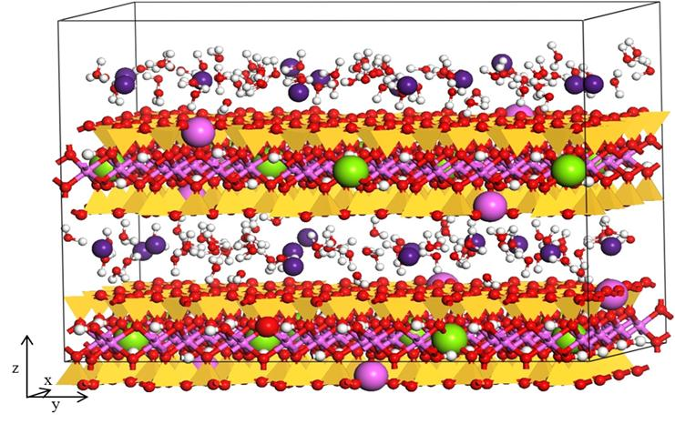
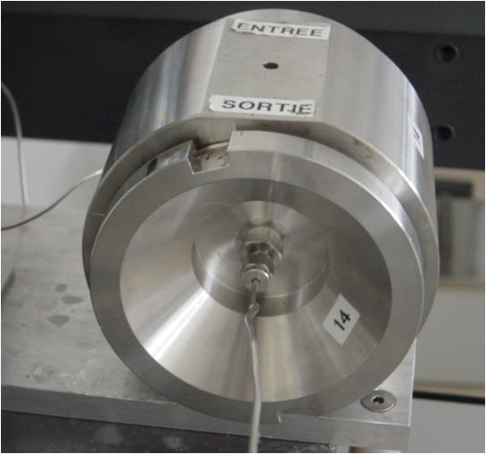
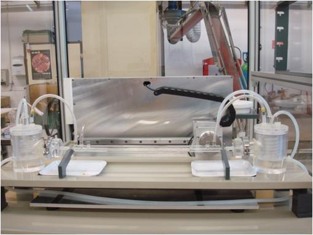

**I**l concerne l’étude du transfert des radioisotopes dans les barrières des stockages de déchets radioactifs et l’étude du comportement des radioisotopes artificiels ou naturels dans la biosphère et géosphère. L’objectif final est de permettre une description quantitative de ce transfert via l’utilisation des codes de calcul géochimiques. On peut citer ci-dessous les compétences développées pour atteindre cet objectif: L’étude de systèmes modèles qui ne sont pas encore bien compris. Ce travail de base passe par une étude expérimentale au niveau moléculaire et macroscopique qui est complétée par une approche de [modélisation moléculaire](/).

**L**e développement de dispositifs expérimentaux permettant l’acquisition de données représentatives du site (échantillon intact, atmosphère contrôlée,..). En particulier, Subatech a mis au point des dispositifs expérimentaux en laboratoire adaptés à des échantillons de très faible perméabilité.

**L**’étude de l’effet des colloïdes sur le transfert des radionucléides.

**L**e développement de méthode pour l’analyse (quantité, spéciation) des radioisotopes dans l’environnement. L’achat d’un récent [ICP-MS haute résolution](fr/recherche/nucleaire-et-environnement/radiochimie/equipements-methodes-techniques) s’inscrit dans cette volonté. L’objectif est également de renforcer l’interface avec le service [SMART](fr/mesures/le-service-smart/presentation) qui est déjà impliqué dans des programmes de radioécologie. Ce travail se réalisera notamment dans le cadre de l’Observatoire des Sciences de l’Univers Nantes Atlantique ([OSUNA](http://www.osuna.univ-nantes.fr/)).

**T**rois projets sont aujourd’hui rattachés à ce thème:

**_Interfaces_** - Il s’agit d’étudier les mécanismes contrôlant la solubilité de phases ou de matériaux au contact de leur solution d’équilibre vis-à-vis de paramètres tels que la température, l’atmosphère, rapport masse de solide/volume de solution. Ces études sont conduites sur un large éventail de phases solides depuis des phases simples de références (ex. SiO2, ThO2, CaCO3, …) à des phases plus complexes en lien avec la gestion des déchets (ex. verre, ciment, argile, …) en passant par des phases complexes de références pour ces dernières (ex. illite, bentonite, CSH, …). Ces études ont pu être menées en partie grâce à l’acquisition d’un ICP-MS à Haute Résolution permettant de suivre les échanges isotopiques aux interfaces solides/solutions.

**_Matière organique & transport_** - ce projet s’intéresse à l’effet de la matière organique sur le transfert de la radioactivité, que ce soit de manière indirecte (complexation de métaux) ou directe (molécules marquées au tritium/C-14). Il s’agit d’une approche complète , allant du niveau moléculaire au niveau macroscopique, dont le but est de générer de nouvelles connaissances mais également des données opérationnelles pour les industriels/agences impliqués dans ce projet.
