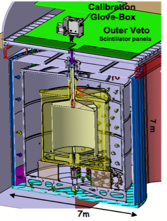

The [Double Chooz](http://doublechooz.in2p3.fr/Status_and_News/status_and_news.php) experiment is dedicated to reactor antineutrino detection through two identical detectors (figure 1) placed close to the Chooz power plant in France \[1\]. The main goal of this experiment is to better constraint the θ13 mixing angle (more information in the [first](http://prl.aps.org/abstract/PRL/v108/i13/e131801) and [second](http://arxiv.org/abs/1207.6632) Double Chooz pubbblications). The employed detection principle is inverse beta decay process : \\(\\bar{\\nu}\_e+p \\rightarrow e^++n\\) (threshold 1.8 MeV). The neutron is tagged by its capture on Gd nuclei dissolved in the liquid, occuring a few 10µs after the prompt signal due to the positron energy loss, time for the neutron to thermalize and get captured. The neutron capture on Gd produces a shower of γ-rays with a total energy of ≈ 8 MeV. The signature of antineutrino interaction is provided by a delayed coincidence between these two events, allowing a powerful rejection of many backgrounds.

Figure 1: Double Chooz far detector

The close detector (400m), located at a distance where no oscillation occur, will also perform the most precise measurement of a reactor antineutrino energy spectrum, thanks to its 10.3m3 liquid scintillator target. The study of the relationships between the observed spectrum and the power history and inventory of the reactor cores of Chooz will allow to put a stringent limit on the reachable accuracy on the thermal power measurement and on the Pu content of the core. In the framework of the Double Chooz collaboration, an important simulation work co-lead by the SUBATECH team and the CEA/DSM/IRFU/SPhN team consisting in reactor and beta/antineutrino spectra simulations has been performed also, related to applied neutrino physics \[2-4\]. To improve the inputs to these simulations the SUBATECH group is also involved in [measurement of beta decay](/recherche/sen/measurement-of-beta-decay-properties-of-fission-products.en) of interesting fision products. Thanks to the expertize on optimized detector developments obtained through the Double Chooz experiment and to the simulation developments, a part of the Double Chooz collaboration has proposed to design and build a miniature detector dedicated to reactor monitoring, the [Nucifer](/recherche/sen/nucifer-experiment.en) detector.

The SUBATECH group participates also to the European analysis cluster in the neutrino signal selection with the far detector. In this contest we are also studing, in partnership with the APC laboratory, the correlated background induced by muons interacting in the detector or in its vicinity. The optimization of signal selection allows to reduce the correllated background <0.2%!,(MISSING) by both identifying muons crossing the detector with an efficiency\> 99.999%!a(MISSING)nd applying a veto time window after the muon detection of 1 ms. The remaining correlated background in our sample of  neutrino candidate have been estimated: they are due to muons which are not crossing the detector or which generate an energy deposition in the detector below the identification threshold. For the first time, a pure sample of correlated backgroind is studied in the energy region dominated by antineutrinos, defining identification strategies based on dedicated direct detection of background noise by the two external detectors of Double Chooz: the "inner-veto" and "outer-veto."

Double Chooz is an international collaboration composed by France, Germany, USA, UK, Spain, Japan, Russia and Brazil

The french laboratories are: CNRS/IN2P3/APC, CEA/DSM/SPP, CEA/DSM/SPhN, CNRS/IN2P3/IPHC and CNRS/IN2P3/SUBATECH.

In this collaboration, the SUBATECH group has the co-responsability of the «Reactor and anti-neutrino energy spectrum prediction» working group (with CEA/IRFU/SPhN), and the responsability of the reactor simulation of Chooz power plant.

### Bibligraphy

\[1\] Ardellier, F., et. al., 2006. Double Chooz: A Search for the Neutrino Mixing Angleθ13. arXiv: hep-ex/0606025v4.

\[2 \]Fallot, M. et al., 2007, Towards Applied Neutrino Physics. Proceedings of ND2007 - France.

\[3\] Guillon B. et al., Toward reactor monitoring with antineutrinos. Proceedings of the GLOBAL 2007 conference.

\[4\] Internal Note of the Double Chooz collaboration. Report on the activities of the Working Group Reactor and Antineutrino energy spectra simulation. S. Cormon et al.

\[5\] Giot et al., 2008, Monte-Carlo simulations in the context of reactor monitoring with antineutrinos. Proceedings of the PHYSOR 2008 conference.
