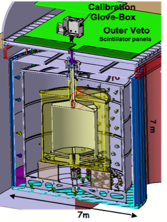

Les détecteurs de l’expérience Double Chooz représentent l’état de l’art actuel en terme de détection des antineutrinos des réacteurs \[1\].

L’expérience Double Chooz a pour but la mesure de l’angle de mélange θ13, avec une sensibilité telle que sin2(2)<0.025 @ C.L.. Avant les premières publications des résultats de Double Chooz \[2\], Daya Bay \[3\] et Reno \[4\], en fin 2011/début 2102, la plus forte contrainte sur la valeur de l’angle de mélange avait été établie par l’expérience Chooz qui s’est déroulée près des réacteurs de la centrale nucléaire de Chooz dans les Ardennes françaises dans les années 90 \[5\].

Double Chooz consiste en l’installation de deux détecteurs identiques auprès des réacteurs de la centrale de Chooz dans les Ardennes, à 400m (« détecteur proche ») et 1050m (« détecteur lointain »). Le premier détecteur mesure le spectre des antineutrinos précisément à un endroit où ils n’ont pas encore changé de saveur, et le second mesure à nouveau le spectre après oscillation. Le détecteur proche va également réaliser la mesure la plus précise du spectre en énergie des antineutrinos des réacteurs. L’étude des corrélations entre les mesures et l’historique de puissance et l’inventaire des cœurs des réacteurs de la centrale permettra de fournir une limite de sensibilité de la « méthode antineutrinos » pour le suivi d’un réacteur nucléaire. La méthode de détection utilise la réaction bêta inverse (seuil 1.8MeV) : \\(\\bar{\\nu}\_e+p \\rightarrow e^++n\\). On utilise une cible remplie par 10.3m3 de liquide scintillant comme cible active. Le neutron est détecté via sa capture par des noyaux de Gd dissous dans le liquide scintillant, après sa thermalisation dans la cible. La signature de l’interaction d’un antineutrino est donc fournie par la détection en coïncidence retardée entre le signal de perte d’énergie du positron et le signal de décroissance des noyaux de Gd après capture du neutron, dans une fenêtre de l’ordre de 30μs. Cette méthode permet de s’affranchir d’une proportion importante du bruit de fond.

Le détecteur lointain de Double Chooz.

Dans le cadre du cluster européen d'analyse de Double Chooz, le groupe DC de SUBATECH a contribué à la sélection des neutrinos avec le détecteur lointain. D'autre part, le groupe étudie également, en partenariat avec le laboratoire APC, le bruit de fond corrélé induit par les muons interagissant dans le détecteur ou dans ses environs. L'optimisation de la sélection du signal permet de réduire le bruit de fond corrélé < 0.2%!,(MISSING) d'une part en repérant les muons traversant le détecteur avec une efficacité > 99.999%!e(MISSING)t d'autre part en appliquant un temps de latence après une détection muon de 1 ms. Le bruit de fond corrélé restant dans notre échantillon de candidats neutrinos, découlant de muons qui n'ont pas traversé le détecteur ou d'un dépôt d' énergie des muons dans le détecteur en dessous du seuil d'identification, a été estimé. Pour la première fois, un échantillon pur de bruit de fond corrélé est étudié dans la région en énergie dominée par les antineutrinos, en définissant des stratégies de marquage dédiées basées sur la détection directe du bruit de fond par les détecteurs externes de Double Chooz: l' "inner-veto" et l' "outer-veto".

Double Chooz est une collaboration internationale réunissant des chercheurs français, allemands, américains, britanniques, espagnols, japonais, russes, brésiliens.

Les laboratoires français impliqués sont le CNRS/IN2P3/APC, CEA/DSM/SPP, CEA/DSM/SPhN, CNRS/IN2P3/IPHC et CNRS/IN2P3/SUBATECH.

[1er publication de Double Chooz](http://arxiv.org/abs/1112.6353)

[2eme publication Double Chooz](http://arxiv.org/abs/1207.6632)

#### Stagiaires, doctorants, post-doctorants et ATER qui font ou ont fait partie de l'equipe Double Chooz de Subatech :

B. Guillon, K. Zbiri, S. Cormon (lien these), A. Remoto (lien these), A. Onillon (lien these), M. Elnimr (lien resume), A. Cucoanes (lien resume), A. Cantin (stage de L3), G. Pronost (lien these)

#### Bibliographie

\[1\] Ardellier, F., et. al., 2006. Double Chooz: A Search for the Neutrino Mixing Angleθ13. arXiv: hep-ex/0606025v4.

\[2\] Y. Abe et al., Phys. Rev. Lett. 108, 131801 (2012). [Y. Abe et al., Double Chooz collaboration,](http://arxiv.org/abs/1207.6632.) [http://arxiv.org/abs/1207.6632.](http://arxiv.org/abs/1207.6632.)

\[3\] F. P. An et al., Phys. Rev. Lett. 108, 171803 (2012).

\[4\] J. K. Ahn et al., Phys. Rev. Lett. 108, 191802 (2012).

\[5\] Apollonio, M. et al., 2003. Search for neutrino oscillations on a long baseline at the CHOOZ nuclear power station. Eur. Phys. J. C27 (2003) 331-374.

\[6\] Fallot, M. et al., 2007, Towards Applied Neutrino Physics. Proceedings of ND2007 - France.

\[7\] Guillon B. et al., Toward reactor monitoring with antineutrinos. Proceedings of the GLOBAL 2007 conference.

\[8\] Internal Note of the Double Chooz collaboration. Report on the activities of the Working Group Reactor and Antineutrino energy spectra simulation. S. Cormon et al.

\[9\] Giot L. et al., 2008, Monte-Carlo simulations in the context of reactor monitoring with antineutrinos. Proceedings of the PHYSOR 2008 conference.

\[10\] Fallot M. et al., The Double Chooz experiment, proceedings of the Blois International conference, 2010.
