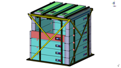
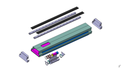

The [Nucifer muon veto](/services-techniques-et-administration/mecanique/projets-realisations.fr) has been designed, developed, tested and installed at Osiris reactor by the ERDRE group in collaboration with the Mechanical and Electrical services.

Because Nucifer will be installed at shallow depths, cosmic rays and their associated secondary particles induce the major sources of background (fast neutrons, spallation products and accidental events). Fast neutrons, induced by cosmic ray muon spallation on surrounding material, impinging upon the detector can be captured after recoiling on a detector proton. The recoiling proton produces a flash of light in the scintillator, and the neutron is captured after a time similar to that for antineutrino events. Thus these events can fake real antineutrinos. Having a small overburden at the detector site is an important feature, since this reduces the cosmic ray muon flux and cuts its hadronic component. The muon veto tags these particles in or near the detector. Although this background rate is difficult to estimate, preliminary measurements at OSIRIS indicate a control of the simulated mu-induced neutrons already good enough for the purpose of shielding and muon veto design. A high-Z shielding around the target is mandatory to reduce the important external gamma background, like 10 cm of low activity lead for an installation at a research reactor. The Nucifer Veto configuration setup is shown Fig. 1.

Fig. 1: The Nucifer Veto detector setup. External shielding and target are not shown.

In this gamma environment, recent studies performed by the group with the GEANT4 code \[4\] have shows that it is mandatory to place the muon veto inside the 10 cm Pb shielding. This latter one will surround 5/6th of the detector. The goal, is to minimize the veto triggering on reactor gammas and neutrons to guarantee a 100 micros minimal time delay between 2 veto signals.

The muon veto will consist in plastic scintillator slabs, thick enough (5 cm) in order to discriminate cosmic muons from gamma background. The used technique is a threshold principle to cut a maximum of gammas. Indeed cosmic ray muons are generally high-energy particles, so that we can assume that most of them are minimum ionizing particles. For plastic scintillator, the minimum ionizing value of dE/dx is 1.9 MeV.cm\-2. Therefore a 5 cm plastic slabs leads to an averaged deposited energy of about 10 MeV. Such a threshold can be applied to eliminate gammas of deposited energy below this threshold. The R&D activities were essentially carried out in order to optimize the size and the light collection homogeneity of plastics scintillators. Indeed the threshold value depends also on the light collection uniformity over the slab area. A test-bench has thus been developed at SUBATECH.

The slabs are read by only one PMT to insure a reasonable size and cost (AIEA requirements). The difficulty caused by one read-out channel, in terms of light efficiency according the crossing particle position, can be got around. As it is shown in Fig. 2, the slab is located deep down a aluminium box. The PMT, as for it, is suspended over, in a air gap. The PMT is not in contact with plastic slab. The plastic is unpolished in order to facilitate the passage of produced optical photons in the air gap.

In addition an aluminium foil is placed on the slab, in front of the photocathode to reduce the collected light in this zone. The air gap works as a smooth over of the number of optical photons able to reach the photocathode whatever the crossing muon position. Smearing the light collection allows maintaining a reasonable homogeneity factor, even if, consequently, the collection efficiency is deeply lowered. The veto modules have being mounted and installed close to the OSIRIS reactor in Spring 2012. The target of the Nucifer detector has also been installed inside the shielding and the veto. The veto response to the reactor–induced gamma and the cosmic muon flux are under study in order to tag the correlated background.

 

Fig. 2: Box concept for muon veto (Drawing by G. Guilloux)
