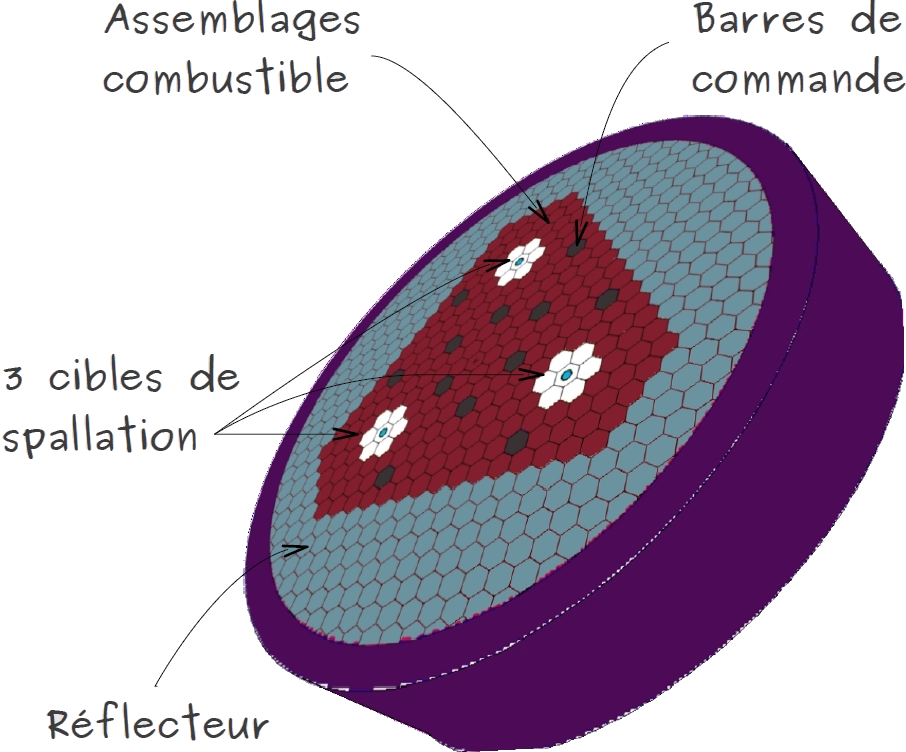
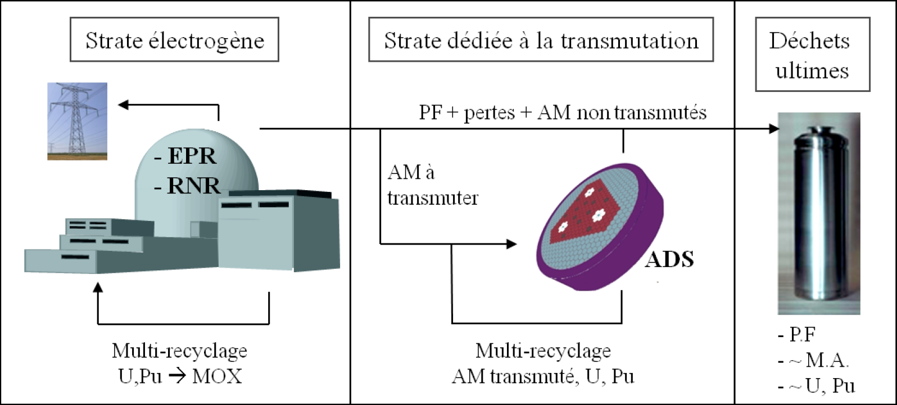

Afin de revisiter le potentiel des ADS, un concept original a été développé au sein du groupe ERDRE du laboratoire SUBATECH qui permet d'augmenter la taille de la zone irradiée, la puissance thermique du système et donc la quantité d'actinides mineurs transmutée par ADS. Les ADS "MUltiple Spallation Target" (MUST) consistent à combiner plusieurs cibles de spallation afin d'augmenter le flux neutronique entre elles. Nos efforts se concentrent particulièrement sur le dimensionnement de ces ADS de grande puissance, à partir de calculs de neutronique puis de thermohydraulique. Nous calculons ensuite les efficacités de transmutation des systèmes retenus. La figure 1 montre une vue schématique du concept MUST incluant trois cibles de spallation

 Figure 1: Vue schématique du concept MUST à trois cibles de spallation.

Nos études de réacteurs MUST sont réalisées dans le cadre de scénarios doubles strates où des systèmes ADS seraient implantés en parallèle d'une strate électrogène, composée de REP et/ou de RNR. A cette fin, nous utilisons deux types de combustible d'entrée, des combustibles correspondant à des fins de cycle REP et de RNR. La figure 2 illustre les scénarios qualifés de double-strates. Nous avons à l'heure actuelle pu concevoir des ADS MUST d'une puissance allant de 1.2 à 1.5 GWth soit 2 à 3 fois plus puissant que le précédent concept.

Figure 2: Illustration d'un scénario double-strates

Afin de tester les performances sur le long terme de l'ADS MUST, il importe de simuler sur de grandes échelles temporelles les bilans de matières dans l'ensemble du parc électronucléaire. Des codes de scénarios permettent de réaliser de tel calculs. Cependant, ils ne sont pas particulièrement adaptés pour répondre à nos besoins.
