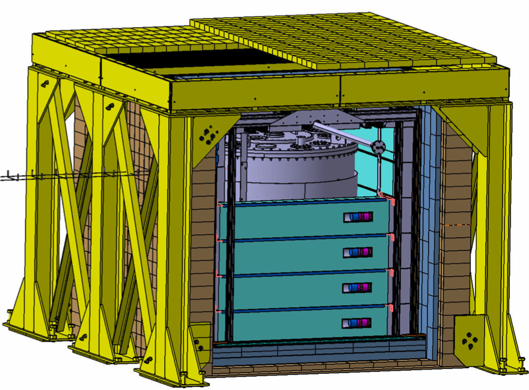

The Nucifer detector is based on the principle of an automatic, non-intrusive and virtually unfalsifiable monitoring of nuclear reactor by its antineutrino signal. Nucifer is an antineutrino detector seen as a prototype of an antineutrino monitor for safeguards and fuel management purposes constructed by groups from France (CEA/DSM, CEA/DAM, CNRS/IN2P3/SUBATECH and CNRS/IN2P3/APC).

The detector design (figure 1) is simple to construct, integrate, and ultimately operate with non neutrino-physicists. The detection principle is based on the inverse beta decay reaction, such as [Double Chooz](/recherche/sen/double-chooz-experiment.en), the most mature technics. The target is constituted of 0.85 m3 of liquid scintillator doped with Gd. The detector is monolithic, with a small surface to volume ratio favouring high detection efficiency. The energy resolution should be of about 20%!a(MISSING)nd the overall detection efficiency of 50%!
(MISSING)

Figure 1: Nucifer detector design

Our progresses on associated simulations of the antineutrino spectrum emitted by a nuclear reactor show that a sensibilily at the level of 100 kg of plutonium could be envisaged with Nucifer placed at 25m of a 1GWe reactor core and a thermal power monitoring at the percent level could be performed \[1-5\]. Nucifer started taking data in Mai 2012, at a location placed at 7m from the OSIRIS research reactor core (Saclay). If this first test will be successful, we then plan to install it close to a power reactor. The cosmic muon veto part of the Nucifer detector is essential for the background rejection. This essential part of the Nucifer experiment is of the responsibility of the SUBATECH lab. which has been in charge of the design, building and commissioning of the full veto detector (figure 2) and its associated electronics. The aim of the Nucifer prototype is to construct and demonstrate the simple operation of a detector that could interest industry or IAEA, in order to make the antineutrino reactor monitoring a reality. We emphasize that antineutrino applied physics represents an original application of fundamental particle physics and valorizes the developments of new experimental methods and techniques made in fundamental physics context.

Figure 2 : Nucifer detector and muon veto installet at Osiris research reactor

Beyond the non-proliferation task, Nucifer wants also to study netrino oscillation at short distances to test the hypothesis of a sterile neutrino as possible solution of the reactor anomaly \[6\] (see also introduction on neutrino physics).

### Bibliography

\[1\] Giot et al., 2008, Monte-Carlo simulations in the context of reactor monitoring with antineutrinos. Proceedings of the PHYSOR 2008 conference.

\[2\] F. Yermia et al.,The Nucifer experiment : antineutrino detection for reactor monitoring , GLOBAL 2009 Proceedings Paris, Sept. 2009.

\[3\] M. Fallot et al., PWR and CANDU Reactor monitoring with antineutrinos : non proliferation scenarios and expected sensitivity with the NUCIFER experiment, proceedings of the International Congress on Advances for Nuclear Power Plants 2009, Tokyo, May 2009 (proceedings accepté par ICAPP 2009, non présenté).

\[4\] A. Porta et al., Reactor neutrino detection for non proliferation with the nucifer experiment ,IEEE vol. 57, no. 5.

 \[5\] Reactor and antineutrino spectra simulations for unveiling diversion scenarios. M. Fallot, D. Lhuillier et al. (for the Double Chooz and Nucifer collaborations)

\[6\] G. Mention et al., Phys. Rev. D83, 073006 (2011).
