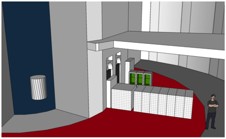
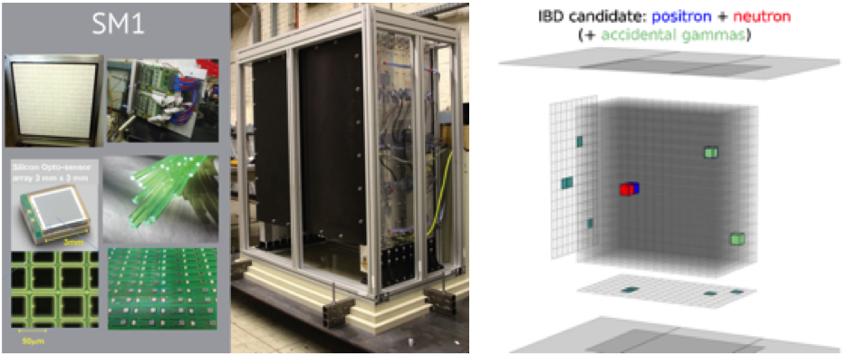
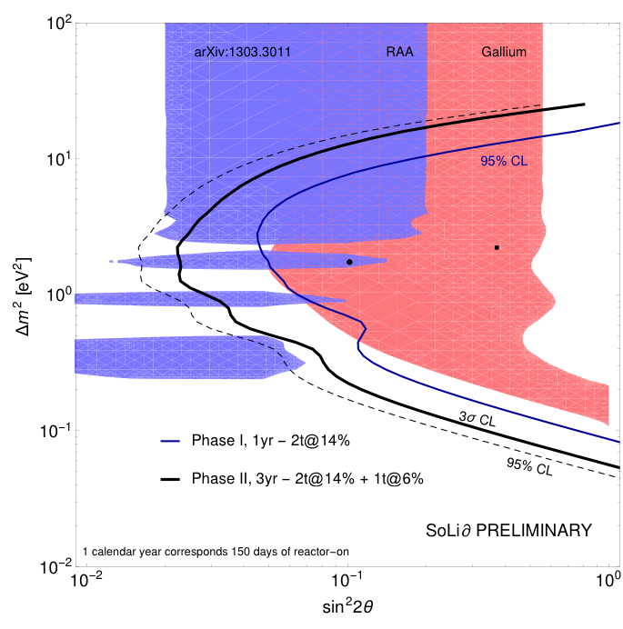

The SoLid experiment will address and solve one of the most outstanding issue in neutrino physics: the experimental neutrino oscillation anomalies that are pointing towards the existence of a new neutrino state with a mass of around 1 eV.

Neutrino oscillation, which has received the Nobel prize this year has far reaching consequences showing neutrino have mass. A result that shows the Standard Model needs to be extended. As such the neutrino sector is the first door opened beyond the standard model or Particle physics. The discovery of a purely neutral particle at 1 eV would profoundly shake our current understanding of the universe adding a completely new component to the universe.

The best way to tackle this problem is to make a measurement close to a reactor core < 10m were little is known and were the oscillation effect would be most prominent.

Using reactor antineutrinos, a large statistical sample can be accumulated quickly and combined with the well known IBD cross section the best way to obtain an unambiguous result.

This measurement presents a new challenge which call for a new type of technology. Operation of detector on the surface and very close to research reactor core. It requires the miniaturisation of a neutrino detector system which has consequences to the containment of energy unlike the current state-of-the-art detectors deployed at long baseline experiments. The SoLid technology solve this problem by a localisation of the IBD products close the vertex and a high segmentation to image external and internal background which also solve the energy containment problem. The BR2 research reactor demonstrated to be a low background environment suitable for this kind of measurement close to a reactor and the surface.

This experiment uses a novel approach to detect anti-neutrino with a highly segmented detector based on Lithium-6. With the combination of high granularity, high neutron-gamma discrimination using 6LiF:ZnS(Ag) and precise localization of the Inverse Beta Decay products, a better experimental sensitivity can be achieved compared to other state-of-the-art technology. This compact system requires minimum passive shielding allowing for very close stand off to the reactor. The experimental set up of the SoLid experiment and the BR2 reactor, the new principle of neutrino detection and the detector design made the experiment one of the main suitable experiment for the sterile neutrino search. Along with this world leading measurement, this project will deliver the best flux measurement of 235U, the key ingredient of flux prediction for future experiments.

_SoLid @ BR2_

A reduced-size prototype (4x4x4 cubes ; 8kg), has already been constructed in June. BR2 granted the installation of the prototype at 5.5 meters of the core, after only two weeks that demonstrated that there is no major safety issue with the technology. The prototype has been commissioned and itook data at BR2, with reactor OFF and ON. Results, which are very promising, demonstrate the low reactor background level and we can distinguish signal from background. The prototype demonstrates the main advantages quoted above.

Finally, one module (SM1) has been built by the SoLid collaboration, funded by Subatech (Mines Carnot) and installed at BR2 at 5.5 m from the core, at the end of 2014 for commissioning and for many days of data taking before the BR2 2015 stop. This first phase of the SoLid project is, first, providing the expertise for the detector construction and its rationalization and for a better understanding of the full size detector response. However, the first promising analysis demonstrates clearly the expected performance. The Inverse Beta decay analysis is currently in progress.

_SoLid Module 1 deployed at BR2, IBD candidate from data_

This project is lead by a international collaboration (Belgium, France, UK, US) composed of 10 laboratories

The SoLid experiment gather an international collaboration of about 50 physicists distributed in 10 laboratories comprising three partners in France (IN2P3 laboratories), six partners in Europe (UK and Belgium) and one in the United States. LAL and Virginia Tech have joined SoLid this year. This illustrates both the important role of the French institutes in the SoLid collaboration as well as the research potential of the experiment and interest of the world-wide neutrino physics community.

The experiment is split in two phases:

**Phase I** : Probe the high value of ∆m2 using 150 days of running and a 2t detector at 5.5 m.

**Phase II :** Precision phase with the additional CHANDLER module (1t) that will come from the ongoing Virginia Tech’s R&D (based on the mix-up of the SoLid technology and the LENS technology \[LENS\] with expected dE/E ~ 6%!/(MISSING)sqrt(E)).

The total detector will enable a competitive and timely search of oscillation corresponding to the mass splitting region ~ 0.6-2.5 eV2 , probing most of the region of the reactor and Gallium anomalies and a large fraction of the low mass area. The SoLid situation remains very competitive in terms of data accumulation. The estimated sensitivity that the SoLid experiment will have to 3+1 sterile neutrino models as a function of the oscillation parameters sin2(2theta) and Delta(m2) is shown Fig. 3. The 95%!c(MISSING)onfidence level after Phase I and the 3 sigma sensitivity with Phase II are shown Fig. 3. The 95%!c(MISSING)onfidence level parameter space from the reactor and gallium anomalies are in blue and red, respectively.

TheSubatech laboratory had a central role in the R&D phase of SoLid with contribution to the design. He is also involved in the core simulation, the calculation of the neutrino flux (reactor working group), the GEANT4 simulation and the SM1 analysis. Subatech is in charge of the physics coordination of the SoLid experiment.

_SoLid sensitivity for the two phases_

**Contact person: Frederic Yermia, [Frederic.Yermia@subatech.in2p3.fr](mailto:Frederic.Yermia@subatech.in2p3.fr)**

Some references :

[http://pos.sissa.it/archive/conferences/234/071/EPS-HEP2015\_071.pdf](http://pos.sissa.it/archive/conferences/234/071/EPS-HEP2015_071.pdf)[http://pos.sissa.it/archive/conferences/234/080/EPS-HEP2015\_080.pdf](http://pos.sissa.it/archive/conferences/234/080/EPS-HEP2015_080.pdf)[http://pos.sissa.it/archive/conferences/234/086/EPS-HEP2015\_086.pdf](http://pos.sissa.it/archive/conferences/234/086/EPS-HEP2015_086.pdf)[http://pos.sissa.it/archive/conferences/234/083/EPS-HEP2015\_083.pdf](http://pos.sissa.it/archive/conferences/234/083/EPS-HEP2015_083.pdf)
