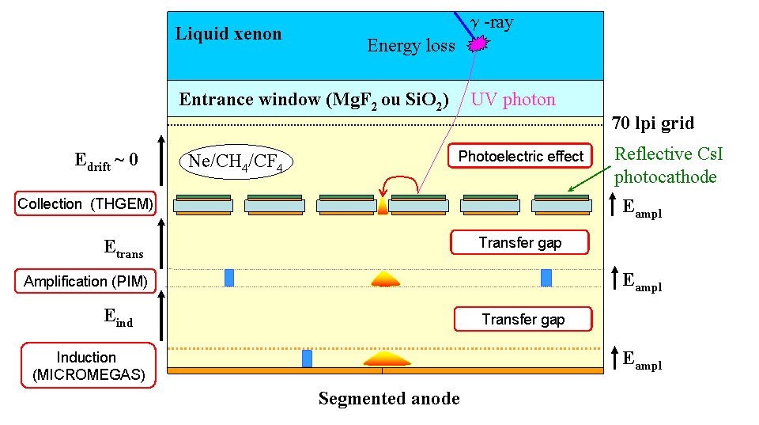
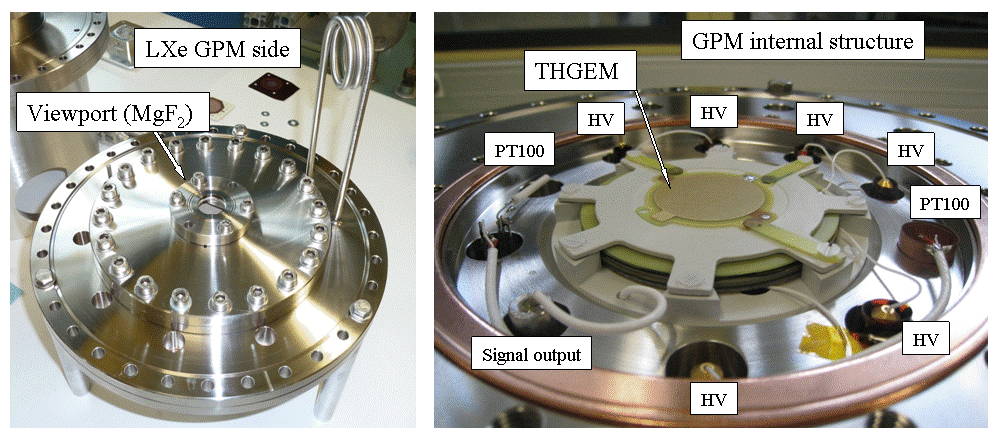

**Until now liquid noble gas detectors do not dispose of large-area photomultipliers adapted to the voluminous liquid scintillators involved. We are developing a large-area gaseous photomultiplier in view of realizing a LXe Compton telescope local trigger.**

### Liquid xenon scintillation

The interaction of an ionizing radiation with liquid xenon induces ionization and excitation of xenon atoms. Excited gas molecules, named exc imers, get back to their fundamental state by emitting ultra-violet photons with a peaked wavelength at 178 nm. Such UV photons are able to c over meter length distances without being absorbed as liquid xenon is transparent to its own luminescence. However, the scintillation light d etection is delicate because of the functioning temperature (165 K) and the energy of the LXe scintillation photons. LXe scintillation signal is fast. Its rise time is around the nanosecond and its duration, dependent on the electric field and the interacting particule, is about 10 0 ns. These fast signals are well suited for time event tagging and interaction depth determination into the time-projection chamber.

### Photodetection principle

Photodetection consists of the conversion of incident photons in a readable electric signal (induced current). In a first step photons are converted, by photoelectric effect, in elementary charges, called photoelectrons, which are then multiplied in order to deliver a sufficiently intense signal. Nowadays the most popular photodetectors used for LXe scintillation detection are vacuum photomultiplier tubes (PMT). Photoelectrons are extracted from a semi-conductor, the photocathode, then are multiplied by a succession of electrodes, the dynodes, by secondary emission and collected on an anode. The corresponding induced signal faithfully reproduced the caracteristic LXe scintillation shape. Nevertheless, the internal vacuum of these tubes does not allow the realization of large flat detection surfaces without dead area.

### A large-area Gaseous PhotoMultiplier

We are developing a photodetector based on a cesium iodide photocathode evaporated on a THick Gaseous Electron Multiplier (THGEM) for the photoconversion, a Parallel Ionization Multiplier (PIM) and a MICROMEsh GAseous Structure (MICROMEGAS) for the charges multiplication. The scheme of principle depicts the GPM structure in figure 1.

#### Scheme of principle of the LXe scintillation detection with a GPM based on a CsI-THGEM, a PIM and a MICROMEGAS

The THGEM is a FR4 or G10 detector of few hundred microns thickness mechanically drilled of millimeter holes. Copper electrodes cover each side of the isolating material. A thin gold or nickel layer is deposed on the electrodes in order to avoid chemical reaction between Cu and CsI. Primary charges multiplication occurs in the hundred microns thickness amplification gap of the PIM defined by two metallic micromeshes (Cu, Ni). With a sufficiently intense electric field (~10kV/cm) electrons acquire enough energy to ionize gas molecules with which they collide. The anode signal is induced in the last 50 microns of the MICROMEGAS detector. The detector is enclosed in a stainless steel cryogenic vessel (304L). Figure 2 shows photographs of one of the GPM prototypes used for cryogenic tests. First results obtained at LXe temperature are promising. They permit to envisage a scaling-up and a segmentation of the active area in view of realizing a position sensitive photodetector.

#### Picture of the GPM prototype developed at Subatech (Øanode = 32 mm)

### Theses and publications

*   S. Duval, [Développement d'un photomultiplicateur gazeux cryogénique dédié à un télescope Compton au xénon liquide pour l'imagerie médicale](http://tel.archives-ouvertes.fr/tel-00594636_v1/), Ph.D. thesis, dec 2010
*   C. Grignon et al., [Nuclear medical imaging using beta(+) gamma coincidences from Sc-44 radio-nuclide with liquid xenon as detection medium](http://www.sciencedirect.com/science/article/pii/S0168900206018456), NIMA 2008, Volume: 571 Issue: 1-2 Pages: 142-145
*   S. Duval, A. Breskin, H. Carduner, J.-P. Cussonneau, J. Lamblin, P. Le Ray, E. Morteau, T. Oger, J.-S. Stutzmann and D. Thers, [MPGDs in Compton imaging with liquid-xenon](http://iopscience.iop.org/1748-0221/4/12/P12008), 2009 JINST 4 P12008
*   S. Duval et al., [On the operation of a micropattern gaseous UV-photomultiplier in liquid-Xenon](http://iopscience.iop.org/1748-0221/6/04/P04007), 2011 JINST 6 P04007
*   A. Breskin et al., [CsI-THGEM gaseous photomultipliers for RICH and noble-liquid detectors](http://dx.doi.org/10.1016/j.nima.2010.10.034), NIMA 639 (2011) 117-120

### Collaborations

*   [Prof. Amos Breskin](mailto:Amos.Breskin@weizmann.ac.il) from [Weizmann Institute of Sciences](http://www.weizmann.ac.il/) (Israël)
