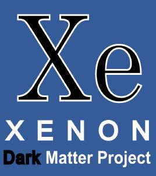
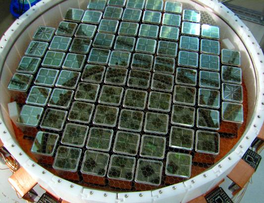
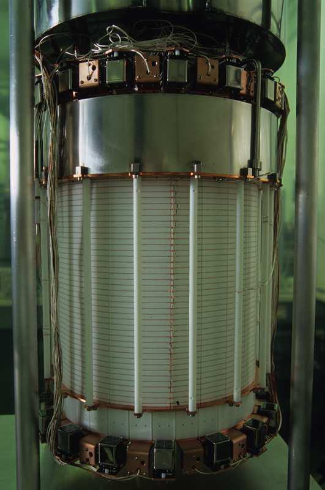
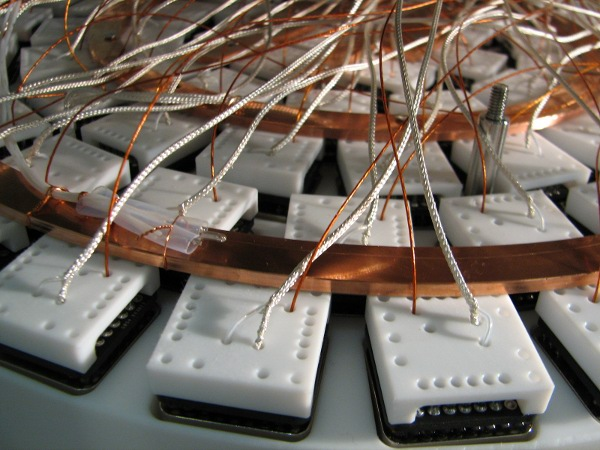
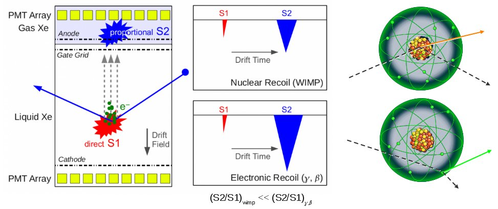
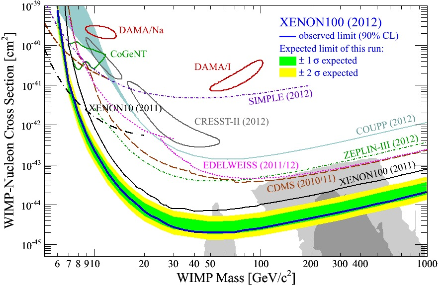

**XENON est un programme de détection directe de matière noire avec du xénon liquide. Il vise à détecter la faible charge et la petite quantité de lumière qui devraient être émises à la suite de l'interaction d'une particule de matière noire avec un noyau de xénon. L'objectif scientifique est d'être sensible aux très faibles sections efficaces prédites par les observations cosmologiques et les modèles théoriques. Le détecteur actuel, XENON100, contenant 162 kg de xénon, a récemment permis d'abaisser la limite sur la section efficace d'intéraction indépendant du spin à une valeur de 2 x 10\-45 cm2 pour un WIMP de 55 GeV/c2 (à 90%!d(MISSING)e degré de confiance). Le détecteur est encore en cours d'acquisition de données et devrait permettre d'atteindre prochainement une meilleure sensibilité.**

### Le détecteur XENON100

Le détecteur XENON100 est situé au Laboratoire Souterrain du Gran Sasso (LNGS) et est en opération depuis 2008. Il utilise le même principe ainsi que de nombreuses caractéristiques testés avec succès à l'aide du prototype XENON10. 10 fois plus grand que son prédécesseur et 100 fois plus sensible, il est constitué d'une chambre à projection temporelle (TPC) contenant du xénon liquide, entourée par deux plans de 178 photomultiplicateurs pour détecter le signal de scintillation primaire ainsi que le signal d'ionisation via le mécanisme de scintillation proportionnelle dans la phase gazeuse située à l'extrémité de la TPC.

  

### La signature de la matière noire

Le signal lumineux primaire (S1) est détecté instantanément par les photomultiplicateurs. Les électrons issus de l'ionisation, quant à eux, dérivent sous l'action d'un fort champ électrique. Un deuxième champ électrique plus fort extrait ces charges de la phase liquide vers la phase gazeuse où elles génèrent un signal scintillation secondaire (S2) proportionnel à la charge et retardé par rapport au signal S1 du temps de dérive. Le concept de la TPC permet un positionnement tridimensionnel des intéractions qui est utile pour rejeter le bruit de fond radioactif situé principalement sur les bords du détecteur. Enfin, le rapport S2/S1 est également utilisé comme critère de discrimination puisqu'il est plus grand dans le cas d'un recul d'électron (bruit de fond) que dans celui d'un recul nucléaire, qui est le signal attendu.

### La sensibilité à la matière noire

L'analyse de 224.6 jours effectifs de données, acquises entre Fevrier 2011 et Mars 2012, n'a révélé aucune évidence de matière noire. Deux événements candidats ont été détectés dans une zone d'observation prédéfinie dans laquelle 1.0±0.2 événements de bruit de fond étaient attendus. La limite sur la section efficace d'interaction indépendante du spin, σ, a été alors calculée en considérant une certaine densité et distribution de vitesse des WIMPs, particules candidates à la matière noire. Cette limite dépend de la masse du WIMP, mχ. Elle atteint un minimum de σ = 2.0 x 10\-45 cm2 à mχ = 55 GeV/c2, meilleure limite à ce jour.

### Theses et publications

*   E. Aprile et al. (The XENON100 Collaboration), First Axion Results from the XENON100 Experiment, Submitted to PRD, [arXiv:1404.1455](http://arxiv.org/abs/1404.1455 "http://arxiv.org/abs/1404.1455")
*   E. Aprile et al. (The XENON100 Collaboration), Observation and applications of single-electron charge signals in the XENON100 experiment, [J. Phys. G: Nucl. Part. Phys. 41 (2014) 035201](http://dx.doi.org/10.1088/0954-3899/41/3/035201 "http://dx.doi.org/10.1088/0954-3899/41/3/035201"), [arXiv:1311.1088](http://arxiv.org/abs/1311.1088 "http://arxiv.org/abs/1311.1088")
    

*   E. Aprile et al. (The XENON100 Collaboration), The neutron background of the XENON100 dark matter experiment, [J. Phys. G: Nucl. Part. Phys. 40, 115201 (2013)](http://dx.doi.org/10.1088/0954-3899/40/11/115201 "http://dx.doi.org/10.1088/0954-3899/40/11/115201"), [arXiv:1306.2303](http://arxiv.org/abs/1306.2303 "http://arxiv.org/abs/1306.2303")
    
*   E. Aprile et al. (The XENON100 Collaboration), Response of the XENON100 Dark Matter Detector to Nuclear Recoils, [Phys. Rev. D 88, 012006 (2013)](http://dx.doi.org/10.1103/PhysRevD.88.012006 "http://dx.doi.org/10.1103/PhysRevD.88.012006"), [arXiv:1304.1427](http://arxiv.org/abs/1304.1427 "http://arxiv.org/abs/1304.1427")
    
*   E. Aprile et al. (The XENON100 Collaboration), Limits on spin-dependent WIMP-nucleon cross sections from 225 live days of XENON100 data, [Phys. Rev. Lett. 111, 021301 (2013)](http://dx.doi.org/10.1103/PhysRevLett.111.021301 "http://dx.doi.org/10.1103/PhysRevLett.111.021301"), [arXiv:1301.6620](http://arxiv.org/abs/arXiv:1301.6620 "http://arxiv.org/abs/arXiv:1301.6620")
    
*   M. Le Calloch (for the XENON Collaboration), Latest results from the XENON Program, [Proceedings Rencontres de Moriond 2013 - VHEPU, Published by ARISF](http://moriond.in2p3.fr/Proceedings/2013/Moriond_VHEPU_2013.pdf "http://moriond.in2p3.fr/Proceedings/2013/Moriond_VHEPU_2013.pdf")
    

*   L. Scotto Lavina, Latest results from the XENON Dark Matter Program, proceedings pour 24th Rencontres de Blois, May 27-June 1, 2012, Blois, France, [arXiv:1305.0224](http://arxiv.org/abs/arXiv:1305.0224 "http://arxiv.org/abs/arXiv:1305.0224")
    
*   E. Aprile et al. (The XENON100 Collaboration), Analysis of the XENON100 Dark Matter Search Data, [Astropart.Phys. 54 (2014) 11-24](http://dx.doi.org/10.1016/j.astropartphys.2013.10.002 "http://dx.doi.org/10.1016/j.astropartphys.2013.10.002"), [arXiv:1207.3458](http://arxiv.org/abs/arXiv:1207.3458 "http://arxiv.org/abs/arXiv:1207.3458")
    
*   E. Aprile et al. (The XENON100 Collaboration), The distributed Slow Control System of the XENON100 Experiment, [JINST 7 T12001 (2012)](http://dx.doi.org/10.1088/1748-0221/7/12/T12001 "http://dx.doi.org/10.1088/1748-0221/7/12/T12001"), [arXiv:1211.0836](http://arxiv.org/abs/arXiv:1211.0836 "http://arxiv.org/abs/arXiv:1211.0836")
    
*   E. Aprile et al. (The XENON100 Collaboration), Dark Matter Results from 225 Live Days of XENON100 Data, [Phys.Rev.Lett. 109 (2012) 181301](http://dx.doi.org/10.1103/PhysRevLett.109.181301 "http://dx.doi.org/10.1103/PhysRevLett.109.181301"), [http://arxiv.org/abs/arXiv:1207.5988](http://arxiv.org/abs/arXiv:1207.5988 "http://arxiv.org/abs/arXiv:1207.5988")
    

*   E. Aprile et al. (The XENON100 Collaboration), Material screening and selection for XENON100, [Astropart.Phys. 35 (2011) 43-49](http://dx.doi.org/10.1016/j.astropartphys.2011.06.001 "http://dx.doi.org/10.1016/j.astropartphys.2011.06.001"), [arXiv:1103.5831](http://arxiv.org/abs/arXiv:1103.5831 "http://arxiv.org/abs/arXiv:1103.5831")
    
*   E. Aprile et al. (The XENON100 Collaboration), Likelihood Approach to the First Dark Matter Results from XENON100, [Phys. Rev. D84 (2011) 052003](http://dx.doi.org/10.1103/PhysRevD.84.052003 "http://dx.doi.org/10.1103/PhysRevD.84.052003"), [arXiv:1103.0303](http://arxiv.org/abs/arXiv:1103.0303 "http://arxiv.org/abs/arXiv:1103.0303")
    
*   E. Aprile et al. (The XENON100 Collaboration), Study of the electromagnetic background in the XENON100 experiment, [Phys.Rev. D83 (2011) 082001](http://dx.doi.org/10.1103/PhysRevD.83.082001 "http://dx.doi.org/10.1103/PhysRevD.83.082001") [Erratum-ibid. D85 (2012) 029904](http://dx.doi.org/10.1103/PhysRevD.85.029904 "http://dx.doi.org/10.1103/PhysRevD.85.029904"), [arXiv:1101.3866](http://arxiv.org/abs/arXiv:1101.3866 "http://arxiv.org/abs/arXiv:1101.3866")
    
*   XENON1T Collaboration (Marco Selvi for the collaboration). 2011, Study of the performances of the shield and muon veto of the XENON1T experiment, [PoS IDM2010 (2011) 053](http://pos.sissa.it/archive/conferences/110/053/IDM2010_053.pdf "http://pos.sissa.it/archive/conferences/110/053/IDM2010_053.pdf")
    
*   XENON Collaboration (Cecilia Levy for the collaboration), Shield design for the XENON1T experiment at LSM., [PoS IDM2010 (2011) 004](http://pos.sissa.it/archive/conferences/110/004/IDM2010_004.pdf "http://pos.sissa.it/archive/conferences/110/004/IDM2010_004.pdf")
    

*   E. Aprile et al. (The XENON100 Collaboration), First Dark Matter Results from the XENON100 Experiment, [Phys.Rev.Lett. 105 (2010) 131302](http://dx.doi.org/10.1103/PhysRevLett.105.131302 "http://dx.doi.org/10.1103/PhysRevLett.105.131302"), [arXiv:1005.0380](http://arxiv.org/abs/arXiv:1005.0380 "http://arxiv.org/abs/arXiv:1005.0380")
