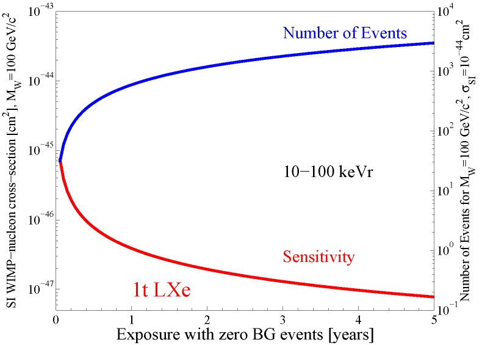

**XENON1T constitue l’un des prochains projets pour la recherche de matière noire, et fera appel à la même technique de détection que celle utilisée par XENON100. Bien que toujours en cours de conception, il sera à terme le plus gros détecteur au xénon liquide construit à ce jour, avec une sensibilité sur les sections efficaces d’interactions WIMPs-nucléons d’environ deux ordres de grandeurs supérieurs à celle des détecteurs actuels.**

### Un outil de plus en plus performant

Les derniers résultats de l’expérience XENON100 ont permis d’exclure avec un niveau de confiance de 90%!l(MISSING)es sections efficaces de diffusions supérieures à 7 x 10\-45 cm2 pour des interactions élastiques WIMPs-nucléons spin-indépendantes, avec des WIMPs de masse égale à 50 GeV/c2. Ceci constitue à ce jour la limite basse la plus contraignante pour les interactions de matière noire. De plus, d’après le Modèle Standard Supersymétrique Minimal (CMSSM), la fenêtre de masse des WIMPs la plus favorisée se trouve entre 100 et 1000 GeV/c2, avec une section efficace d’interaction WIMP-nucléon aux environs de 10\-46 cm2. Or, comme le taux de signaux prévu est très inferieur à une interaction par kilogramme de matériel cible et par jour, il apparait donc nécessaire d’augmenter la quantité de matériel cible pour pouvoir explorer de si petites sections efficaces d’interaction. Fort du succès de sa technique de détection obtenu pour l’expérience XENON100, la collaboration XENON propose une chambre à projection temporelle (TPC) de 2,5 tonnes de xénon liquide (LXe), XENON1T, afin de poursuivre la recherche de WIMPs avec une sensibilité sans précédent. A l’instar de son prédécesseur, ce nouveau détecteur sera assemblé au laboratoire souterrain du Gran Sasso. Si l’augmentation de la quantité de xénon cible permet une hausse du taux d’événements attendus, ce n’est pas là son seul avantage. En effet, il permet aussi la réduction du bruit de fond environnant grâce à l’augmentation de la capacité d’autoprotection du xénon liquide. Le taux de bruit de fond estimé sera de 10\-4 impulsions/keV/kg/jour (0,1 mdru), soit 100 fois moins que le bruit de fond obtenu pour XENON100, ce qui offre la sensibilité nécessaire pour détecter des WIMPs au-delà des fenêtres de paramètres favorisées par la plupart des théories. Les figures ci-dessous montrent le nombre d’événements et la sensibilité attendus pour XENON1T.

 

#### (Gauche) Nombre d’évènements et sensibilité sur les sections efficaces attendus pour XENON1T en fonction du temps d’expositions; (droit) Comparaison de la sensibilité de XENON1T avec la sensibilité actuelle de XENON100 et avec les prévisions théoriques

### Un véritable défi : la réalisation d’un détecteur de plusieurs tonnes de xénon liquide

Les taux de signaux de scintillations et d’ionisations ainsi que leur stabilité étant directement reliés à la pureté du xénon liquide et à la régulation de la pression, il apparait donc nécessaire, pour assurer le bon fonctionnement d’un si grand détecteur, d’utiliser de bons systèmes de cryogénie et de purification du xénon liquide. Pour élaborer de tels systèmes, le groupe Xénon du laboratoire Subatech propose la création d’une cuve de récupération et de stockage à très haute pression du xénon, baptisé RESTOX (REcuperation and Storage Of Xenon), qui pourra conserver puis libérer jusqu’ à 3 tonnes de xénon sous forme liquide en utilisant un système de refroidissement interne, ce qui permettra des gains de temps et d’énergie significatifs. Il sera aussi capable de stocker tout le xénon contenu dans le détecteur sous forme gazeuse en cas de panne générale d’alimentation de XENON1T. Ceci constitue une avancée majeure puisque l’actuel détecteur, XENON100, ne permet d’effectuer ces opérations que sous phase gazeuse. De plus, le xénon recueilli par RESTOX pourra conserver une très grande pureté grâce à un système de purification externe. Ceci permettra de diviser par deux le temps nécessaire au retour d’une pureté optimale du xénon liquide lorsque le détecteur sera à nouveau rempli.

#### Image de ReStoX

### Theses et publications

*   XENON100 Collaboration (E. Aprile et al.), [Dark Matter Results from 225 Live Days of XENON100 Data](http://arxiv.org/abs/1207.5988), submitted to PRL, arXiv:1207.5988 \[astro-ph.CO\]
*   XENON100 Collaboration (E. Aprile et al.), [Analysis of the XENON100 Dark Matter Search Data](http://arxiv.org/abs/1207.3458), submitted to Astropart. Phys., arXiv:1207.3458 \[astro-ph.IM\]
*   XENON100 Collaboration (E. Aprile et al.), [The XENON100 Dark Matter Experiment](http://arxiv.org/pdf/1107.2155), Astropart. Phys. 35:573-590,2012, arXiv:1107.2155 \[astro-ph.IM\]
*   XENON100 Collaboration (E. Aprile et al.), [Implications on Inelastic Dark Matter from 100 Live Days of XENON100 Data](http://arxiv.org/pdf/1104.3121), Phys.Rev.D84:061101,2011, arXiv:1104.3121 \[astro-ph.CO\]
*   XENON100 Collaboration (E. Aprile et al.), [Dark Matter Results from 100 Live Days of XENON100 Data](http://arxiv.org/pdf/1104.2549), Phys. Rev. Lett. 107, 131302 (2011), arXiv:1104.2549 \[astro-ph.CO\]
*   XENON100 Collaboration (E. Aprile et al.), [Likelihood Approach to the First Dark Matter Results from XENON100](http://arxiv.org/pdf/1103.0303), Phys. Rev. D84, 052003 (2011), arXiv:1103.0303 \[hep-ex\]
*   XENON100 Collaboration (E. Aprile et al.), [First Dark Matter Results from the XENON100 Experiment](http://arxiv.org/pdf/1005.0380), Phys.Rev.Lett.105:131302,2010, arXiv:1005.0380 \[astro-ph.CO\]
*   XENON100 Collaboration (E. Aprile et al.), [Material screening and selection for XENON100](http://dx.doi.org/10.1016/j.astropartphys.2011.06.001), Astropart. Phys., 35:43-49,2011, arXiv:1103.5831 \[physics.ins-det\]
*   XENON1T Collaboration (Marco Selvi for the collaboration) Study of the performances of the shield and muon veto of the XENON1T experiment, 2011, PoS IDM2010:053,2011
*   XENON Collaboration (Cecilia Levy for the collaboration) [Shield design for the XENON1T experiment at LSM](http://pos.sissa.it//archive/conferences/110/004/IDM2010_004.pdf), PoS IDM2010:004,2011

(Gauche) Nombre d’évènements et sensibilité sur les sections efficaces attendus pour XENON1T en fonction du temps d’expositions; (droit) Comparaison de la sensibilité de XENON1T avec la sensibilité actuelle de XENON100 et avec les prévisions théoriques
