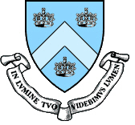
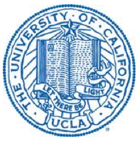
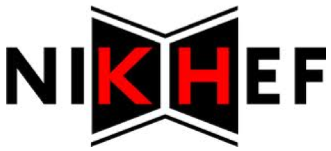

### The XENON Collaboration is...

#### [Columbia University, USA](Xenon_Columbia)

#### [Rice University, USA](http://xenon.physics.rice.edu/)

#### University of California, Los Angeles, USA

#### [University of Zurich, Switzerland](http://www.physik.uzh.ch/groups/groupbaudis/xenon/)

#### [University of Coimbra, Portugal](http://xenon.fis.uc.pt)

#### Gran Sasso National Laboratories, Italy

#### Shanghai Jiao Tong University, China

#### [Johannes Gutenberg University Mainz, Germany](http://xenon.physik.uni-mainz.de/)

#### University of Bologna, Italy

#### [SubaTech, France](fr/recherche/xenon/presentation)

#### [University of Müenster, Germany](http://www.uni-muenster.de/Physik.KP/AGWeinheimer/index.html)

#### National Institute for Subatomic Physics, the Netherlands

#### [The Max Planck Institute for Nuclear Physics, Germany](http://www.mpi-hd.mpg.de/lin)

#### Weizmann Institute of Science, Israel

#### Purdue University, USA

### Other Links

*   [Gran Sasso Laboratory](http://www.lngs.infn.it/home.htm)
*   [Web site of the XENON100 group in Columbia](http://xenon.astro.columbia.edu/)
*   [Web site of the XENON100 group in Zurich](http://www.physik.uzh.ch/groups/groupbaudis/xenon/)
*   [Web site of the OpenGATE Collaboration](http://www.opengatecollaboration.org/)
