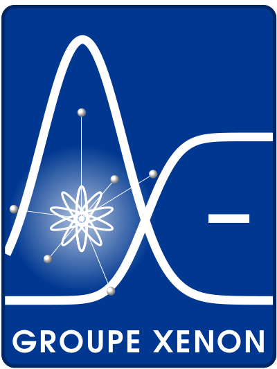

****

**C**omposed by a team of experimental physicists, the Xenon group is searching for experimental evidences that can better observe and understand the nature of our universe. Our scientists use an innovative and particularly exciting technology, the liquid xenon, to always push the limits of experimental detection. Engaged in ambitious research programs, both basic and applied, our team plays in international, national and regional collaborations, with or without industry partnership to promote the dynamism and the spirit of enterprise which characterize the scientific community engaged in observing the laws governing the properties of matter. Our team is very young and open to international partnerships.

**T**wo major scientific programs drive our activities: the search for dark matter in the Universe within the international [XENON Collaboration](http://xenon1t.org) and the development of a new functional nuclear imaging technique based on Compton imaging, the 3-gamma imaging. Both projects receive financial and human support by Subatech, Armines, ANR, INCA and the Region Pays de la Loire. In parallel, we also carry out studies on radiation protection and cryogenics in partnership with industry.

Events
------

**News! Celebration of 20 years of Subatech**

Elena Aprile, head of the Collaboration XENON will be present at the celebration for the twentieth anniversary of the Subatech Laboratory, on June 20th, 2014. The program of the day foresees the talk:

12:15 - The Quest for Dark Matter, Elena APRILE, Principal investigator of the XENON Collaboration , Columbia University, New York

