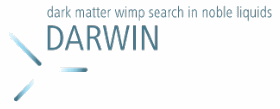
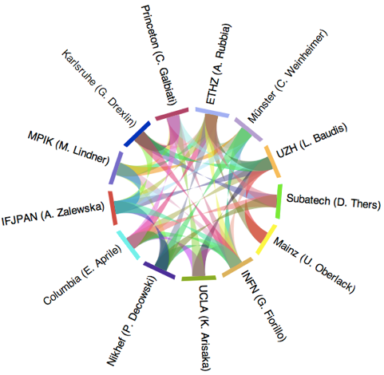

**DARWIN is a design study for the realisation of a future astroparticle infrastructure in Europe for the search for the dark matter. The project has been identified in the ASPERA Roadmap.**

### The Project

The aim of DARWIN is to perform the necessary studies for the construction of multi-ton scale liquid xenon and argon detectors for the direct detection of dark matter with a sensitivity of 10\-47 cm2, which is by three orders of magnitudes beyond the one of existing experiments. Such a detector would not only have a realistic chance of discovering the nature of dark matter, but would also be able to study its properties. DARWIN brings together several European and American groups working in the XENON and DARKSIDE collaborations and unites expertise on liquid noble gas detectors, low-background techniques, cryogenic infrastructure, shielding and astroparticle physics phenomenology. In the recent years, noble liquid detectors demonstrated to be highly competitive to the other main technologies in this area. They offer low-threshold and ultra-low background and position-sensitive detectors. As the passage from XENON10 to XENON100 (and in future to XENON1T) demonstrated, this technology can be scaled to large target masses in a relatively easy way.

### The Subatech contribution

Subatech, co-founder of the DARWIN project, is engaged in three of the eight working packages (WP), namely the WP5, concerning the Electronics and DAQ of which Subatech is coordinator, the WP2, concerning the R&D on the recuperation and storage of a cryogenic liquid, and the WP4 with the development of the GPM. In the latter WP, our engagement consists of bringing our experience in cryogenic detectors (acquired for the medical imaging R&D and as member of XENON Collaboration) for the detection of both charge and prompt light signal in liquid xenon.

### Links

*   [DARWIN Web site](http://darwin.physik.uzh.ch/index.html)
