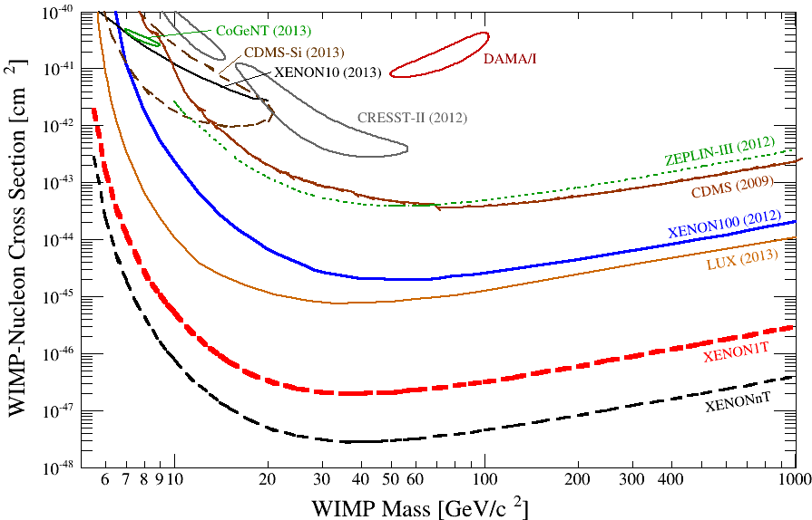
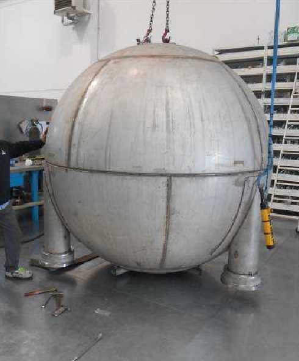
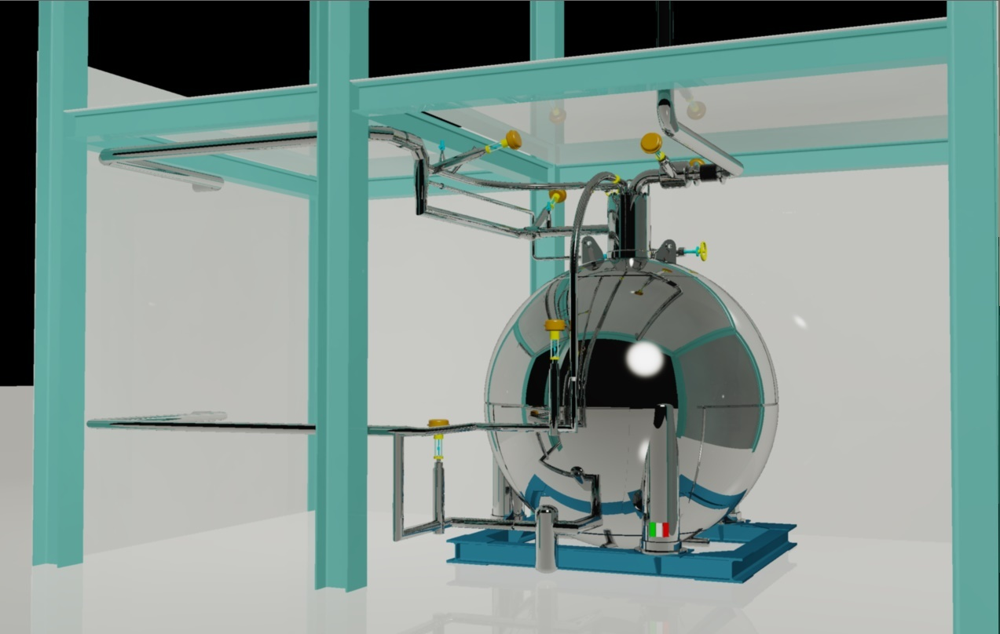

**XENON1T is the next project for the direct search of dark matter, following the same detection technique successfully used by XENON100. The project is still in the design phase. It will be the biggest liquid xenon detector ever built, with a sensitivity to the WIMP-nucleon cross section of about two orders of magnitude over current generation.**

### The performances

The latest XENON100 result has excluded spin-independent elastic WIMP-nucleon scattering cross-sections above 2 x 10\-45 cm2 for a WIMP mass of 55 GeV/c2 at 90%!c(MISSING)onfidence level, which is, together with LUX, one of the most stringent limit on dark matter interactions today. However, according to the Constrained Minimal Supersymmetric Standard Model (CMSSM), the favored WIMP mass predicted is between 100~1000 GeV/c2 with ~ 10\-46 cm2 WIMP-nucleon scattering cross section. Since the predicted signal rates are much lower than one interaction per kg of target material and day, a larger target mass is required for such a small cross sections. Strong of the success of the detection technique obtained with XENON100, XENON Collaboration proposed a 2.2 tons liquid xenon (LXe) Time Projection Chamber (TPC), XENON1T, to continue searching for WIMPs with unprecedented sensitivity. XENON1T will be built in the Gran Sasso laboratories as well. An increased event rate of the expected signal is not the only advantage of a bigger mass, but also the overall background will be reduced because of the improved auto-shielding properties of liquid xenon. The raw background rate will be 10\-4 counts/keV/kg/day (0.1 mdru), a factor of 100 lower than the background achieved in XENON100. This will provide the sensitivity to detect WIMPs over most of the theoretically favored parameter space. The figures below show the number of events and sensitivity expected by XENON1T.

 

#### Expected XENON1T (and its future upgrade) sensitivity compared with the present sensitivities and theoretical expectations

### The challenges of a multi-ton detector

A good cryogenic and purification system will be the key point to get good performance of such a huge volume of LXe detector, since the yield of ionization and scintillation signals and their stability is directly related to the purity of LXe and the pressure regulation. Subatech group proposes a high-pressurized xenon storage (Recuperation and Storage of Xenon, ReStox), which not only can keep up to 7 tons of xenon in liquid phase using the built-in cooling system, but also is able to store all of the xenon in gaseous phase in case of power failure. The xenon inside the storage can be kept in a ultra-high purity state with an external purification system. After the xenon is filled into the detector, the expected time to reach a ultra-low impurity level for data taking can be reduced to one half compared to the case without the storage. With the built-in high-power cooling system, the xenon storage can fill and recuperate the xenon in liquid phase, which would save a significant amount of time and energy compared to the way adopted so far in XENON100 (filling and recuperation in gaseous phase).

#### Picture (left) and 3D design (right) of ReStoX

### Theses and publications

*   M. Le Calloch (for the XENON Collaboration), Latest results from the XENON Program, [Proceedings Rencontres de Moriond 2013 - VHEPU, Published by ARISF](http://moriond.in2p3.fr/Proceedings/2013/Moriond_VHEPU_2013.pdf "http://moriond.in2p3.fr/Proceedings/2013/Moriond_VHEPU_2013.pdf")
    

*   L. Scotto Lavina, Latest results from the XENON Dark Matter Program, proceedings pour 24th Rencontres de Blois, May 27-June 1, 2012, Blois, France, [arXiv:1305.0224](http://arxiv.org/abs/arXiv:1305.0224 "http://arxiv.org/abs/arXiv:1305.0224")
    
*   XENON1T Collaboration (Marco Selvi for the collaboration). 2011, Study of the performances of the shield and muon veto of the XENON1T experiment, [PoS IDM2010 (2011) 053](http://pos.sissa.it/archive/conferences/110/053/IDM2010_053.pdf "http://pos.sissa.it/archive/conferences/110/053/IDM2010_053.pdf")
    
*   XENON Collaboration (Cecilia Levy for the collaboration), Shield design for the XENON1T experiment at LSM., [PoS IDM2010 (2011) 004](http://pos.sissa.it/archive/conferences/110/004/IDM2010_004.pdf "http://pos.sissa.it/archive/conferences/110/004/IDM2010_004.pdf")
