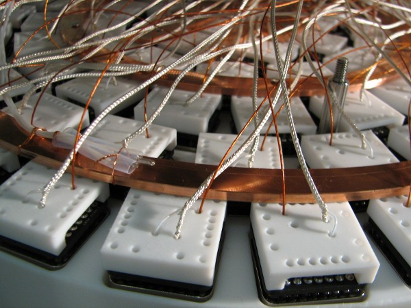
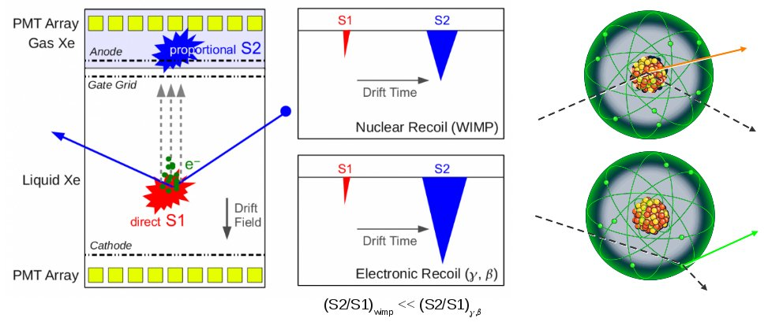

**XENON is a direct dark matter detection project using liquid xenon as the detector medium. The goal is to detect the small charge and light signal after a dark matter particle interacts with a xenon nucleus. Its scientific reach is to be sensitive to very low WIMP-nucleon cross sections, where cosmological observations and theoretical models expect to find dark matter. The latest module, XENON100, is currently taking data and recently published the most stringent limit ever made on dark matter interactions, excluding the spin-independent cross-section above 2 x 10\-45 cm2 for a WIMP mass of 55 GeV/c2 at 90%!c(MISSING)onfidence level.**

### The XENON100 detector

The XENON100 detector is located at the Gran Sasso Underground Laboratory and it is operative since 2008. It uses the same principle of operation and many design features successfully tested in the previous prototype, XENON10. Ten times larger than its predecessor and 100 times more sensitive, it is a position-sensitive time projection chamber (TPC), with the sensitive liquid Xe volume viewed by two arrays of total 178 photomultiplier tubes (PMTs), to detect simultaneously the primary scintillation signal and the ionization signal via the proportional scintillation mechanism.

  

### The dark matter signature

The prompt light signal (S1) is detected by photomultipliers. The ionization electrons are separated from the Xe ions and drifted upwards by a strong electric field. A second electric field extracts the charges from the liquid into the gas phase where they generate secondary scintillation light (S2) which is proportional to the charge signal and delayed to the S1 by the electron drift time. The TPC design allows the precise 3-dimensional reconstruction of the interaction vertex which can be used to reduce the background contamination by fiducial volume cuts. The ratio S2/S1 has a different value for electron recoils (background) and nuclear recoils (signal) and can be used for background discrimination.

### The sensitivity on the dark matter interactions

The analysis of about 224.6 live days of data, acquired between February 2011 and March 2012 showed no evidence for dark matter: two candidate events were observed in a pre-defined signal region in which we expected 1.0±0.2 background events. A limit on the spin-independent WIMP-nucleon elastic scatterinng cross-section σ is calculated by assuming WIMPs to be distributed in an isothermal halo with a certain velocity and density. The limit depends on the unknown WIMP mass mχ and it has a minimum of σ = 2.0 x 10\-45 cm2 at mχ = 55 GeV/c2.

### Theses and publications

*   E. Aprile et al. (The XENON100 Collaboration), First Axion Results from the XENON100 Experiment, Submitted to PRD, [arXiv:1404.1455](http://arxiv.org/abs/1404.1455 "http://arxiv.org/abs/1404.1455")
*   E. Aprile et al. (The XENON100 Collaboration), Observation and applications of single-electron charge signals in the XENON100 experiment, [J. Phys. G: Nucl. Part. Phys. 41 (2014) 035201](http://dx.doi.org/10.1088/0954-3899/41/3/035201 "http://dx.doi.org/10.1088/0954-3899/41/3/035201"), [arXiv:1311.1088](http://arxiv.org/abs/1311.1088 "http://arxiv.org/abs/1311.1088")
    

*   E. Aprile et al. (The XENON100 Collaboration), The neutron background of the XENON100 dark matter experiment, [J. Phys. G: Nucl. Part. Phys. 40, 115201 (2013)](http://dx.doi.org/10.1088/0954-3899/40/11/115201 "http://dx.doi.org/10.1088/0954-3899/40/11/115201"), [arXiv:1306.2303](http://arxiv.org/abs/1306.2303 "http://arxiv.org/abs/1306.2303")
    
*   E. Aprile et al. (The XENON100 Collaboration), Response of the XENON100 Dark Matter Detector to Nuclear Recoils, [Phys. Rev. D 88, 012006 (2013)](http://dx.doi.org/10.1103/PhysRevD.88.012006 "http://dx.doi.org/10.1103/PhysRevD.88.012006"), [arXiv:1304.1427](http://arxiv.org/abs/1304.1427 "http://arxiv.org/abs/1304.1427")
    
*   E. Aprile et al. (The XENON100 Collaboration), Limits on spin-dependent WIMP-nucleon cross sections from 225 live days of XENON100 data, [Phys. Rev. Lett. 111, 021301 (2013)](http://dx.doi.org/10.1103/PhysRevLett.111.021301 "http://dx.doi.org/10.1103/PhysRevLett.111.021301"), [arXiv:1301.6620](http://arxiv.org/abs/arXiv:1301.6620 "http://arxiv.org/abs/arXiv:1301.6620")
    
*   M. Le Calloch (for the XENON Collaboration), Latest results from the XENON Program, [Proceedings Rencontres de Moriond 2013 - VHEPU, Published by ARISF](http://moriond.in2p3.fr/Proceedings/2013/Moriond_VHEPU_2013.pdf "http://moriond.in2p3.fr/Proceedings/2013/Moriond_VHEPU_2013.pdf")
    

*   L. Scotto Lavina, Latest results from the XENON Dark Matter Program, proceedings pour 24th Rencontres de Blois, May 27-June 1, 2012, Blois, France, [arXiv:1305.0224](http://arxiv.org/abs/arXiv:1305.0224 "http://arxiv.org/abs/arXiv:1305.0224")
    
*   E. Aprile et al. (The XENON100 Collaboration), Analysis of the XENON100 Dark Matter Search Data, [Astropart.Phys. 54 (2014) 11-24](http://dx.doi.org/10.1016/j.astropartphys.2013.10.002 "http://dx.doi.org/10.1016/j.astropartphys.2013.10.002"), [arXiv:1207.3458](http://arxiv.org/abs/arXiv:1207.3458 "http://arxiv.org/abs/arXiv:1207.3458")
    
*   E. Aprile et al. (The XENON100 Collaboration), The distributed Slow Control System of the XENON100 Experiment, [JINST 7 T12001 (2012)](http://dx.doi.org/10.1088/1748-0221/7/12/T12001 "http://dx.doi.org/10.1088/1748-0221/7/12/T12001"), [arXiv:1211.0836](http://arxiv.org/abs/arXiv:1211.0836 "http://arxiv.org/abs/arXiv:1211.0836")
    
*   E. Aprile et al. (The XENON100 Collaboration), Dark Matter Results from 225 Live Days of XENON100 Data, [Phys.Rev.Lett. 109 (2012) 181301](http://dx.doi.org/10.1103/PhysRevLett.109.181301 "http://dx.doi.org/10.1103/PhysRevLett.109.181301"), [http://arxiv.org/abs/arXiv:1207.5988](http://arxiv.org/abs/arXiv:1207.5988 "http://arxiv.org/abs/arXiv:1207.5988")
    

*   E. Aprile et al. (The XENON100 Collaboration), Material screening and selection for XENON100, [Astropart.Phys. 35 (2011) 43-49](http://dx.doi.org/10.1016/j.astropartphys.2011.06.001 "http://dx.doi.org/10.1016/j.astropartphys.2011.06.001"), [arXiv:1103.5831](http://arxiv.org/abs/arXiv:1103.5831 "http://arxiv.org/abs/arXiv:1103.5831")
    
*   E. Aprile et al. (The XENON100 Collaboration), Likelihood Approach to the First Dark Matter Results from XENON100, [Phys. Rev. D84 (2011) 052003](http://dx.doi.org/10.1103/PhysRevD.84.052003 "http://dx.doi.org/10.1103/PhysRevD.84.052003"), [arXiv:1103.0303](http://arxiv.org/abs/arXiv:1103.0303 "http://arxiv.org/abs/arXiv:1103.0303")
    
*   E. Aprile et al. (The XENON100 Collaboration), Study of the electromagnetic background in the XENON100 experiment, [Phys.Rev. D83 (2011) 082001](http://dx.doi.org/10.1103/PhysRevD.83.082001 "http://dx.doi.org/10.1103/PhysRevD.83.082001") [Erratum-ibid. D85 (2012) 029904](http://dx.doi.org/10.1103/PhysRevD.85.029904 "http://dx.doi.org/10.1103/PhysRevD.85.029904"), [arXiv:1101.3866](http://arxiv.org/abs/arXiv:1101.3866 "http://arxiv.org/abs/arXiv:1101.3866")
    
*   XENON1T Collaboration (Marco Selvi for the collaboration). 2011, Study of the performances of the shield and muon veto of the XENON1T experiment, [PoS IDM2010 (2011) 053](http://pos.sissa.it/archive/conferences/110/053/IDM2010_053.pdf "http://pos.sissa.it/archive/conferences/110/053/IDM2010_053.pdf")
    
*   XENON Collaboration (Cecilia Levy for the collaboration), Shield design for the XENON1T experiment at LSM., [PoS IDM2010 (2011) 004](http://pos.sissa.it/archive/conferences/110/004/IDM2010_004.pdf "http://pos.sissa.it/archive/conferences/110/004/IDM2010_004.pdf")
    

*   E. Aprile et al. (The XENON100 Collaboration), First Dark Matter Results from the XENON100 Experiment, [Phys.Rev.Lett. 105 (2010) 131302](http://dx.doi.org/10.1103/PhysRevLett.105.131302 "http://dx.doi.org/10.1103/PhysRevLett.105.131302"), [arXiv:1005.0380](http://arxiv.org/abs/arXiv:1005.0380 "http://arxiv.org/abs/arXiv:1005.0380")
