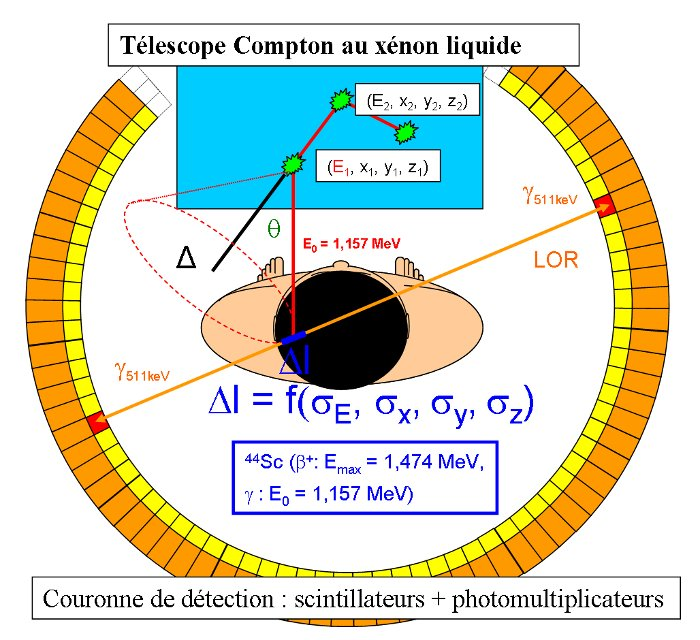
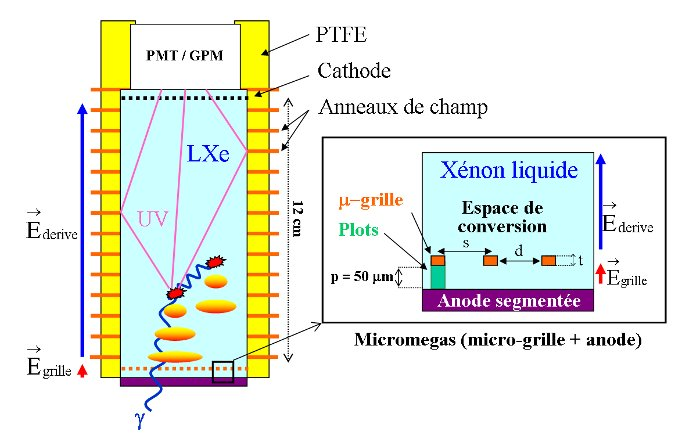
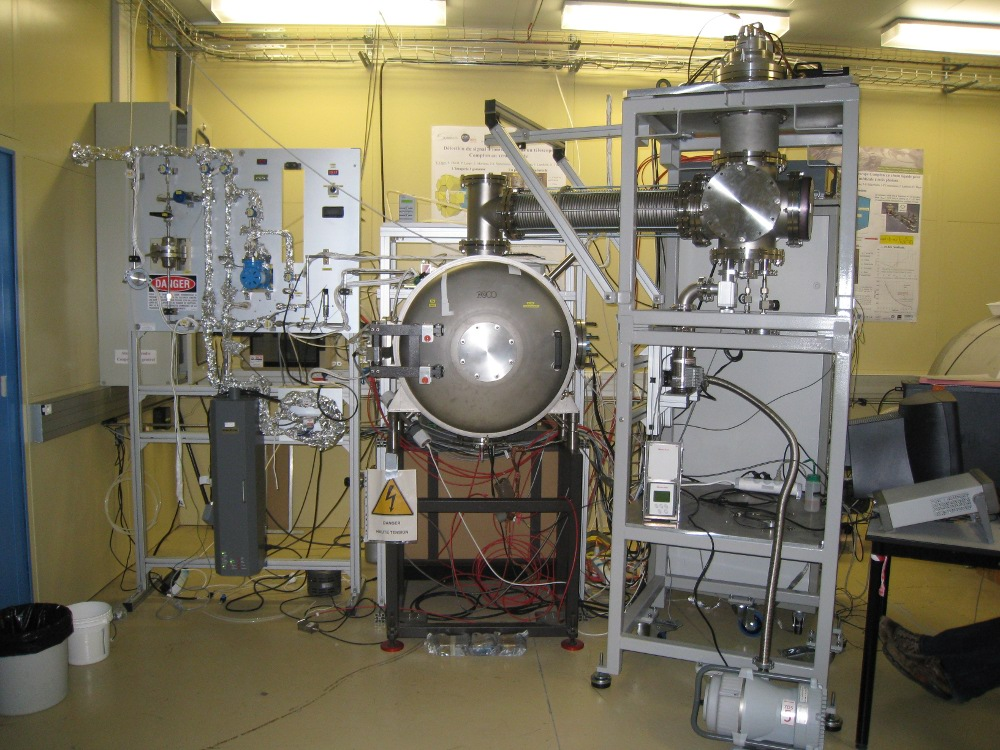
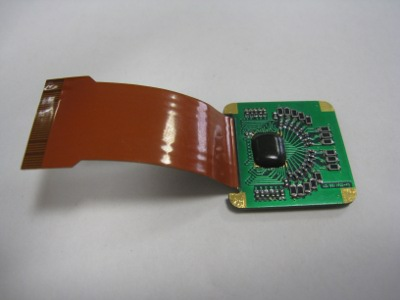
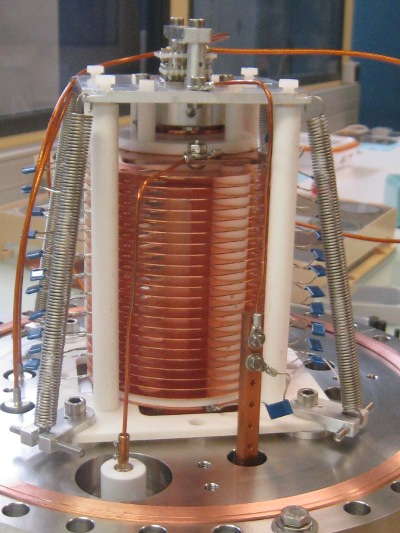
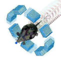
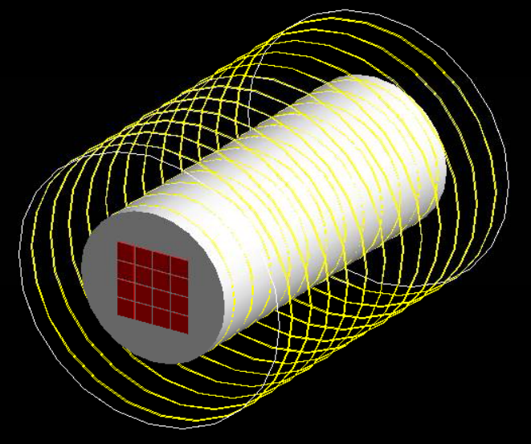
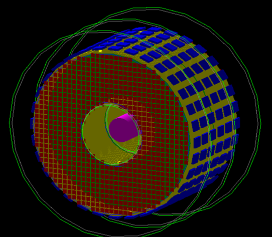

**The XEMIS project, started in Subatech in 2004, has the goal of developing a Compton camera with liquid xenon for the medical imaging.**

### The project

A new imaging technique named 3-gamma imaging has been proposed by our group in the Subatech Laboratory. It is based on the direct 3D reconstruction of the position of specific radioactive emitters: the Scandium-44, a (β+,γ) emitter. It is indeed an excellent candidate for such a kind of imaging, requiring a radioactive tracer which emits a positron and a gamma photon in temporal coincidence. The two gamma emitted by the annihilation of the positron with the matter are detected in coincidence, as in the case of the positron emission tomography (PET). The direction of the third gamma is reconstructed by means of a Compton telescope with liquid xenon. By crossing the two informations, it is possible to reconstruct the position of the emission point for each single disintegration, which would be otherwise impossible with the present nuclear imaging techniques. Based on this concept, a small dimension prototype of Compton telescope with liquid xenon has been set up in Subatech (XEMIS1). This first R&D phase is going to be followed by the set up of a bigger telescope (XEMIS2), a demonstrator to perform imaging on small animals. It will allow the feasibility study of the 3-gamma imaging on humans. In parallel, ongoing tests and developments are being performed around the chemical properties of the scandium, an innovative radioelement, which could be delivered by the ARRONAX cyclotron (Accélérateur pour la Recherche en Radiochimie et Oncologie à Nantes Atlantique) in Nantes. The extra valuable resource of the 3-gamma imaging under consideration in oncology centers would allow several improvements:

*   increasing of the precision on the mesurement of the tumoral activity
*   reducing dose, consequently of the biological impact associated to the nuclear imaging
*   reducing time exposures of the patient
*   reducing delays in care for patients in hospitals (increased volume of consultations/day)

### Development of the Compton telescope with liquid xenon XEMIS1

Since the \`70, liquid xenon has been used for developments directly related to the functional nuclear imaging. Two broad categories of developments around the liquid xenon have emerged. The first combines the detection of scintillation to the ionization signal. The ionization is used to determine the 3D position and the energy of each interaction, the light is used to measure the drift time of charges. The second type of detector uses only the detection of the scintillation signal to determine the position and the energy of interactions. Liquid xenon has a high atomic number (54) and high density (3), which gives it a high stopping power of ionizing particles. Its use as a liquid is however constrained by its boiling temperature of 165 K at 1 bar. Liquid xenon also has an excellent ionisation and scintillation yield, which makes it very interesting for the detection of gamma photons.

The figure on the side shows schematically the structure and working principle of the Time Projection Chamber (TPC) in liquid xenon used in our experimental device. The depth of the xenon active volume is 12 cm in order to have the highest intrinsic efficiency in detecting 1.157 MeV gamma. When a gamma interacts in the liquid xenon, a scintillation and an ionization signal are simultaneously created at each interaction. The scintillation photons are detected by a photomultiplier (PM). The development of a gas photomultiplier with microstructures (GPM) is underway in the laboratory, the GPM may eventually be an alternative to PM. The scintillation signal is unique for a sequence and sets the time, t0, corresponding to the begin of the charges drift. The charges created around each gamma interaction vertex will drift in an electric field toward the segmented readout pads in order to induce a signal. Each ionization signal allows localization of the interactions in a plane perpendicular to the electric field (x,y) by a barycentric calculation. The time associated with the arrival of the electron cloud from each interaction (t1) at the anode allows, knowing the drift speed of electrons in the liquid xenon, the calculation of the third coordinate z, which is therefore equal to: z = V / (t1 - t0). In order to not induce a signal on the anode during the whole drift of the charges, the signal is shielded by a Frisch grid. The ionization signal reading is made with a microstructure of type MICROMEGAS. An integrated low noise front-end electronics IDEF-X with 16 channels has been tested in the laboratory on the prototype XEMIS1, it was initially developed by the CEA and includes a charge preamplifier and a shaper. The system of liquefaction and purification of liquid xenon is presented on the following pictures together with the prototype XEMIS1 and its associated electronics.

 

### Simulation of the Compton telescope with GATE

### 

In parallel with the R&D on the Compton telescope, a first simulation phase of this new Compton imaging was initiated several years ago and allowed to show the interest of the concept. A second phase of simulation using the GATE platform began in late 2009 is expected to more accurately assess the performance of this new imaging in a more realistic measurement configuration. Our team is a member of the collaboration [OpenGate](http://www.opengatecollaboration.org/), and contributes to the development of the open source simulation platform GATE based on the Monte Carlo simulation software GEANT4. The picture below shows some examples of simulation. On the left XEMIS1 on the right XEMIS2, a liquid xenon telescope for the imaging on small animals.

#### XEMIS1 (left) and XEMIS2 (right) geometry

### Theses and publications

*   C. Grignon, [Étude et développement d'un télescope Compton au xénon liquide dédié à l'imagerie médicale fonctionnelle](http://tel.archives-ouvertes.fr/tel-00288738/en/), Ph.D. thesis, dec 2007
*   S. Duval, [Développement d'un photomultiplicateur gazeux cryogénique dédié à un télescope Compton au xénon liquide pour l'imagerie médicale](http://tel.archives-ouvertes.fr/tel-00594636_v1/), Ph.D. thesis, dec 2010
*   C. Grignon et al., [Nuclear medical imaging using beta(+) gamma coincidences from Sc-44 radio-nuclide with liquid xenon as detection medium](http://www.sciencedirect.com/science/article/pii/S0168900206018456), NIMA 2008, Volume: 571 Issue: 1-2 Pages: 142-145
*   S. Duval, A. Breskin, H. Carduner, J.-P. Cussonneau, J. Lamblin, P. Le Ray, E. Morteau, T. Oger, J.-S. Stutzmann and D. Thers, [MPGDs in Compton imaging with liquid-xenon](http://iopscience.iop.org/1748-0221/4/12/P12008), 2009 JINST 4 P12008

### Collaborations

*   [KEK, Japon](http://www.kek.jp/intra-e/index.html)
*   [Weizmann Institute of Science, Israel](http://www.weizmann.ac.il/)
*   [OpenGATE Collaboration](http://www.opengatecollaboration.org/)
