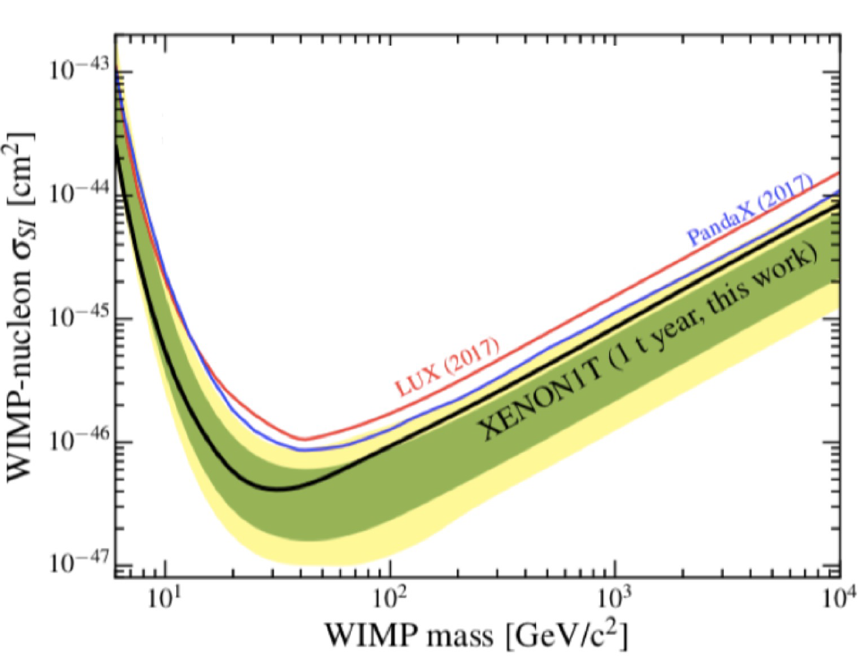
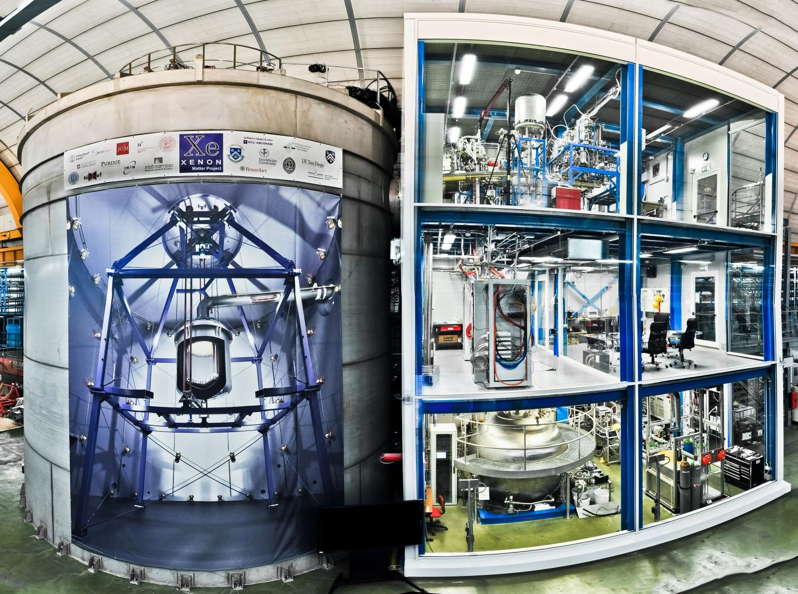

Les résultats de XENON1T, actuellement le plus grand et le plus sensible détecteur dédié à la recherche de matière noire sous forme de Weakly Interacting Massive Particles (WIMPs), sont présentés aujourd'hui (le 28 Mai 2018 à 11:00) par Elena Aprile de l’Université de Columbia et Manfred Lindner du Max Planck Institute d’Heidelberg, porte-paroles de l’expérience. L’événement a lieu simultanément lors de séminaires au laboratoire où se trouve le dispositif expérimental, l’INFN Laboratori Nazionali del Gran Sasso (LNGS) en Italie et au CERN en Suisse. En regroupant plus de 165 chercheurs de 27 centres de recherche, la collaboration internationale XENON a exploité avec succès XENON1T, recueillant une exceptionnellement grande exposition d’environ 1 tonne pendant 1 an grâce à l’utilisation d’une chambre à projection temporelle remplie de xénon à l’état liquide. Les données sont en accord avec le bruit de fond attendu, elles permettent à l’expérience XENON1T de placer des limites encore plus faibles sur les interactions indépendantes du spin de WIMPs avec la matière ordinaire pour les masses supérieures à 6 GeV/c2. La sensibilité ainsi obtenue avec XENON1T est presque quatre ordres de grandeur meilleure que celle de XENON10, la première phase du projet XENON matière noire qui a été installé au LNGS en 2005. La masse exposée de xénon a ainsi augmenté d’un facteur 260 (5 kg avec XENON10, 1300 kg aujourd’hui), alors qu’en parallèle la quantité de bruit de fond a été réduite d’un facteur proche de 5000. Ces nouveaux résultats témoignent de la puissance de la collaboration XENON qui continue à rester à l’avant-garde internationale de la détection directe de matière noire en repoussant sans cesse les limites observables grâce à une capacité expérimentale sans précédent. Un détecteur encore plus massif, XENONnT, remplacera dès l’année prochaine XENON1T afin d’aller encore plus loin.

Les WIMPs sont une nouvelle famille de particules élémentaires candidates pour expliquer la nature de la Matière Noire, elles sont également recherchées ardemment avec les expériences du grand collisionneur de hadrons (LHC au CERN), dans l’espace et sur terre dans des laboratoires souterrains. Bien qu’environ 1 milliard de WIMPs devraient traverser une surface d’un mètre carré par seconde sur terre, ces hypothétiques nouvelles particules restent extrêmement difficiles à découvrir. Ainsi, les nouveaux résultats de XENON1T montrent que les particules WIMPs, si elles constituent en effet la matière noire présente dans notre galaxie, génèrent encore un signal trop rare, tellement rare que même le plus grand détecteur construit jusqu'à présent n’a pas été en mesure de les observer directement.

XENON1T est un détecteur cylindrique d’environ un mètre de hauteur et de diamètre, rempli de xénon liquide à -95 °C, avec une densité proche de 3 ton/m3. Dans XENON1T, la signature d’une interaction d’une particule de type WIMP avec des atomes de xénon est un petit éclair de lumière de scintillation et une poignée d’électrons d’ionisation, qui eux-mêmes sont transformés en éclats de lumière. Les deux flashs de lumière sont enregistrés simultanément avec des photo- détecteurs ultra sensibles, afin d’obtenir à la fois la position en 3D et l’énergie déposée pour chaque événement interne au volume actif. L’élaboration de ce type unique de détecteur pour rechercher un signal WIMP est passée par de nombreux défis expérimentaux, en particulier pour réduire le bruit de fond environnant provenant de nombreuses sources associées à la radioactivité naturelle et aux rayons cosmiques. Aujourd'hui, XENON1T est la plus grande expérience de matière noire avec le fond le plus bas jamais mesurée pour une recherche de WIMP. Les résultats de la recherche, soumis au journal Physical Review Letters, sont basés sur l’exploitation de 1300 kg de xénon et 279 jours de données, ce qui en fait la première recherche de WIMPs avec l’exposition d’une cible de liquide noble de 1 tonne pendant 1 an. Seuls deux événements de bruit de fond étaient attendus, mais aucun n’a été détecté. XENON1T continue d’acquérir des données de haute qualité et la recherche se poursuivra jusqu'à la prochaine mise à niveau avec un détecteur de masse plus grande, développé en parallèle par la collaboration. Avec une augmentation de la masse de la cible d’un facteur 4 et dix fois moins de bruit de fond attendu, XENONnT sera prêt en 2019 pour une nouvelle exploration de la matière noire à un niveau de sensibilité qui n’était pas envisageable quand le projet a commencé en 2002.
